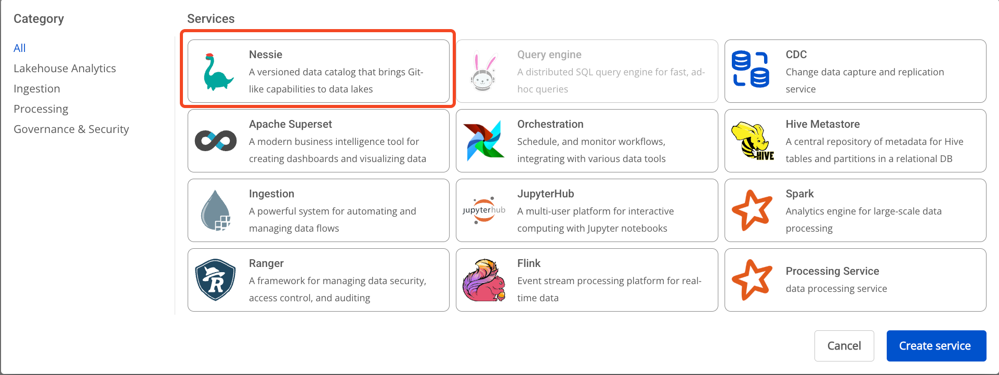
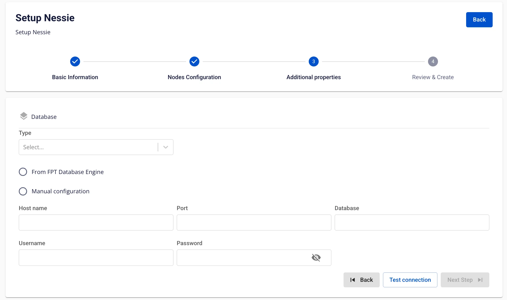
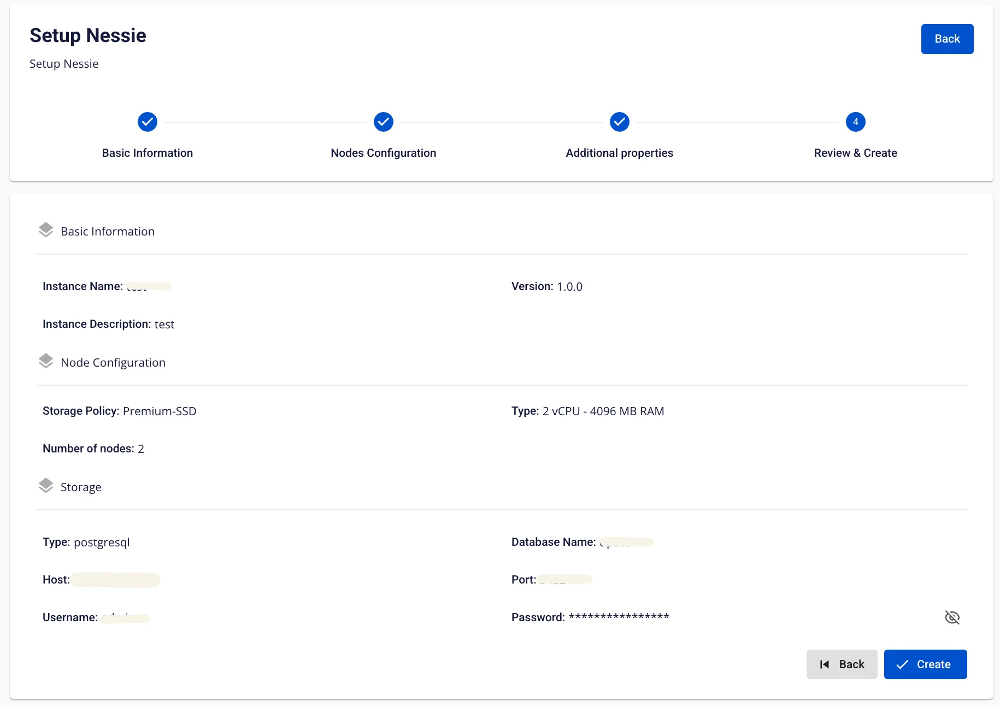

# Nessieの作成

**Nessie** は、大規模で複雑な分散データ環境をサポートするよう設計されており、データチームがシステム内のデータの開発、管理、展開プロセスをより効率的に管理できるようにします。

**Nessie** を作成するには、以下の手順に従ってください。

**ステップ 1.** メニューバーで **Data Platform** > **Workspace Management** を選択し、**Workspace name** を選択します。

**ステップ 2.** アプリケーションセクションで **Create** をクリック > アプリケーション選択ポップアップが表示されたら **Nessie** を選択し、**Create** をクリックします。

**ステップ 3.** **Nessie** 作成フォームで **Basic Information** を入力します。

 * **Name**（必須）：Nessie 名

:::warning
Nessie 名は 1〜30 文字である必要があります。英小文字 a-z、英大文字 A-Z、数字 0-9 を使用できます。
:::

 * **Description**（任意）：説明

 * **Version**（必須）：バージョンを選択します。

**ステップ 4.** **Next Step** をクリックして **Node configuration** 情報入力画面に進みます。

以下の情報を入力します。

 * **Storage policy**（必須）：Nessie 用の Storage を選択します。

 * **Type**（必須）：Nessie の設定タイプを選択します。

 * **Number of nodes**：ノード数を入力します。

:::warning
ノード数は 2 以上である必要があります。
:::

サービスの自動スケールが必要な場合は、**Enable auto scaling** をチェックし、希望するノード数を入力します。

:::warning
スケール後のノード数は **Number of nodes** より大きい必要があります。
:::

**ステップ 5.** **Next Step** をクリックして **Additional properties** 画面に進みます。

以下の情報を入力します。

タイプが **PostgreSQL** の場合：

 * **Host name**（必須）：Postgres サーバーのホスト名または IP

 * **Port**（必須）：Postgres サーバーポート（デフォルトは 5432）

 * **Database name**（必須）：データベース名

 * **Username**（必須）：Postgres サーバーへのアクセスユーザー名

 * **Password**（必須）：Postgres サーバーへのアクセスパスワード

タイプが **MySQL** の場合：

 * **Host name**（必須）：MySQL サーバーのホスト名または IP

 * **Port**（必須）：MySQL サーバーポート（デフォルトは 5432）

 * **Database name**（必須）：データベース名

 * **Username**（必須）：MySQL サーバーへのアクセスユーザー名

 * **Password**（必須）：MySQL サーバーへのアクセスパスワード

:::warning
ユーザーは **FPT の Database** を使用するか、独自の Database を使用するかを選択できます。
:::

**ステップ 6.** **Next Step** をクリックして **Review & Create** 画面に進みます。

**ステップ 7.** 入力情報を確認し、**Create** をクリックして完了します。
