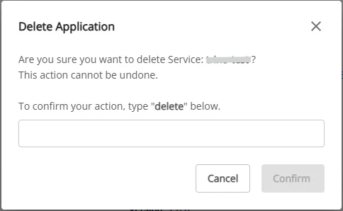

# Nessieの削除

Nessie を削除するには、以下の手順に従ってください。

**ステップ 1.** メニューバーで **Data Platform** > **Workspace Management** を選択し、**Workspace name** を選択します。

**ステップ 2.** アプリケーションセクションで **Nessie** を選択し、画面右上のアクションボタンをクリックして **Delete** を選択します。

**ステップ 3.** **Delete** application ダイアログボックスが表示されます。**delete** と入力し、**Confirm** をクリックして削除を完了します。

