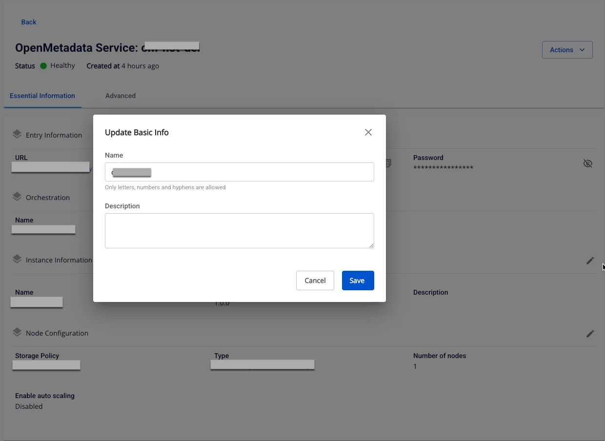

# Open Metadata の更新

**Open Metadata service** の情報を編集するには、以下の手順に従ってください。

**ステップ 1:** メニューバーで **Data Platform** > **Workspace Management** > **Workspace name** を選択します。

注意: メニューバーで Data Platform > Open Metadata service を選択することで、Open Metadata サービスに直接アクセスすることもできます。

**ステップ 2:** **My Service** セクションで Open Metadata **Service** を選択します。**Detail Open Metadata Service** 画面で、更新したいセクションの **Edit** アイコンをクリックします。

  * Instance Information の更新

**Instance Information** 編集画面が表示され、以下の項目を変更できます。

    * **Name**（必須）: サービス名

注意: サービス名は 1 〜 30 文字である必要があります。小文字 a-z、大文字 A-Z、または数字 0-9 を使用できます。

    * **Description**（任意）: サービスの説明

  * Node Configuration の更新

**Node Configuration** 編集画面が表示され、以下の項目を変更できます。

    * **Type**: サービスの設定タイプを選択します。

    * **Number of node:** 適切なノード数を選択します。

:::warning
ノード数は 1 以上 10 以下である必要があります。
:::

    * **Storage policy**: Storage policy を選択します。

**ステップ 3:** **Save** をクリックして完了します。
