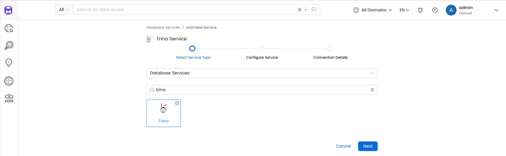
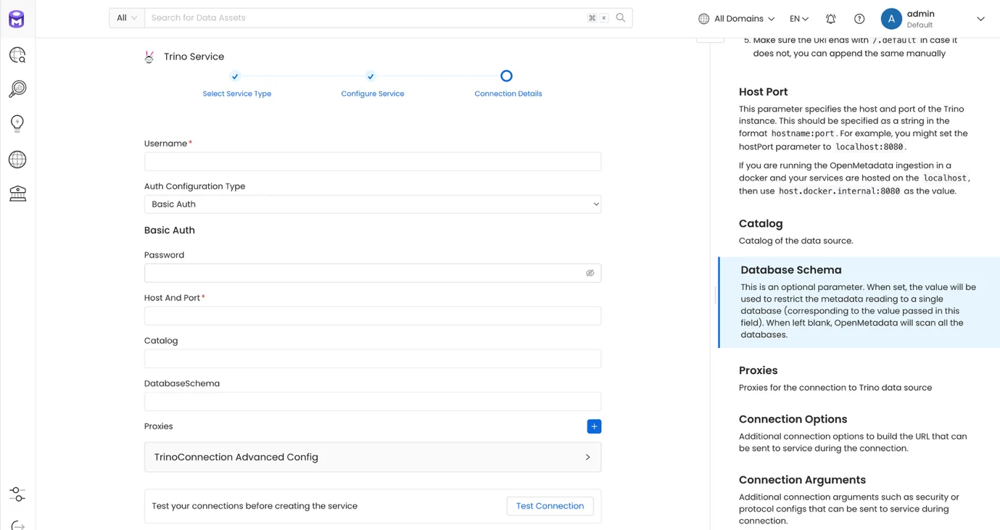
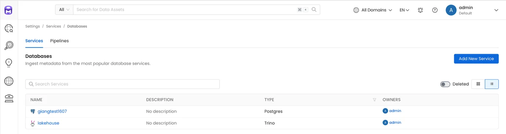
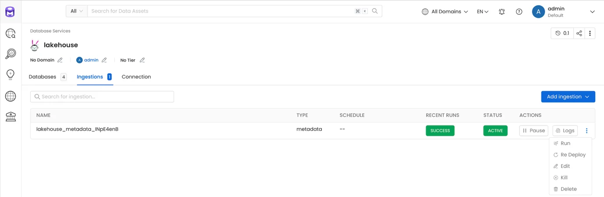
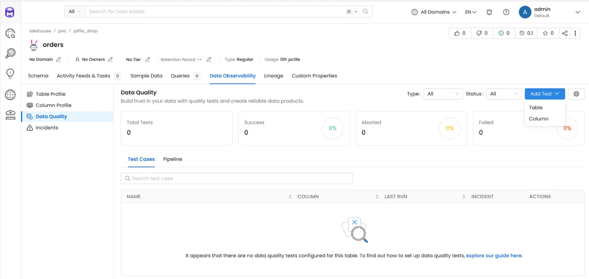
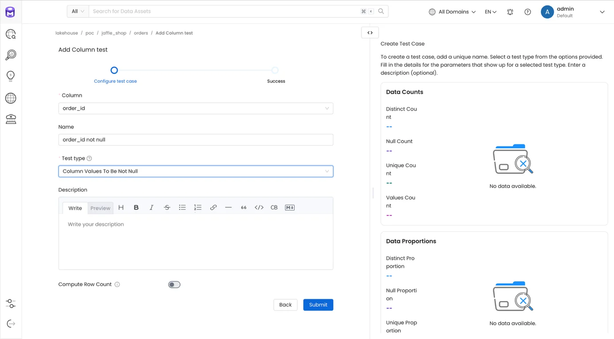
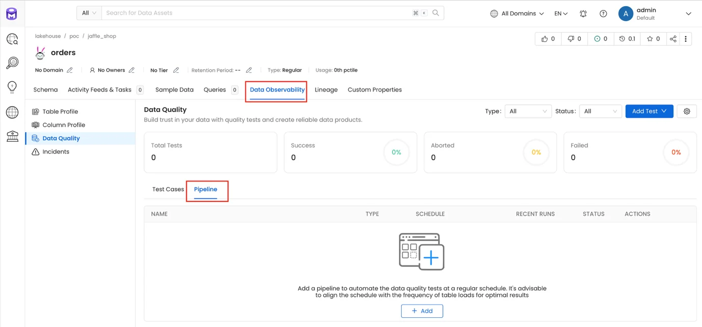
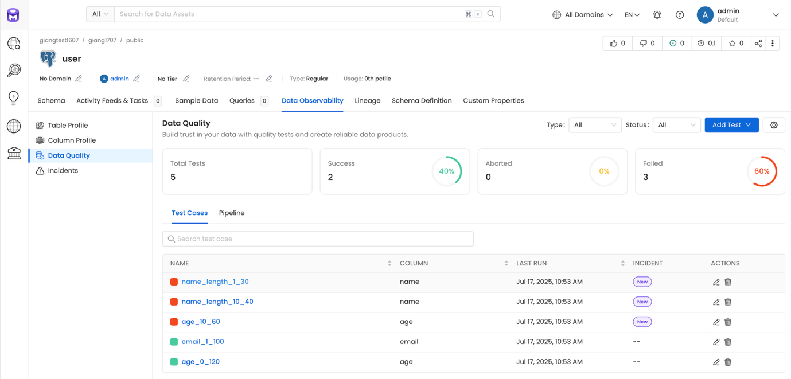

# Open Metadata 利用ガイド

### 1\. Service の作成

**ステップ 1.** Open Metadata にアクセスし、左メニューで Settings > Services > Databases を選択し、**Add New Service** をクリックします。

**ステップ 2.** Service Type で **Trino** を選択し、**Next** をクリックします。

**ステップ 3.** 以下の情報を入力します。

 * **Service name**: サービス名

 * **Description**: サービスの説明

**Next** をクリックします。

**ステップ 4.** **Connection Details** を入力します。

 * **Username**: アカウント名

 * **Auth Configuration Type**: Basic Auth を選択します。

 * **Host and Port**: Trino の接続情報を入力します。

 * **Catalog**（任意）: データを取得する Catalog を正確に入力します。空白のままにすると、Trino を通じて利用可能なすべての Catalog からデータを取得します。

 * **DatabaseSchemas**（任意）: データを取得する Schema を正確に入力します。空白のままにすると、Trino を通じて利用可能なすべての Schema からデータを取得します。

**Test connection** をクリックして Trino への接続を確認します。

**ステップ 5.** **Save** をクリックして **Service** の作成を完了します。

### 2\. Pipeline の設定

Service から Open Metadata へデータを取り込む Pipeline を設定します。

**ステップ 1:** Service 一覧画面で、作成したサービスの詳細を表示するためにクリックします。

**ステップ 2:** Service 詳細画面で **Ingestion** タブを選択し、**Add Ingestion** > **Add Metadata Ingestion** をクリックします。

**ステップ 3.** **Add Metadata Ingestion** 画面で以下を入力します。

 * **Name**: Pipeline 名

 * **Database Filter Pattern**

 * **Includes**: データを取り込む対象のデータベースを入力します。

 * **Exclude**（任意）: データ取り込みから除外するデータベースを入力します。

 * **Schema Filter Pattern**

 * **Includes**: データを取り込む対象のスキーマを入力します。

 * **Exclude**（任意）: データ取り込みから除外するスキーマを入力します。

 * **Table Filter Pattern**

 * **Includes**: データを取り込む対象のテーブルを入力します。

 * **Exclude**（任意）: データ取り込みから除外するテーブルを入力します。

**Next** をクリックします。

 * **Schedule** を選択して定期的な Ingestion スケジュールを設定します。

 * **On demand** を選択して手動で Ingestion を実行します。

 * **Number of retries**: Ingestion が失敗した場合の再試行回数

**Add & Deploy** をクリックして Ingestion の追加と Ingestion Job のデプロイを完了します。

### 3\. Pipeline の実行

**ステップ 1:** Service 一覧画面で、作成したサービスの詳細を表示するためにクリックします。

**ステップ 2:** **Service** 詳細画面で **Ingestion** タブを選択します。

**ステップ 3:** 作成した Pipeline の **Run** アクションをクリックします。

**Run** をクリックすると、Ingestion Job が実行されて **Metadata** がシステムに取り込まれます。

Ingestion Job がスケジュール設定されている場合、Pipeline は設定された時刻に自動的に実行されます。

### 4\. Explore

Ingestion を実行した後、**Explore** メニューでデータを探索します。

### 5\. Testcase の作成

データ品質を確認します。

**ステップ 1.** **Explore** 画面で **Testcase** を作成するテーブルを選択し、**Add Test** をクリックします（テーブルレベルでテストする場合は **Table**、カラムレベルでテストする場合は **Column** を使用します）。

**ステップ 2.** **Add Column Test** を作成します。

**Submit** をクリックしてテストを作成します。

### 6\. Pipeline Test の作成

**ステップ 1.** **Explore** 画面で、作成した Test case があるテーブルで **Pipeline** タブを選択し、**Add** をクリックします。

**ステップ 2.** **Scheduler for Test Cases** 情報を入力します。

 * **Name**: スケジュール名

 * **Schedule** を選択して定期的なスケジュールを設定します。

 * **On Demand** を選択して手動で実行します。

 * Pipeline で実行するテストケースを選択します。

**Submit** をクリックしてテストケースのスケジュール作成を完了します。

テスト Pipeline が実行されると、設定されたテストケースに従ってデータのチェックが行われ、テーブルレベルとシステム全体の両方で結果が返されます。

