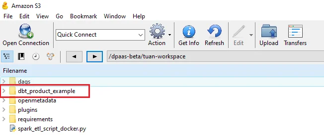
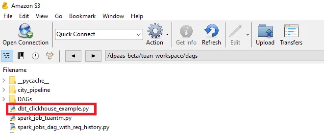

# Airflow と dbt ガイド

**ステップ 1.** dbt プロジェクトを、Orchestration service に設定したマウントパスのディレクトリにアップロードします。




**ステップ 2.** テンプレートに従って DAG を作成し、dbt ジョブを実行します。

dbt_clickhouse_example.py

dbt プロジェクトが含まれるディレクトリへのパスを変更します。

```
DBT_PROJECT_DIR = "/mnt/<WORKSPACE-STORAGE-NAME>/<DBT-PROJECT-DIRECTORY>"  |
```

**ステップ 3.** dbt ジョブを実行する DAG ファイルを、Orchestration サービスの dags ディレクトリにアップロードします。



**ステップ 4.** Orchestration service の Airflow URL にアクセスしてログインし、DAG を実行します。


