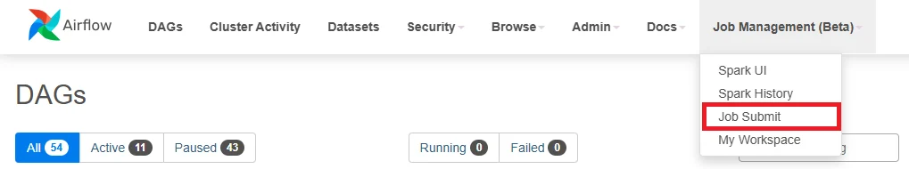

# Airflow & Job Submit ガイド

**Job Submit** は、DAG を手動で作成することなく、Airflow UI からデータ処理ジョブ（例: Spark ジョブ）を直接作成・送信できる機能です。この機能は、テスト、分析スクリプトの迅速な実行、またはデータ処理パイプラインの検証に特に役立ちます。

Job Submit インターフェースは以下の主な機能をサポートしています。

 * ジョブタイプの選択（例: Spark Python ジョブ）

 * ドライバーとエグゼキューターのリソース設定

 * メインスクリプト、依存関係、引数、環境変数の指定

 * 初期化スクリプトとカスタム Spark 設定の追加

**Job Submit へのアクセス**

 * **ステップ 1:** 作成済みの Orchestration サービス画面から **Airflow UI** にアクセスします。

 * **ステップ 2:** メニューバーで **Job Management (Beta)** > **Job Submit** を選択します。

### 1\. Airflow で新しい Job を作成する（Job Submit）

**ステップ 1:** Airflow UI にアクセスし、**Job Management (Beta) > Job Submit** を選択します。

**ステップ 2:** **Create Job** ボタンをクリックして、新しいジョブ作成インターフェースを開きます。

**ステップ 3:** ジョブのすべての設定情報を入力します。

 * **Runtime Image**: ジョブの目的に適したイメージを選択します。

Image | 説明
---|---
Python Spark 3.4.2 (ID: 1) | Python バージョン 3 で Spark ライブラリ バージョン 3.4.2 をサポート
Scala Spark 3.4.2 (ID: 2) | Scala で Spark ライブラリ バージョン 3.4.2 をサポート
Spark 3.5.0 with Python 3.10 (ID: 3) | Python バージョン 3.10 で Spark ライブラリ バージョン 3.5.0 をサポート
Spark 3.5.0 with Scala 2.12 (ID: 4) | Scala バージョン 2.12 で Spark ライブラリ バージョン 3.5.0 をサポート
DBT Core 1.9 (ID: 5) | Python バージョン 3 で DBT Core ライブラリ バージョン 1.9 の実行をサポート
RAPIDS Spark GPU Accelerated (ID: 7) | Python バージョン 3 で RAPIDS Spark GPU Accelerated ライブラリをサポート

 * **Job Name**: ジョブ名を設定します（小文字、スペースなし、英字・数字・「-」のみ使用可能）

 * **Dependency Type**:

   * **PyPi Requirements**: My Workspace から requirements.txt ファイルを選択します。

   * **Packaged Virtual Environment**: *.tar.gz ファイルを選択します。

   * **No Additional Dependencies**: 依存関係をインストールしません。

 * **Kubernetes Connection**: kubernetes_default（environment）を選択します。

 * **Compute Name**: Compute を選択します。

 * **Spark Job** にチェックを入れます。

 * **Path to main application file**: My Workspace 内のメイン .py ファイルを選択します。

 * **Driver Configuration**:

   * CPU: 1

   * RAM: 1000m

 * **Executor Configuration**:

   * CPU: 1

   * RAM: 1000m

   * Number of Executors: 1

 * **Init Scripts（任意）**: ジョブ実行前に初期化ステップがある場合は .sh ファイルを追加します。

 * **Arguments（任意）**: コマンドライン引数を追加します（例: --input /mnt/data/input.csv）

 * **Environment Variables（任意）**: 必要に応じて環境変数を追加します。

 * **Custom Spark Configurations（任意）**: デフォルトをオーバーライドする場合は Spark 設定のキーと値を追加します。

**ステップ 4:** すべての情報を確認し、**Create Spark Job** をクリックしてジョブをシステムに送信します。

### 2\. Airflow で Job を編集する

**ステップ 1:** Airflow UI にアクセスし、**Job Management (Beta) > Job Submit** を選択します。

**ステップ 2:** 更新したいジョブの **Action** ボタンをクリックします。

**ステップ 3:** **Edit Job** を選択して Edit job インターフェースを開きます。

**ステップ 4:** **Job** 情報を更新します。

**ステップ 5:** すべての情報を確認し、**Update Spark Job** をクリックして変更をシステムに保存します。

### 3\. Airflow で Job を削除する

**ステップ 1:** Airflow UI にアクセスし、**Job Management (Beta) > Job Submit** を選択します。

**ステップ 2:** 削除したいジョブの **Action** ボタンをクリックします。

**ステップ 3:** **Delete** を選択します。

**ステップ 4.** **Confirm Delete Spark Job - Delete job** ポップアップに「delete」と入力します。

**ステップ 5.** **Confirm Delete Spark Job** ポップアップに「delete」と入力して、ジョブとすべての関連 DAG リソース（データベースレコード、DAG ファイル、実行履歴を含む）を削除します。

### 4\. DAG の設定

**ステップ 1:** Job 一覧ページで、設定したいジョブの右側にある三点アイコンをクリックし、**Configure DAG** を選択します。

**ステップ 2: DAG 情報を入力します。**

 * **DAG ID**: DAG 名を設定します。

 * **Spark Job**: 対応するジョブを選択します。

 * **Description**: DAG の簡単な説明

 * **Schedule Type**: 実行タイプを選択します。

   * 手動実行の場合は None（Manual Trigger）を選択します。

**ステップ 3: 詳細設定を行います。**

 * **Timing**:

   * **Start Date**: DAG の実行開始日を選択します。

   * **End Date（任意）**: 終了日を制限しない場合は空白のままにできます。

   * チェックオプション:

     * **Paused on creation**: 作成直後に DAG をアクティブにしたくない場合にチェックします。

     * バックフィルや履歴依存が不要な場合は **Catchup** と **Depends on past** のチェックを外します。

 * **Concurrency Settings**:

   * **Max Active Runs**: 並行して実行できる DAG 実行数

   * **Concurrency**: 同時実行を許可するタスク数

 * **Retry Settings**:

   * **Retries**: 失敗した場合の再試行回数

   * **Retry Delay（seconds）**: 再試行間の待機時間（秒単位）

 * **Owner & Tags**:

   * **Owner**: DAG オーナーの名前

   * **Add Tag**: 分類用タグを追加します（例: spark submit）

**ステップ 4:** すべての情報を確認し、**Create DAG** ボタンをクリックして DAG 作成を完了します。

### 5\. DAG のトリガー

**ステップ 1:** Job 一覧ページで、設定したいジョブの右側にある三点アイコンをクリックし、**Trigger DAG** を選択します。

**ステップ 2:** メニューバーで **Job Management (Beta)** > **Spark UI** を選択します。

**ステップ 3:** **Spark UI** 画面で、DAG をトリガーしたジョブの **View Logs** を選択します。

**ログ確認の目的:**

 * ジョブの実行プロセスの詳細を監視する

 * Spark の処理ステップの状態を確認する（例: データ読み込み、変換処理の実行、結果の書き込みなど）

 * ジョブが失敗した場合にエラーを分析してトラブルシューティングする

 * ジョブが正常に完了し、期待通りの結果を返したことを確認する
