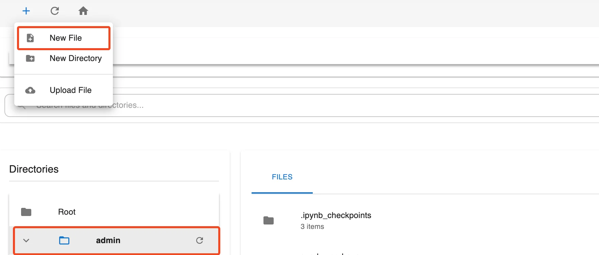

# Airflow & My Workspace ガイド

**My Workspace** は Orchestration Service（Airflow UI）内で提供される個人作業スペースであり、DAG ソースコード、スクリプト、設定ファイル、サンプルデータなどをすべて一か所で管理できます。

My Workspace 内のすべてのファイルとディレクトリは Root のディレクトリツリー構造で整理されており、バージョン管理とソースコードの同期を容易にするために Git と統合できます。

Workspace インターフェースは以下の基本機能をサポートしています。

 * 新しいファイル・ディレクトリの作成、ファイルのアップロード

 * ファイル内容の直接編集

 * クイック検索

 * ファイルまたはディレクトリの削除

 * Git リポジトリへの接続とソースコードの同期

### 1\. My Workspace へのアクセス

**ステップ 1:** 作成済みの Orchestration サービス画面から Airflow UI にアクセスします。

**ステップ 2:** メニューバーで **Browse > My Workspace** を選択します。

**注意:** 各ユーザーの **Workspace** は Root ディレクトリ内に別々に表示されます。各ディレクトリはワークスペースに対応しています（例: giang-git、cdcs3、dbt-demo など）。

### 2\. My Workspace のレイアウト

My Workspace 画面のレイアウトは 3 つの主要エリアで構成されています。

 * **Breadcrumb navigation**: 現在のディレクトリパスを表示します。

 * **左サイドバー（Directories）**: Root ディレクトリツリー構造を表示します。

 * **メインパネル（Files）**: 現在のワークスペースのファイルとディレクトリの内容を表示します。

### 3\. My Workspace でのリソース管理

#### a. 新しいファイル / ディレクトリの作成 / ファイルのアップロード

 * **新しいファイルの作成:**

   * **ステップ 1:** Directories 一覧または Files パネルでディレクトリ名をクリックして、対象ディレクトリを選択します。

   * **ステップ 2:** 上部角の **+** アイコンをクリックし、**New File** を選択します。

   * **ステップ 3:** ファイル名を入力し、**Create** をクリックして保存します。

**注意:** Orchestration サービスに DAG を宣言したい場合は、dags/ ディレクトリに .py 拡張子のファイルを作成してください。

 * **新しいディレクトリの作成:**

   * **ステップ 1:** Directories 一覧または Files パネルでディレクトリ名をクリックして、対象ディレクトリを選択します。

   * **ステップ 2:** **+** アイコンをクリックし、**New Directory** を選択します。

   * **ステップ 3:** ディレクトリ名を入力し、**Create** をクリックして保存します。

 * **コンピューターからファイルをアップロード:**

   * **ステップ 1:** Directories 一覧または Files パネルでディレクトリ名をクリックして、アップロード先の対象ディレクトリを選択します。

   * **ステップ 2:** **+** アイコンをクリックし、**Upload File** を選択します。

   * **ステップ 3:** コンピューターからアップロードするファイルを選択します。

ファイルは現在のディレクトリに保存されます。実行前に対象ディレクトリを十分に確認してください。

#### b. ファイル / ディレクトリの名前変更

 * **ステップ 1:** 名前を変更したいファイルまたはディレクトリを右クリックします。

 * **ステップ 2:** **Rename** を選択します。

 * **ステップ 3:** 新しい名前を入力し、**Enter** キーを押して確定します。

#### c. ファイル / ディレクトリを別の場所にコピー

 * **ステップ 1:** コピーしたいファイルまたはディレクトリを右クリックします。

 * **ステップ 2:** **Copy** を選択します。

 * **ステップ 3:** _Enter target directory path_ フィールドに対象ディレクトリのパスを入力します（ルートディレクトリにコピーする場合は空白のまま）。

 * **ステップ 4:** **OK** をクリックしてコピーを実行します。

#### d. ファイル / ディレクトリを別の場所に移動

 * **ステップ 1:** 移動したいファイルまたはディレクトリを右クリックします。

 * **ステップ 2:** **Move** を選択します。

 * **ステップ 3:** **Enter target directory path** フィールドに対象ディレクトリのパスを入力します（ルートディレクトリに移動する場合は空白のまま）。

 * **ステップ 4:** **OK** をクリックして移動を実行します。

#### e. ファイル / ディレクトリの削除

 * **ステップ 1:** 削除したいファイルまたはディレクトリを右クリックします。

 * **ステップ 2:** **Delete** を選択します。

 * **ステップ 3:** システムが確認ポップアップ（例: Delete directory "" recursively?）を表示した場合はアクションを確認します。

 * **ステップ 4:** **OK** をクリックして確認するか、**Cancel** をクリックして中止します。

**注意:** 削除されたファイル/ディレクトリは復元できません。

#### f. ファイル / ディレクトリのダウンロード

 * **ステップ 1:** ダウンロードしたいファイルまたはディレクトリを右クリックします。

 * **ステップ 2:** **Download** を選択します。

 * **ステップ 3:** ファイル/ディレクトリが元の形式でデバイスにダウンロードされます。

#### g. Git リポジトリの初期化（Initialize Git Repository）

**ディレクトリにのみ適用されます**

 * **ステップ 1:** Git リポジトリとして初期化したいディレクトリを右クリックします。

 * **ステップ 2:** **Initialize Git Repository** を選択します。

 * **ステップ 3:** 設定ウィンドウが表示されます。以下の項目が含まれます。

   * **Repository URL**（必須）: Git リポジトリへのパスを入力します。

   * **Authentication Type**: リポジトリの認証方式を選択します。

     * **None**

       * 認証不要

       * パブリック Git リポジトリに適用

       * ログイン資格情報の入力は不要

     * **SSH Key**

       * SSH キーペアを使用してリポジトリを認証します。

       * システムに SSH キーが設定済みであることを確認してください。

       * このタイプを選択した場合:

         * ユーザー名またはパスワードの入力は不要

         * システムはデフォルトの SSH キー（利用可能な場合）を自動的に使用します。

     * **Username & Password**

       * ユーザー名とパスワードで認証します。

       * プライベートリポジトリまたは Git が認証を要求する場合に適用

       * パスワードの代わりに **Personal Access Token** を使用できます（GitHub、GitLab などの場合）

       * このタイプを選択した場合:

         * **Username** を入力します。

         * **Password** または **Access Token** を入力します。

 * **ステップ 4:** Git からプルするブランチを選択します。

 * **ステップ 5:** **Test connection** をクリックしてリポジトリへの接続を確認します。

 * **ステップ 6:** 接続が成功した場合、**Initialize** ボタンが有効になります。

 * **ステップ 7:** **Initialize** をクリックして、選択したディレクトリの Git リポジトリを初期化します。

#### h. Git Pull

**Git が初期化されたディレクトリにのみ適用されます**

 * **ステップ 1:** Git Pull したいディレクトリを右クリックします。

 * **ステップ 2:** **Initialize Git Repository** を選択します。

システムはディレクトリへの最新の変更をプルします。

#### i. Git Repository Settings

Git Repository Settings 機能は、Git（.git）で初期化されたディレクトリにのみ表示・適用されます。ユーザーはインターフェースからローカルディレクトリと Git リポジトリ間の同期設定を確認・設定できます。

Git 初期化済みのディレクトリにのみ適用されます。

**A. 手動プル（Pull Now — Git Pull に相当）**

 * **ステップ 1:** Git 初期化済みのディレクトリを右クリックします。

 * **ステップ 2:** **Git Repository Settings** を選択します。

 * **ステップ 3:** **Sync Settings** タブで、同期を実行する 2 つの方法があります。

 * **ステップ 4:** ウィンドウ右下の **Pull Now** ボタンをクリックします。

 * **ステップ 5:** システムはリポジトリから最新の変更をローカルディレクトリにプルします。

**B. 自動同期の有効化（Auto Sync）**

 * **ステップ 1:** Git 初期化済みのディレクトリを右クリックします。

 * **ステップ 2:** **Git Repository Settings** を選択します。

 * **ステップ 3:** **Sync Settings** タブで、同期を実行する 2 つの方法があります。

 * **ステップ 4:** **Enable automatic synchronization** スイッチを ON に切り替えます。

 * **ステップ 5:** **Sync Interval (minutes)** フィールドに同期時間間隔を入力します。
_— 最小値: 5 分、最大: 1440 分（24 時間）_

 * **ステップ 6:** **Save Sync Settings** をクリックして設定を保存します。

 * **ステップ 7:** システムは設定した間隔で自動的に同期します。

