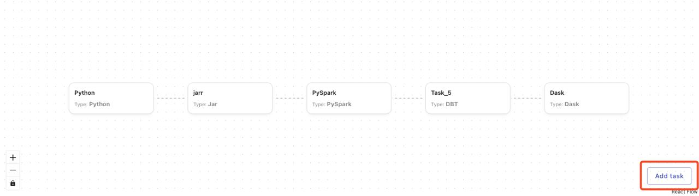
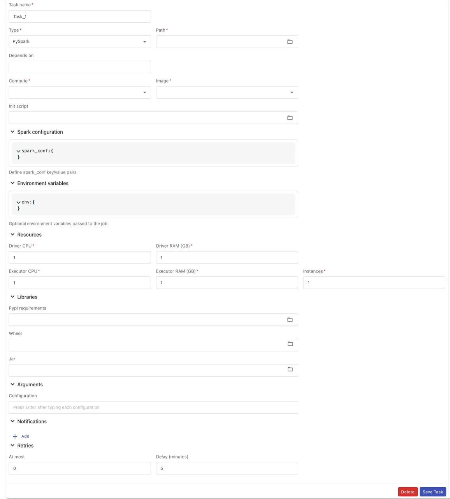
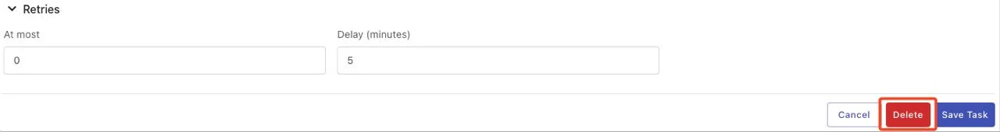
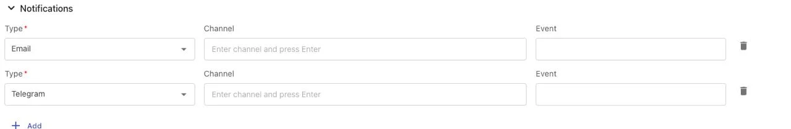
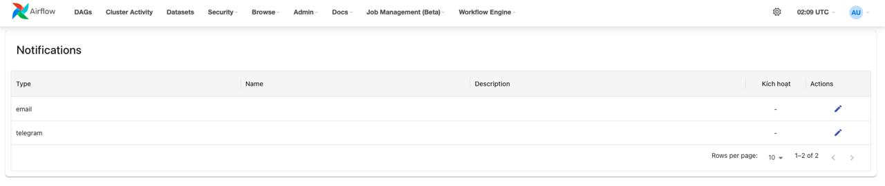
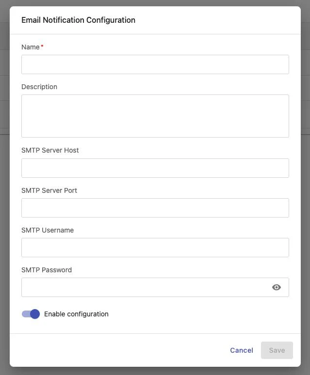
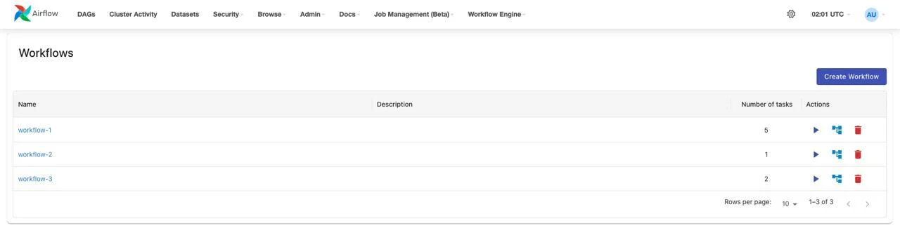
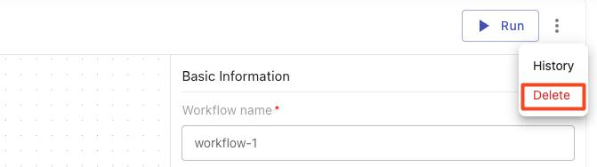

# Airflow Workflow ガイド

Workflow Engine は Data Platform のコアコンポーネントであり、ユーザーがデータ処理ワークフローを定義、管理、実行できます。各ワークフローは相互依存する複数のタスクで構成されており、DAG（Directed Acyclic Graph）としてモデル化されています。

このガイドでは以下の内容を説明します。

 * ワークフロー一覧へのアクセスと管理

 * ワークフローの作成と設定

 * 様々なタイプのタスク設定（Python、PySpark、Jar、DBT、Dask）

 * スケジュールと通知の設定

 * ワークフローの管理と削除

### 1\. Workflow Engine へのアクセス

Workflow Engine 機能にアクセスするには、以下の手順に従ってください。

**ステップ 1:** Data Platform のメインメニューバーで **Workflow Engine** を選択します。

**ステップ 2:** ドロップダウンメニューに 2 つのオプションが表示されます。

 * **Jobs**: ワークフロー一覧の管理

 * **Notifications**: 通知チャンネルの設定（Email、Telegram）

**ステップ 3:** **Jobs** を選択してワークフロー一覧にアクセスします。

### 2\. ワークフロー一覧

ワークフロー一覧インターフェースには、システム内のすべてのワークフローが概要情報とともに表示されます。

### 主な機能

**機能** | **説明**
---|---
**Create Workflow** | 新しいワークフローを作成する
**Trigger workflow** | ワークフローを手動でトリガーして実行する
**View graph** | ワークフローの詳細と実行履歴を表示する
**Delete workflow** | システムからワークフローを削除する
**Sort** | Name、Description、Number of tasks（昇順/降順）でリストをソートする
**Filter** | contains、equals、starts with、ends with、is empty、is any of の条件でフィルタリングする
**Hide column** | 不要な列を非表示にする
**Manage columns** | 一覧に表示する列をカスタマイズする
**Rows per page** | 1 ページに表示するワークフロー数を選択する（10、25、50）

### 表示情報

一覧の各ワークフローには以下の情報が表示されます。

 * **Name**: ワークフロー名（クリックして詳細を表示）

 * **Description**: ワークフローの簡単な説明

 * **Number of tasks**: ワークフロー内のタスク数

 * **Actions**: クイックアクション（Run、View graph、Delete）

### 3\. 新しいワークフローの作成

### ワークフローの初期化

**ステップ 1:** ワークフロー一覧インターフェースで **Create Workflow** ボタンをクリックします。

**ステップ 2:** システムはデフォルト情報でワークフローを自動的に初期化します。

 * **Workflow ID**: 昇順で自動生成（システム内で一意）

 * **Workflow name**: workflow- + 8 文字のランダム文字列（英字と数字）のパターンで自動生成

 * **Description**: 空（後で追加可能）

 * **Tag**: 空（後で追加可能）

 * **Schedule**: デフォルトは "Manual trigger"

**ステップ 3:** システムに通知が表示されます。

 * Subject: **Success**

 * Message: **Workflow initialized successfully!**

**ステップ 4:** タスクを設定するためにワークフロー詳細インターフェースに移動します。

### ワークフロー詳細インターフェース

ワークフロー詳細インターフェースは 2 つのメインセクションで構成されています。

**セクション 1: Graph View エリア（左側）**

 * タスクの DAG ダイアグラムを表示します。

 * ズームイン/ズームアウトで詳細を確認できます。

 * タスクをクリックして設定を表示または編集します。

 * 新しいタスクを追加する **Add task** ボタン

**セクション 2: 情報エリア（右側）**

 * **Basic Information**: ワークフローの名前、説明、タグ

 * **Schedule**: 自動実行スケジュール

 * **Notifications**: ワークフロー実行時の通知設定

### 機能ボタン

**ボタン** | **機能**
---|---
**Run** | ワークフローをすぐに実行するようトリガーする
**History** | ワークフローの実行履歴を表示する
**Delete** | ワークフローとすべての関連データを削除する
**Zoom in** | Graph View をズームインする
**Zoom out** | Graph View をズームアウトする
**Add task** | ワークフローに新しいタスクを追加する

### 4\. タスクの設定

Workflow Engine は 5 種類の異なるタスクタイプをサポートしており、それぞれ特定の処理目的に適しています。

#### ワークフローへの新しいタスクの追加

**ステップ 1:** ワークフロー詳細インターフェースで Graph View の **Add task** ボタンを見つけます。

**ステップ 2:** **Add task** ボタンをクリックします。

**ステップ 3:** システムは下部にデフォルトタイプ "Python" のタスク設定フォームを表示します。

**ステップ 4:** **Type** ドロップダウンから適切なタスクタイプを選択します。

 * **Python**: シンプルな Python スクリプト

 * **PySpark**: Python で記述された Spark ジョブ

 * **Jar**: パッケージ化された Java/Scala アプリケーション

 * **DBT**: DBT（Data Build Tool）プロジェクト

 * **Dask**: Dask 分散コンピューティングジョブ

**ステップ 5:** 設定フォームが選択したタスクタイプに応じて変わります。

**ステップ 6:** 必須フィールドをすべて入力します（各タスクタイプの詳細は以下を参照）。

**ステップ 7:** **Save Task** をクリックして設定を保存します。

**ステップ 8:** 新しいタスクが Graph View に表示されます。

**注意:**

 * 現在のタスクフォームが編集中で未保存の場合、**Add task** をクリックすると警告が表示されます。

`o` Subject: **Warning**

`o` Message: **Please save the current task before creating a new one**

 * 新しいタスクにはデフォルトの依存関係がありません。他のタスクの後に実行する場合は「Depends on」セクションを設定してください。

 * ワークフローには複数のタスクを追加でき、数に制限はありません。

#### タスクタイプ: Python

Python タスクは、シンプルな Python スクリプトを実行でき、小規模データ処理タスク、自動化スクリプト、またはシンプルなビジネスロジックに適しています。

#### 設定フィールド

**基本情報:**

 * **Task name**（必須）: タスク名 — 英字、数字、アンダースコア（_）、ハイフン（-）のみ、最大 100 文字

 * **Type**（必須）: ドロップダウンリストから "Python" を選択します。

 * **Path**（必須）: ディレクトリから Python ファイルパス（*.py）を選択します。

 * **Depends on**: このタスクが依存するタスクを選択します（複数選択可）。

 * **Trigger rule**: アップストリームタスクのステータスに基づいてタスクをトリガーするルール

**実行環境:**

 * **Compute**（必須）:

`o` スクリプトを実行する Compute を選択します。

`o` Processing サービスの Compute 一覧から選択します。

`o` 単一選択のみ

 * **Image**（必須）: 適切なランタイムイメージを選択します。

`o` Python Spark 3.4.2

`o` Spark 3.5.0 with Python 3.10

`o` DBT Core 1.9

`o` Spark 3.5.0 with Python3 for Openmetadata with Lakehouse

`o` RAPIDS Spark GPU Accelerated

`o` Python Dask 2025.4.1 (Beta)

 * **Init scripts**: Python スクリプト実行前に実行するスクリプト（任意）

**リソース:**

 * **CPU**（必須）: CPU コア数（最小: 1、最大: 64）

 * **RAM (GB)**（必須）: RAM 容量（最小: 1、最大: 128）

**ライブラリ:**

 * **Pypi**: インストールする Python ライブラリの一覧を含む requirements.txt ファイル

 * **Wheel**: .whl ファイル（複数ファイル選択可）

**引数:**

 * **Arguments**: スクリプト実行時に渡すパラメーター（最大 255 文字）

**通知:**

 * **Type**: 通知タイプを選択します（Telegram または Email）

 * **Channel**: 通知を受け取る Telegram チャンネルまたはメールアドレス（5-254 文字、有効なメール形式）

 * **Event**: 通知を送信するステータスを選択します（running、success、failed）— 複数選択可

**リトライポリシー:**

 * **At most**（必須）: スクリプト失敗時のリトライ回数（最小: 0、最大: 10）

 * **Delay**（必須）: リトライ間の待機時間（分単位）（最小: 1、最大: 10）

#### トリガールール

**Trigger Rule** | **説明**
---|---
**all_success** | すべてのアップストリームタスクが成功した場合のみタスクを実行する
**all_failed** | すべてのアップストリームタスクが FAILED の場合のみタスクを実行する
**all_done** | すべてのアップストリームタスクが終了した場合にタスクを実行する（任意の状態: success、failed、skipped）
**all_done_setup_success** | すべてのアップストリームタスクが終了し、すべての SETUP タスクが成功した場合のみタスクを実行する
**one_success** | 少なくとも 1 つのアップストリームタスクが SUCCESS の場合にタスクを実行する
**one_fail** | 少なくとも 1 つのアップストリームタスクが FAILED の場合にタスクを実行する
**one_done** | 少なくとも 1 つのアップストリームタスクが DONE（状態に関わらず終了）の場合にタスクを実行する
**none_failed** | FAILED のアップストリームタスクがない場合にタスクを実行する（SKIPPED は許容）
**none_failed_or_skipped** | FAILED も SKIPPED もない場合にタスクを実行する。SUCCESS のみ許容
**none_skipped** | SKIPPED のアップストリームタスクがない場合にタスクを実行する。FAILED または SUCCESS は可
**dummy** | 何もアクションを実行しない。前のタスクが成功、失敗、スキップされたかに関わらず常に実行される
**always** | アップストリームのステータスに関わらずタスクが常に実行される
**none_failed_min_one_success** | FAILED タスクがなく、少なくとも 1 つの SUCCESS タスクがある場合にタスクを実行する
**all_skipped** | すべてのアップストリームタスクが SKIPPED の場合にタスクを実行する

#### 手順

**ステップ 1:** ワークフロー詳細インターフェースで **Add task** ボタンをクリックします。

**ステップ 2:** システムはデフォルトタイプ "Python" のタスク設定フォームを表示します。

**ステップ 3:** 必須フィールドをすべて入力します。

 * タスク名

 * Python ファイルへのパス

 * Compute クラスター

 * ランタイムイメージ

 * CPU と RAM

**ステップ 4:** （任意）追加設定:

 * 依存関係（Depends on）

 * トリガールール

 * Init スクリプト

 * ライブラリ（Pypi、Wheel）

 * 引数

 * 通知

 * リトライポリシー

**ステップ 5:** **Save Task** ボタンをクリックします。

**ステップ 6:** システムに通知が表示されます。

 * Subject: **Success**

 * Message: **{{task_name}} created successfully!**

**ステップ 7:** 新しいタスクが Graph View に表示されます。

#### タスクタイプ: PySpark

PySpark タスクは Python で記述された Spark ジョブを実行でき、分散コンピューティングによる大規模データ処理に適しています。

#### 設定フィールド

**基本情報:**

 * **Task name**（必須）: タスク名 — 英字、数字、アンダースコア（_）、ハイフン（-）のみ、最大 100 文字

 * **Type**（必須）: ドロップダウンリストから "PySpark" を選択します。

 * **Path**（必須）: ディレクトリから Python ファイルパス（*.py）を選択します。

 * **Depends on**: このタスクが依存するタスクを選択します（複数選択可）。

 * **Trigger rule**: アップストリームタスクのステータスに基づいてタスクをトリガーするルール

**実行環境:**

 * **Compute**（必須）:

`o` スクリプトを実行する Compute を選択します。

`o` Processing サービスの Compute 一覧から選択します。

`o` 単一選択のみ

 * **Image**（必須）: 適切なランタイムイメージを選択します。

`o` Python Spark 3.4.2

`o` Spark 3.5.0 with Python 3.10

`o` Spark 3.5.0 with Python3 for Openmetadata with Lakehouse

 * **Init scripts**: PySpark スクリプト実行前に実行するスクリプト（任意）

 * **Spark configuration**: JSON Key-Value 形式で Spark パラメーターを設定します（参考: https://spark.apache.org/docs/latest/configuration.html）

 * **Environment variables**: JSON Key-Value 形式で環境変数を設定します。

**リソース（Spark 固有）:**

 * **Driver CPU**（必須）: Spark Driver の CPU（最小: 1、最大: 64）

 * **Driver RAM (GB)**（必須）: Spark Driver の RAM（最小: 1、最大: 128）

 * **Executor CPU**（必須）: 各 Executor の CPU（最小: 1、最大: 64）

 * **Executor RAM (GB)**（必須）: 各 Executor の RAM（最小: 1、最大: 128）

**ライブラリ:**

 * **Pypi requirements**: requirements.txt ファイル

 * **Wheel**: .whl ファイル（複数選択可）

 * **Jar**: Java ランタイム用の .jar ファイル（複数選択可）

**引数:**

 * **Arguments**: スクリプト実行時に渡すパラメーター（最大 255 文字）

**通知:**

 * **Type**: 通知タイプを選択します（Telegram または Email）

 * **Channel**: 通知を受け取る Telegram チャンネルまたはメールアドレス（5-254 文字、有効なメール形式）

 * **Event**: 通知を送信するステータスを選択します（running、success、failed）— 複数選択可

**リトライポリシー:**

 * **At most**（必須）: スクリプト失敗時のリトライ回数（最小: 0、最大: 10）

 * **Delay**（必須）: リトライ間の待機時間（分単位）（最小: 1、最大: 10）

#### 手順

**ステップ 1:** ワークフローインターフェースで **Add task** をクリックします。

**ステップ 2:** ドロップダウンから Type = "PySpark" を選択します。

**ステップ 3:** Driver と Executor の両方のリソースを含むすべての必須フィールドを入力します。

**ステップ 4:** （任意）設定:

 * Spark 設定

 * 環境変数

 * Jar ライブラリ（必要な場合）

**ステップ 5:** **Save Task** をクリックして設定を保存します。

#### タスクタイプ: Jar

Jar タスクは JAR ファイルとしてパッケージ化された Java/Scala アプリケーションを実行でき、Scala または Java で記述された Spark ジョブに適しています。

#### 設定フィールド

**基本情報:**

 * **Task name**（必須）: タスク名 — 英字、数字、アンダースコア（_）、ハイフン（-）のみ、最大 100 文字

 * **Type**（必須）: ドロップダウンリストから "Jar" を選択します。

 * **Path**（必須）: ディレクトリから JAR ファイルパス（*.jar）を選択します。

 * **Main class**（必須）: 実行を開始するための main() メソッドを含む Java クラス名（最大 255 文字、英字、数字、ドット（.）、アンダースコア（_）のみ）

 * **Depends on**: このタスクが依存するタスクを選択します（複数選択可）。

 * **Trigger rule**: アップストリームタスクのステータスに基づいてタスクをトリガーするルール

**実行環境:**

 * **Compute**（必須）:

`o` スクリプトを実行する Compute を選択します。

`o` Processing サービスの Compute 一覧から選択します。

`o` 単一選択のみ

 * **Image**（必須）: 適切なランタイムイメージを選択します。

`o` Scala Spark 3.4.2

`o` Spark 3.5.0 with Scala 2.12

 * **Init scripts**: Jar スクリプト実行前に実行するスクリプト（任意）

 * **Spark configuration:**

`o` Spark パラメーターを設定します。

`o` JSON Key-Value 形式: https://spark.apache.org/docs/latest/configuration.html

 * **Environment variables:**

`o` 環境パラメーターを設定します。

`o` JSON Key-Value 形式

**リソース:**

 * **Driver CPU**（必須）: ジョブ実行用の Driver CPU リソース（最小: 1、最大: 64）

 * **Driver RAM (GB)**（必須）: ジョブ実行用の Driver RAM リソース（最小: 1、最大: 128）

 * **Executor CPU**（必須）: ジョブ実行用の Executor CPU リソース（最小: 1、最大: 64）

 * **Executor RAM (GB)**（必須）: ジョブ実行用の Executor RAM リソース（最小: 1、最大: 128）

**ライブラリ:**

 * **Pypi requirements**: Python ライブラリインストールファイル requirements.txt を選択します。

 * **Wheel**: Python ライブラリインストールファイル *.whl を選択します。

 * **Jar**: Java ランタイムライブラリインストールファイル *.jar を選択します（複数選択可）。

**引数:**

 * **Arguments**: スクリプト実行時に渡すパラメーター（最大 255 文字）

**通知:**

 * **Type**: 通知タイプを選択します（Telegram または Email）

 * **Channel**: 通知を受け取る Telegram チャンネルまたはメールアドレス（5-254 文字、有効なメール形式）

 * **Event**: 通知を送信するステータスを選択します（running、success、failed）— 複数選択可

**リトライポリシー:**

 * **At most**（必須）: スクリプト失敗時のリトライ回数（最小: 0、最大: 10）

 * **Delay**（必須）: リトライ間の待機時間（分単位）（最小: 1、最大: 10）

#### 手順

**ステップ 1:** ワークフローインターフェースで **Add task** をクリックします。

**ステップ 2:** ドロップダウンから Type = "Jar" を選択します。

**ステップ 3:** 必須フィールドをすべて入力します。

 * タスク名

 * JAR ファイルへのパス

 * Main class（例: com.example.MainApp）

 * Compute、Image

 * Driver と Executor のリソース

**ステップ 4:** （任意）必要に応じて依存 JAR ファイルを追加します。

**ステップ 5:** **Save Task** をクリックします。

#### タスクタイプ: DBT

DBT タスクは DBT（Data Build Tool）プロジェクトを実行でき、ELT モデルを使用したデータウェアハウス内のデータ変換に適しています。

#### 設定フィールド

**基本情報:**

 * **Task name**（必須）: タスク名 — 英字、数字、アンダースコア（_）、ハイフン（-）のみ、最大 100 文字

 * **Type**（必須）: ドロップダウンリストから "DBT" を選択します。

 * **Path**（必須）: DBT プロジェクトを含むディレクトリへのパス

 * **Depends on**: このタスクが依存するタスクを選択します（複数選択可）。

 * **Trigger rule**: アップストリームタスクのステータスに基づいてタスクをトリガーするルール

**実行環境:**

 * **Compute**（必須）:

`o` スクリプトを実行する Compute を選択します。

`o` Processing サービスの Compute 一覧から選択します。

`o` 単一選択のみ

 * **Image**（必須）: 適切なランタイムイメージを選択します。

`o` DBT Core 1.9

 * **Init scripts**: DBT スクリプト実行前に実行するスクリプト（任意）

**リソース:**

 * **CPU**（必須）: DBT の CPU コア数（最小: 1、最大: 64）

 * **RAM (GB)**（必須）: DBT の RAM 容量（最小: 1、最大: 128）

**DBT コマンド:**

 * **Commands**（必須）: 実行する DBT コマンドの一覧

`o` 各コマンド: 7-100 文字、英字、数字、ハイフン（-）、アンダースコア（_）、スペースのみ

`o` 最大 20 コマンド

`o` 例: dbt run、dbt test、dbt snapshot

**ライブラリ:**

 * **Pypi requirements**: Python ライブラリインストールファイル requirements.txt を選択します。

 * **Wheel**: Python ライブラリインストールファイル *.whl を選択します。

**環境変数:**

 * JSON Key-Value 形式で環境変数を設定します。

**引数:**

 * **Arguments**: スクリプト実行時に渡すパラメーター（最大 255 文字）

**通知:**

 * **Type**: 通知タイプを選択します（Telegram または Email）

 * **Channel**: 通知を受け取る Telegram チャンネルまたはメールアドレス（5-254 文字、有効なメール形式）

 * **Event**: 通知を送信するステータスを選択します（running、success、failed）— 複数選択可

**リトライポリシー:**

 * **At most**（必須）: スクリプト失敗時のリトライ回数（最小: 0、最大: 10）

 * **Delay**（必須）: リトライ間の待機時間（分単位）（最小: 1、最大: 10）

#### 手順

**ステップ 1:** ワークフローインターフェースで **Add task** をクリックします。

**ステップ 2:** ドロップダウンから Type = "DBT" を選択します。

**ステップ 3:** すべての必須情報を入力します。

 * タスク名

 * DBT プロジェクトディレクトリへのパス

 * Compute、Image

 * CPU と RAM

**ステップ 4:** 実行する DBT コマンドを入力します（例: dbt run、dbt test）。

**ステップ 5:** （任意）必要に応じて環境変数を設定します。

**ステップ 6:** **Save Task** をクリックします。

#### タスクタイプ: Dask

Dask タスクは Dask フレームワークを使用した並列データ処理ジョブを実行でき、分散環境での Python による大規模データ処理に適しています。

#### 設定フィールド

**基本情報:**

 * **Task name**（必須）: タスク名 — 英字、数字、アンダースコア（_）、ハイフン（-）のみ、最大 100 文字

 * **Type**（必須）: ドロップダウンリストから "Dask" を選択します。

 * **Path**（必須）: ディレクトリから Python ファイルパス（*.py）を選択します。

 * **Depends on**: このタスクが依存するタスクを選択します（複数選択可）。

 * **Trigger rule**: アップストリームタスクのステータスに基づいてタスクをトリガーするルール

**実行環境:**

 * **Compute**（必須）: `o` スクリプトを実行する Compute を選択します。 `o` Processing サービスの Compute 一覧から選択します。 `o` 単一選択のみ
 * **Image**（必須）: 適切なランタイムイメージを選択します: `o` Python Dask 2025.4.1 (Beta)
 * **Init scripts**: Python スクリプト実行前に実行するスクリプト（任意）

**リソース（Dask 固有）:**

 * **Job - CPU**（必須）: ジョブの CPU（最小: 1、最大: 64）
 * **Job - RAM (GB)**（必須）: ジョブの RAM（最小: 1、最大: 128）
 * **Scheduler - CPU**（必須）: Dask Scheduler の CPU（最小: 1、最大: 64）
 * **Scheduler - RAM (GB)**（必須）: Dask Scheduler の RAM（最小: 1、最大: 128）
 * **Worker - CPU**（必須）: 各 Dask Worker の CPU（最小: 1、最大: 64）
 * **Worker - RAM (GB)**（必須）: 各 Dask Worker の RAM（最小: 1、最大: 128）
 * **Worker instances**（必須）: Worker 数（最小: 1、最大: 100）

**ライブラリ:**

 * **Pypi**: インストールする Python ライブラリの一覧を含む requirements.txt ファイル
 * **Wheel**: .whl ファイル（複数ファイル選択可）

**引数:**

 * **Arguments**: スクリプト実行時に渡すパラメーター（最大 255 文字）

**通知:**

 * **Type**: 通知タイプを選択します（Telegram または Email）
 * **Channel**: 通知を受け取る Telegram チャンネルまたはメールアドレス（5-254 文字、有効なメール形式）
 * **Event**: 通知を送信するステータスを選択します（running、success、failed）— 複数選択可

**リトライポリシー:**

 * **At most**（必須）: スクリプト失敗時のリトライ回数（最小: 0、最大: 10）
 * **Delay**（必須）: リトライ間の待機時間（分単位）（最小: 1、最大: 10）

#### 手順

**ステップ 1:** ワークフローインターフェースで **Add task** をクリックします。

**ステップ 2:** ドロップダウンから Type = "Dask" を選択します。

**ステップ 3:** 以下のリソース情報をすべて入力します。

 * Job
 * Scheduler
 * Worker（インスタンス数を含む）

**ステップ 4:** Python タスクと同様に他の情報を設定します。

**ステップ 5:** **Save Task** をクリックします。

#### タスクの削除

タスクを削除すると、ワークフローからタスクとすべての関連依存関係が削除されます。

#### 手順

**ステップ 1:** ワークフロー詳細インターフェースで Graph View の削除したいタスクをクリックします。

**ステップ 2:** タスク設定フォームが下部に表示されます。

**ステップ 3:** フォームの左下にある **Delete** ボタン（赤）をクリックします。

**ステップ 4:** 確認ポップアップが表示されます。

 * Title: **Delete task**
 * Message: **Are you sure you want to delete task "{{task_name}}"? This action cannot be undone.**

**ステップ 5:** **Delete** をクリックして削除を確認するか、**Cancel** をクリックして中止します。

**ステップ 6:** 確認後、システムは以下を実行します。

 * ワークフローからタスクを削除します。

 * このタスクに関連するすべての依存関係を削除します。

 * 通知を表示します。

`o` Subject: **Success**

`o` Message: **Task deleted successfully!**

**ステップ 7:** タスクが Graph View から消えます。

**注意:**

 * 削除アクションは取り消せません。

 * 削除されたタスクに依存する他のタスク（ダウンストリームタスク）がある場合は、それらの依存関係を更新してください。

 * タスクを削除するとワークフローの実行フローに影響します。削除前に十分に確認してください。

 * 削除前にタスク設定をバックアップすることをお勧めします（スクリーンショットを撮るか、パラメーターをメモする）。

### 5\. ワークフロー情報の更新

ワークフローを作成した後、基本情報、スケジュール、通知設定を更新できます。

#### 基本情報の更新

**ステップ 1:** ワークフロー詳細インターフェースで右側の **Basic Information** セクションを見つけます。

**ステップ 2:** Basic Information セクションの右上にある **Edit** アイコン（鉛筆アイコン）をクリックします。

**ステップ 3:** "Workflow Basic Information" ポップアップが以下のフィールドとともに表示されます。

**フィールド** | **説明** | **要件**
---|---|---
**Name** | ワークフロー名 | 必須。3-100 文字、英字、数字、_、- のみ。システム内の他のワークフローと重複不可
**Description** | ワークフローの説明 | 任意。最大 255 文字
**Tags** | ワークフローのタグ | 任意。各タグ 1-30 文字、英字、数字、-、_ のみ。同一ワークフロー内でタグの重複不可。最大 10 タグ

**ステップ 4:** 必要な情報を編集します。

**ステップ 5:** **Save** をクリックして変更を保存するか、**Cancel** をクリックして中止します。

**ステップ 6:** システムに通知が表示されます。

 * Subject: **Success**

 * Message: **Workflow updated successfully!**

**注意:** ワークフロー名がすでに存在する場合、システムはエラーを表示します。

 * Subject: **Error**

 * Message: **Workflow with name '{{workflow_name}}' already exists**

#### スケジュールの更新

スケジュールにより、ワークフローの自動実行スケジュールを設定できます。

**ステップ 1:** ワークフロー詳細インターフェースで右側の **Schedule** セクションを見つけます。

**ステップ 2:** Schedule セクションの右上にある **Edit** アイコンをクリックします。

**ステップ 3:** "Schedule" ポップアップが以下のオプションとともに表示されます。

**手動トリガー:**

 * チェックボックス "Manual trigger (do not run on schedule)" — ワークフローは手動でトリガーされた場合のみ実行されます。

**スケジュール間隔（Manual trigger を選択しない場合）:**

 * **Minutes**: 分単位で実行

 * **Hourly**: 毎時実行

 * **Daily**: 毎日実行

 * **Weekly**: 曜日を選択（Monday、Tuesday、Wednesday、Thursday、Friday、Saturday、Sunday）

 * **Monthly**: 毎月実行

 * **Custom**: カスタム cron 表現を入力

**開始時刻:**

 * ワークフローの実行開始時刻（時間と分）を選択します。

**Cron 表現プレビュー:**

 * システムは選択したオプションに対応する cron 表現を表示します。

 * 例: 0 0 * * *（毎日 12:00 AM に実行）

**ステップ 4:** 必要に応じてスケジュールを設定します。

**ステップ 5:** **Save** をクリックして変更を保存するか、**Cancel** をクリックして中止します。

**ステップ 6:** システムに通知が表示されます。

 * Subject: **Success**

 * Message: **Schedule updated successfully!**

**注意:**

 * cron 表現は正しい 5 フィールド構文（minute、hour、day-of-month、month、day-of-week）に従う必要があります。

 * 有効な文字: * , - /

 * 改行は許可されません。

 * 最大 100 文字

#### 通知の更新（ワークフローレベル）

イベント発生時にワークフロー全体の通知を設定します。

**ステップ 1:** ワークフロー詳細インターフェースで右側の **Notifications** セクションを見つけます。

**ステップ 2:** Notifications セクションの右上にある **Edit** アイコンをクリックします。

**ステップ 3:** "Notifications" ポップアップが以下のフィールドとともに表示されます。

**フィールド** | **説明**
---|---
**Type** | 通知タイプを選択します: Telegram または Email
**Channel** | 通知を受け取る Telegram チャンネルまたはメールアドレス（5-254 文字、有効なメール形式）
**Event** | 通知を送信するステータスを選択します: running、success、failed（複数選択可）

**ステップ 4:** **Add** ボタン（+）をクリックして新しい通知設定を追加します。

**ステップ 5:** 各通知の情報を入力します。

 * Type（Telegram/Email）を選択します。

 * Channel（Telegram チャンネル名またはメールアドレス）を入力します。

 * Event（running、success、failed）を選択します。

**ステップ 6:** **Add** を複数回クリックして複数の通知を追加できます。

**ステップ 7:** 通知を削除するには、その通知の横にある **Delete** アイコン（ゴミ箱）をクリックします。

**ステップ 8:** **Save** をクリックして設定を保存するか、**Cancel** をクリックして中止します。

**ステップ 9:** システムに通知が表示されます。

 * Subject: **Success**

 * Message: **Notifications updated successfully!**

#### 通知の更新（タスクレベル）

ワークフローレベルの通知に加えて、各タスクも独自の通知を設定できます。

**ステップ 1:** Graph View でタスクをクリックしてタスク設定フォームを開きます。

**ステップ 2:** タスクフォームの **Notifications** セクションまでスクロールします。

**ステップ 3:** Notifications セクションの展開アイコン（ドロップダウン）をクリックします。

**ステップ 4:** **Add** ボタンをクリックして新しい通知を追加します。

**ステップ 5:** 通知情報を入力します（ワークフローレベルと同様）。

 * Type（Telegram/Email）

 * Channel

 * Event（running、success、failed）

**ステップ 6:** タスクに複数の通知を追加できます。

**ステップ 7:** **Save Task** をクリックしてタスク設定を保存します。

**注意:**

 * タスクの通知はワークフローの通知とは独立しています。

 * ワークフローとタスクの両方に通知が設定されている場合、対応するイベントが発生した際に両方が送信されます。

### 6\. 通知チャンネルの設定

ワークフロー/タスクで通知を使用する前に、通知チャンネル（Notification Channels）を設定する必要があります。

#### 通知管理へのアクセス

**ステップ 1:** メインメニューバーで **Workflow Engine** を選択します。

**ステップ 2:** ドロップダウンメニューで **Notifications** を選択します。

**ステップ 3:** 通知チャンネル一覧インターフェースに以下の情報が表示されます。

 * **Type**: 通知タイプ（email/telegram）

 * **Name**: 設定名

 * **Description**: 説明

 * **Active**: アクティブ/非アクティブのステータス

 * **Actions**: 操作（Edit）

#### Email 通知の設定

**ステップ 1:** 通知一覧で Type = "email" の行を見つけます。

**ステップ 2:** Actions 列の **Edit** アイコン（鉛筆）をクリックします。

**ステップ 3:** "Email Notification Configuration" ポップアップが以下のフィールドとともに表示されます。

**フィールド** | **説明** | **要件**
---|---|---
**Name** | メール設定名 | 必須
**Description** | 設定の説明 | 任意
**SMTP Server Host** | SMTP サーバーアドレス（例: smtp.gmail.com） | 必須
**SMTP Server Port** | SMTP サーバーポート（例: 587、465） | 必須
**SMTP Username** | SMTP ログインユーザー名 | 必須
**SMTP Password** | SMTP パスワード（表示/非表示ボタンあり） | 必須
**Enable configuration** | 設定を有効化/無効化するトグル | —

**ステップ 4:** SMTP サーバー情報をすべて入力します。

 * Host: メールプロバイダーの SMTP サーバーアドレス

 * Port: 通常 587（TLS）または 465（SSL）

 * Username: メールまたはログインユーザー名

 * Password: アプリパスワードまたはメールパスワード

**ステップ 5:** **Enable configuration** トグルを有効にしてアクティブ化します。

**ステップ 6:** **Save** をクリックして設定を保存するか、**Cancel** をクリックして中止します。

**注意:**

 * Gmail の場合、通常のパスワードの代わりに「アプリパスワード」を作成してください。

 * Office 365 の場合、SMTP 認証を設定してください。

 * 本番環境で使用する前に SMTP 接続をテストしてください。

#### Telegram 通知の設定

**ステップ 1:** 通知一覧で Type = "telegram" の行を見つけます。

**ステップ 2:** Actions 列の **Edit** アイコンをクリックします。

**ステップ 3:** "Telegram Notification Configuration" ポップアップが以下のフィールドとともに表示されます。

**フィールド** | **説明** | **要件**
---|---|---
**Name** | Telegram 設定名 | 必須
**Description** | 設定の説明 | 任意
**Telegram Bot Token** | Telegram Bot のトークン（表示/非表示ボタンあり） | 必須
**Enable configuration** | 設定を有効化/無効化するトグル | —

**ステップ 4:** Telegram Bot Token を取得します。

 * Telegram を開いて @BotFather を見つけます。

 * /newbot コマンドを送信して新しいボットを作成します。

 * ボットの名前とユーザー名を設定します。

 * BotFather が Bot Token を返します（形式: 123456789:ABCdefGHIjklMNOpqrsTUVwxyz）。

**ステップ 5:** Bot Token をコピーして **Telegram Bot Token** フィールドに貼り付けます。

**ステップ 6:** **Enable configuration** トグルを有効にしてアクティブ化します。

**ステップ 7:** **Save** をクリックして設定を保存するか、**Cancel** をクリックして中止します。

**ステップ 8:** Chat ID/チャンネルを取得します。

 * 通知を受け取りたいグループ/チャンネルにボットを追加します。

 * グループ/チャンネルで任意のメッセージを送信します。

 * URL にアクセスします: https://api.telegram.org/bot{YOUR_BOT_TOKEN}/getUpdates

 * JSON レスポンスで chat.id を見つけます。

 * ワークフロー/タスクで通知を設定する際にこの Chat ID を使用します。

**注意:**

 * ボットは通知を送信する前にグループ/チャンネルに追加されている必要があります。

 * チャンネルの場合、ボットには "Post Messages" 権限が必要です。

 * 負の Chat ID はグループ/チャンネル、正の Chat ID は個人チャットです。

### 7\. ワークフローの実行

ワークフローを実行するには 2 つの方法があります: 手動と自動スケジュールです。

#### 手動トリガー

**方法 1: ワークフロー一覧から**

**ステップ 1:** ワークフロー一覧インターフェースで実行するワークフローを見つけます。

**ステップ 2:** Actions 列の **Trigger workflow** アイコン（再生ボタン）をクリックします。

**ステップ 3:** ワークフローがすぐに実行されます。

**方法 2: ワークフロー詳細から**

**ステップ 1:** ワークフロー名をクリックして詳細インターフェースに入ります。

**ステップ 2:** 右上の **Run** ボタンをクリックします。

**ステップ 3:** ワークフローがすぐに実行されます。

#### 自動スケジュール実行

ワークフローは Schedule セクションで設定されたスケジュールに従って自動的に実行されます（セクション 5.5.2 を参照）。

#### 実行履歴の確認

**方法 1: ワークフロー一覧から**

Actions 列の **View graph** アイコン（グラフアイコン）をクリックします。

**方法 2: ワークフロー詳細から**

右上の **History** ボタンをクリックします。

**表示情報:**

 * ワークフロー実行の一覧

 * 開始時刻と終了時刻

 * ステータス（success、failed、running）

 * 各タスクの詳細ログ

### 8\. ワークフローの削除

ワークフローを削除すると、ワークフロー全体、その中のすべてのタスク、およびすべての関連データ（実行履歴、ログ）が削除されます。

#### 手順

**方法 1: ワークフロー一覧から**

**ステップ 1:** ワークフロー一覧インターフェースで削除するワークフローを見つけます。

**ステップ 2:** Actions 列の **Delete** アイコン（ゴミ箱）をクリックします。

**ステップ 3:** 確認ポップアップが表示されます。

 * Title: **Delete workflow**

 * Message: **Are you sure you want to delete workflow "{{workflow_name}}"? This action cannot be undone.**

**ステップ 4:** **Delete** をクリックして削除を確認するか、**Cancel** をクリックして中止します。

**ステップ 5:** システムはワークフローを削除し、通知を表示します。

 * Subject: **Success**

 * Message: **Workflow deleted successfully!**

**ステップ 6:** ワークフロー一覧画面に戻ります。

**方法 2: ワークフロー詳細から**

**ステップ 1:** ワークフロー名をクリックして詳細インターフェースに入ります。

**ステップ 2:** 右上の **Delete** ボタンをクリックします。

**ステップ 3:** 確認ポップアップが表示されます。

 * Title: **Delete workflow**

 * Message: **Are you sure you want to delete workflow "{{workflow_name}}"? This action cannot be undone.**

**ステップ 4:** **Delete** をクリックして削除を確認するか、**Cancel** をクリックして中止します。

**ステップ 5:** システムはワークフローを削除し、通知を表示します。

 * Subject: **Success**

 * Message: **Workflow deleted successfully!**

**ステップ 6:** ワークフロー一覧画面に戻ります。

**注意:**

 * 削除アクションは取り消せません。

 * すべての実行履歴とログがワークフローとともに削除されます。

 * ワークフローが実行中の場合は、削除前に停止してください。
