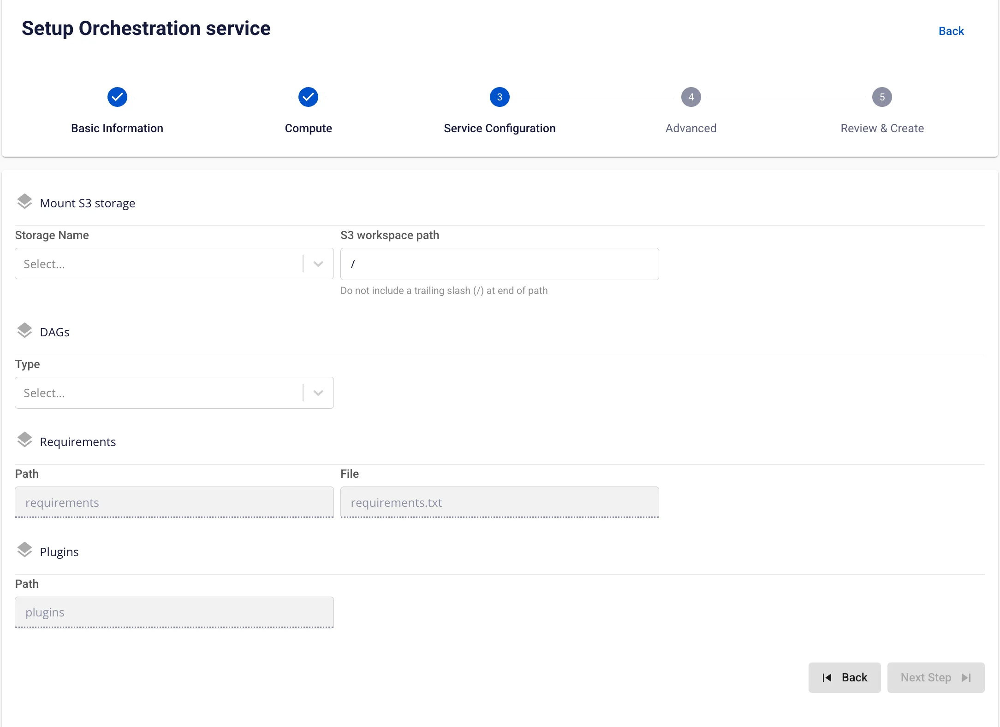
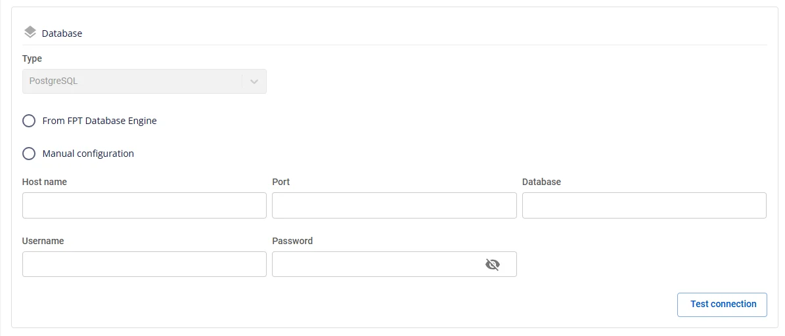

# Orchestration の作成

**Orchestration service** は、データシステム内のワークフローを管理・自動化するサービスとして定義されており、データ処理タスクがスケジュールまたはイベントに従って順次または並列で実行されることを保証し、効果的な監視とトラブルシューティング機能を提供します。

Orchestration サービスを作成するには、以下の手順に従ってください。

**ステップ 1:** メニューバーで **Data Platform** > **Workspace Management** > **Workspace name** を選択します。

**ステップ 2:** **My services** セクションで **Create** をクリックし、**New service** ポップアップが表示されたら **Orchestration** を選択し、**Create** をクリックします。


**ステップ 3:** **Orchestration** 作成フォームで **Basic Information** を入力します。

 * **Name**（必須）: Orchestration 名

注意: Orchestration 名には小文字 a-z、大文字 A-Z、数字 0-9 を使用できます。スペースは使用できません — 代わりに「-」または「_」を使用してください。

 * **Description**（任意）: 説明

 * **Version**（必須）: バージョンを選択します。

 * **Size**（必須）: 同時実行 DAG 数に基づいて Airflow の設定サイズを選択します。

   * **Dev** パッケージ: 推奨 DAG 制限は約 20-25 DAG

   * **Small** パッケージ: 推奨 DAG 制限は約 40-50 DAG

   * **Medium** パッケージ: 推奨 DAG 制限は約 70-80 DAG


**ステップ 4:** **Next Step** をクリックして **Compute** 情報入力画面に進みます。

以下の情報を入力します。

 * **Storage policy**（必須）: **Storage Policy** を選択します。


Airflow Worker の設定を自動スケールアップしたい場合は、**Enable worker auto scaling** にチェックを入れ、**Worker** の最大ノード数を入力します。

**ステップ 5:** **Next** をクリックして **Service configuration** 画面に進みます。

以下の情報を入力します。

 * **Mount S3 storage**

   * **Storage Name**（必須）: S3 マウント用の Storage を選択します。

 * **DAGs**

   * **Type**（必須）: タイプとして S3 または GIT を選択します。

   * **Type** が **S3** の場合: S3 ストレージから DAG 情報を取得します。

   * **Type が GIT の場合**、以下の情報を入力します。

     * **Repository URL（必須）**: DAG ファイルを保存するアドレス

     * **Branch（必須）**: DAG ファイルが格納されたディレクトリへの接続ブランチ

     * **Path（必須）**: DAG ファイルが格納されたディレクトリへの具体的なパス



**ステップ 6:** **Next** をクリックして **Advanced** 画面に進みます。

 * **Database**（Data governance データを保存するための Database 情報。**FPT Database Engine** サービスで作成した Database または他の **Database** を使用できます）

**type** が **PostgreSQL** の場合:

   * **Select Database**（必須）: データベースを選択します。

   * **Host name**（必須）: Postgres サーバーのホスト名または IP アドレス

   * **Port**（必須）: Postgres サーバーポート（デフォルト: 5432）

   * **Database**（必須）: データベース名

   * **Username**（必須）: データベースにアクセスするアカウント名

   * **Password**（必須）: データベースにアクセスするパスワード

**Manual configuration** の場合:

   * **Host name**（必須）: Postgres サーバーのホスト名または IP アドレス

   * **Port**（必須）: Postgres サーバーポート（デフォルト: 5432）

   * **Database**（必須）: データベース名

   * **Username**（必須）: データベースにアクセスするユーザー名

   * **Password**（必須）: データベースにアクセスするパスワード



**Database** 情報をすべて入力したら、**Test connection** をクリックして **Workspace** から入力した **Database** への接続を確認します。

 * **Redis**

**From FPT Database Engine** の場合:

   * **Select Database**（必須）: データベースを選択します。

   * **Host name**（必須）: Redis のホスト名または IP アドレス

   * **Port**（必須）: Redis ポート（デフォルト: 6379）

   * **Username**（必須）: データベースにアクセスするユーザー名

   * **Password**（必須）: データベースにアクセスするパスワード

   * **Logical database**（必須）: ロジカル DB 情報を選択します。

**Manual configuration** の場合:

   * **Host name**（必須）: Redis のホスト名または IP アドレス

   * **Port**（必須）: Redis ポート

   * **Username**（必須）: データベースにアクセスするユーザー名

   * **Password**（必須）: データベースにアクセスするパスワード

   * **Logical database**（必須）: ロジカル DB 情報を選択します。

**Database** 情報をすべて入力したら、**Test connection** をクリックして **Workspace** から入力した **Database** への接続を確認します。

 * **Remote logging**

   * **Bucket name**（必須）: バケット名

   * **Endpoint**（必須）: アクセスアドレス

   * **Access key**（必須）: アクセスキー

   * **Secret**（必須）: アクセスコード

   * **Path**（必須）: **リモートログ**ファイルが格納されるディレクトリ

**Remote logging** 情報をすべて入力したら、**Test connection** をクリックして **Workspace** から入力した **S3** への接続を確認します。

 * **Single Sign On**

   * Single Sign On を選択しない場合、Airflow は **Basic 認証**で初期化されます。

   * **Single Sign On** を選択した場合:

   * **Provider: FPT ID**

以下の情報を入力します。

     * **Username**: ユーザー名

     * **Email**: FPT メールアドレス

   * **Provider: Google**

以下の情報を入力します。

     * **Client ID**: Google でクライアントを認証するための ID コード

     * **Client Secret**: Google でクライアントを認証するためのパスワード

     * **Email**: メールアドレス

   * **Provider: Keycloak**

以下の情報を入力します。

     * **Auth Provider name**: プロバイダー名

     * **Realm**: すべてのユーザー、グループ、ロール、クライアント、その他のオブジェクトが独立して管理・保護される管理スペース

     * **Auth server url**: クライアントが認証を行うために使用する Keycloak サーバーのベース URL

     * **Client ID**: Keycloak でクライアントを認証するための ID コード

     * **Client Secret**: Keycloak でクライアントを認証するためのパスワード

     * **Username**: Keycloak のユーザー名

     * **Email**: Keycloak のメールアドレス

 * **Secret backends**

   * **Provider = FPT Key Vault**

     * **Mount point（必須）:** Secret backend のマウントポイントパス（例: airflow-connections）

     * **Connection path（必須）:** Airflow 接続に使用するパス/キー

     * **Variable path（必須）:** 環境変数または secrets のパス/キー

     * **URL（必須）:** Vault のエンドポイントアドレス（例: http://pickadkf.keyvault.fptcloud.com）

     * **Auth type:** Vault との認証タイプ（例: token）

     * **Token（必須）:** Vault でアカウントを認証するトークンコード

**注意:** Vault Policy — Token は connections および variables を含むパスに対して「read」と「list」の権限が必要です。Token にポリシーを割り当ててください。

```
{
 "path": {
 "/data//*": {
 "capabilities": [
 "read",
 "list"
 ]
 },
 "/data//*": {
 "capabilities": [
 "read",
 "list"
 ]
 },
 "/metadata/": {
 "capabilities": [
 "list"
 ]
 },
 "/metadata/": {
 "capabilities": [

 "list"
 ]
 }
 }
 }
```

**Test connection** ボタンをクリックして、Secret backend への実際の接続を確認します。


 * **Custom Domain**

   * **目的:** サービスにアクセスするためのカスタムドメインを設定できます。

     * **Public Workspace の場合:** TLS の有効化/無効化を必要とせず、ドメインと証明書を割り当てるために使用します（HTTPS は常に利用可能）。

     * **Private Workspace の場合:** ドメインと証明書に加えて、TLS/SSL を有効化または無効化して HTTPS または HTTP を選択できます。

   * **Workspace が Public の場合**

     * **Custom domain**: カスタムドメインを有効にするにはチェックを入れます。

     * **Domain**: ドメイン名を入力します（例: abc.local、jupyter.example.com）。

     * **Certificate name**: **Certificate Manager** でインポートされた証明書の一覧から選択します。

     * **ボタン**:

       * **Manage certificate**: 証明書管理画面を開きます。

       * **Validate**: ドメインに対して証明書が有効かどうかを確認します。

:::note
Public Workspace では、**TLS/SSL certificate** オプションは**表示されません** — システムはデフォルトで HTTPS をサポートしています。
:::


   * **Workspace が Private の場合**

     * **Custom domain**: カスタムドメインを有効にするにはチェックを入れます。

     * **Domain**: ドメイン名を入力します。

     * **TLS/SSL certificate**: サービスで HTTPS を有効にするにはチェックを入れます。

     * **Certificate name**: 証明書一覧から選択します。

     * **ボタン**:

       * **Manage certificate**: 証明書管理画面を開きます。

       * **Validate**: 証明書を確認します。

:::note
**TLS/SSL certificate** のチェックを外した場合、サービスは HTTP で動作し、証明書は不要です。
:::


**ステップ 7:** **Next** をクリックして **Review & create** 画面に進みます。

**ステップ 8.** 入力したすべての情報を確認し、**Create** をクリックして **Orchestration** の初期化を完了します。

**Worker Status** が **Succeeded** になり、**Orchestration** の **Status** が **Healthy** になったら初期化完了です（約 10 分）。
