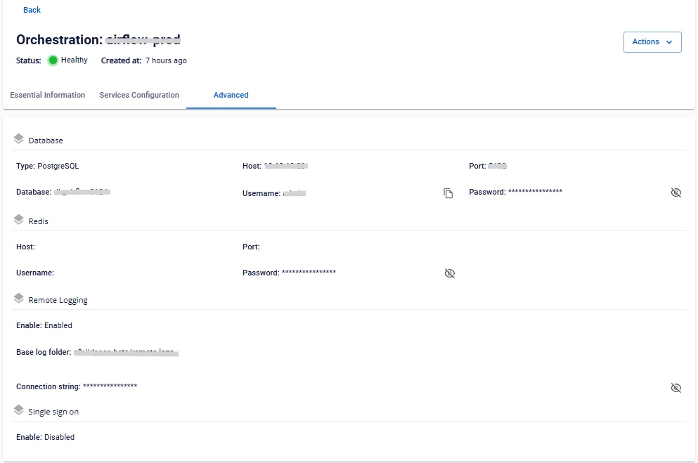

# Orchestration 詳細表示

**Orchestration** の情報を確認するには、以下の手順に従ってください。

**ステップ 1:** メニューバーで **Data Platform** > **Workspace Management** > **Workspace name** を選択します。

**ステップ 2:** **Workspace** の詳細画面で **Orchestration** を選択します。

**「Essential Information」タブ**

ユーザーが設定した **Orchestration** サービスの詳細情報が表示されます。画面に表示されている **URL/Username/Password** を使用して **Orchestration** にアクセスできます。

**Services Configuration**

**Orchestration** に使用している **DAGs** の連携情報が表示されます。

**Advanced**

**Orchestration** に使用している **Database** および **SSO** の情報（連携している場合）が表示されます。

