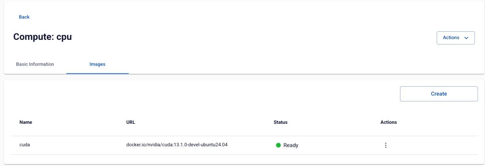
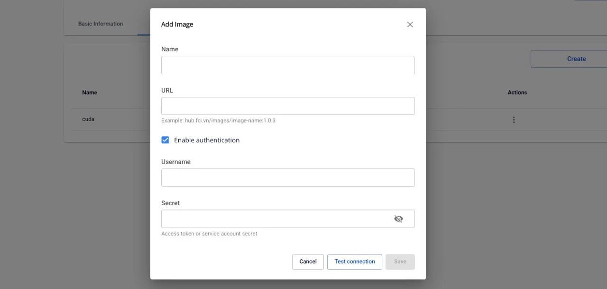
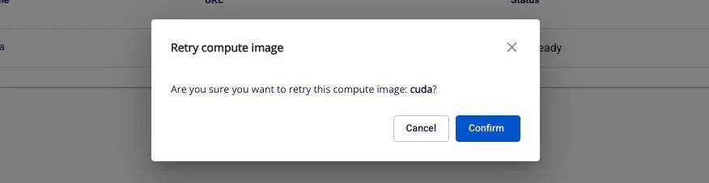

# Compute イメージの管理

**Prepulling Image** 機能を使用すると、さまざまなレジストリから Docker イメージをワークスペースにプルして管理できます。イメージを事前にプルしておくことで、コンテナの起動時間を最適化し、必要なときにイメージをすぐに使用できる状態にします。

**メリット:**

  * コンテナの起動時間を短縮
  * Compute に必要なイメージを一元管理
  * パブリックおよびプライベートレジストリの両方をサポート
  * イメージのプル状態をリアルタイムで監視

**制限:** 各 Processing Service で作成できる Compute は最大 **5 件** です。

### 1\. Compute のイメージ一覧を確認する

Compute にプリプルされたイメージの一覧を確認するには、以下の手順に従ってください。

**ステップ 1:** **Processing services** 画面で **Compute** タブを選択します。

**ステップ 2:** イメージ一覧を確認したい Compute をクリックします。

**ステップ 3:** **Images** タブを選択します。

**結果:** Compute に追加されたイメージの一覧が以下の情報とともに表示されます。

  * **Name**: イメージの識別名
  * **URL**: イメージレジストリへの完全なパス
（例: `docker.io/nvidia/cuda:13.1.0-devel-ubuntu24.04`）
  * **Status**: イメージの現在のステータス
    * **Ready**: イメージは使用可能な状態
    * **Progressing**: イメージのプルが進行中
    * **Processing**: 処理中
    * **Failed**: イメージのプルが失敗
    * **Degraded**: イメージに問題あり（詳細ログを確認するためのアイコンあり）
    * **Unknown**: 不明なステータス
  * **Actions**: イメージ操作メニュー（Update、Retry、Delete）

**注意:** イメージがまだない場合、画面には「No image yet」というメッセージと新しいイメージを追加するための **Create** ボタンが表示されます。

### 2\. 新しいイメージを追加する

#### パブリックレジストリからのイメージ追加（認証不要）

**ステップ 1:** Compute の **Images** タブで **Create** ボタンをクリックします。

**ステップ 2:** **Add Image** ポップアップで以下の情報を入力します。

  * **Name**: イメージの識別名（必須）
    * 英字、数字、ハイフン（-）のみ使用可能
    * 最大 30 文字
    * 例: `nginx-latest`、`cuda-13-1-0`
  * **URL**: イメージへのパス（必須）
    * 形式: registry/repository/image-name:tag
    * 例: docker.io/library/nginx:latest
    * 例: hub.fci.vn/images/image-name:1.0.3

**ステップ 3:** **Enable authentication** チェックボックスが選択されていないことを確認します（パブリックイメージ用）。

**ステップ 4:** **Test connection** ボタンをクリックして、レジストリへの接続を確認します。

  * 成功した場合: 「Success - Test connection successfully」というメッセージが表示されます。
  * 失敗した場合: 詳細なエラーメッセージが表示されます。

**ステップ 5:** テスト接続が成功したら、**Save** ボタンが有効になります。

**ステップ 6:** **Save** ボタンをクリックします。

**結果:**

  * 「Success - Add successfully」というメッセージが表示されます。
  * 新しいイメージが **Progressing** ステータスで一覧に表示されます。
  * プルが完了すると、ステータスが **Ready** に変わります。

#### プライベートレジストリからのイメージ追加（認証あり）

**ステップ 1:** Compute の **Images** タブで **Create** ボタンをクリックします。

**ステップ 2:** **Add Image** ポップアップで以下の情報を入力します。

  * **Name**: イメージの識別名
  * **URL**: プライベートイメージへのパス

**ステップ 3:** **Enable authentication** チェックボックスをオンにします。

**ステップ 4:** 認証情報を入力します。

  * **Username**: ユーザー名またはサービスアカウント（必須）
  * **Secret**: アクセストークンまたはパスワード（必須）
    * 表示アイコンをクリックしてパスワードの表示/非表示を切り替えます。

**ステップ 5:** **Test connection** ボタンをクリックして接続を確認します。

**ステップ 6:** テスト接続が成功したら、**Save** ボタンをクリックします。

**結果:** イメージが一覧に追加され、提供された認証情報を使用してプロセスが開始されます。

### 3\. イメージの更新

既存のイメージの情報（名前、URL、認証）を更新できます。更新すると、システムは新しい情報でイメージを自動的に再プルします。

**ステップ 1:** Images 一覧で、更新したいイメージの **Actions** 列にある **⋮** アイコン（縦三点）をクリックします。

**ステップ 2:** ドロップダウンメニューから **Update** を選択します。

**ステップ 3:** **Update Image** ポップアップで、現在のイメージ情報がフィールドに表示されます。

**ステップ 4:** 必要な情報を編集します。

  * **Name** を変更する（ルールに従う: 英字、数字、ハイフン、最大 30 文字）
  * **URL** を変更する
  * **authentication** を有効/無効にする:
    * 有効にする場合: 新しい Username と Secret を入力します。
    * 無効にする場合: 認証を削除します（パブリックイメージ用）。

**ステップ 5:** **Test connection** ボタンをクリックして新しい設定を確認します。

**ステップ 6:** テストが成功したら、**Save** ボタンをクリックします。

### 4\. イメージの再試行（Retry）

イメージのステータスが **Failed** または **Degraded** の場合、再試行してイメージを再プルできます。

**ステップ 1:** Images 一覧で、Failed/Degraded ステータスのイメージの **⋮** アイコンをクリックします。

**ステップ 2:** ドロップダウンメニューから **Retry** を選択します。

**ステップ 3:** **Retry compute image** ポップアップで情報を確認します。

**ステップ 4:** **Confirm** ボタンをクリックして再試行を確認します。

### 5\. イメージの削除

不要になったイメージを Compute から削除できます。

**ステップ 1:** Images 一覧で、削除したいイメージの **⋮** アイコンをクリックします。

**ステップ 2:** ドロップダウンメニューから **Delete**（赤）を選択します。

**ステップ 3:** **Delete compute image** ポップアップで警告を読みます。

**ステップ 4:** 削除を確認するには、入力欄に「`delete`」（小文字）と正確に入力します。

**ステップ 5:** 正しく入力されると **Confirm** ボタンが有効になります。

**ステップ 6:** **Confirm** ボタンをクリックします。

### 6\. イメージのログを確認する

イメージのステータスが **Degraded** の場合、詳細ログを確認して問題をトラブルシュートできます。

**ステップ 1:** Images 一覧で **Degraded** ステータス（横にアイコンあり）のイメージを見つけます。

**ステップ 2:** インフォメーションアイコンをクリックします。

**ステップ 3:** **Logs** ポップアップに詳細なログ内容が表示されます。

**ログの例:** _[2020-07-07 15:04:29,334] DEBUG Progress event:
TRANSFER_PART_COMPLETED_EVENT, bytes: 0
(io.confluent.connect.s3.storage.S3OutputStream:286)_

**ステップ 4:** ログを読み、エラーの原因を特定します。

**ステップ 5:** X アイコンをクリックしてログポップアップを閉じます。

**結果:** ポップアップが閉じ、Images 一覧画面に戻ります。
