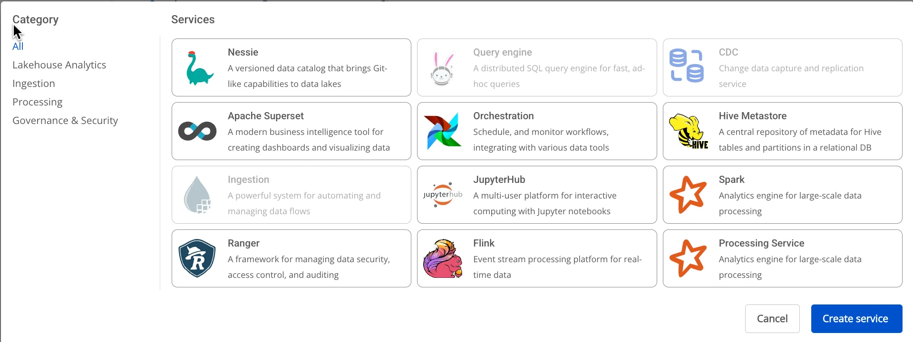
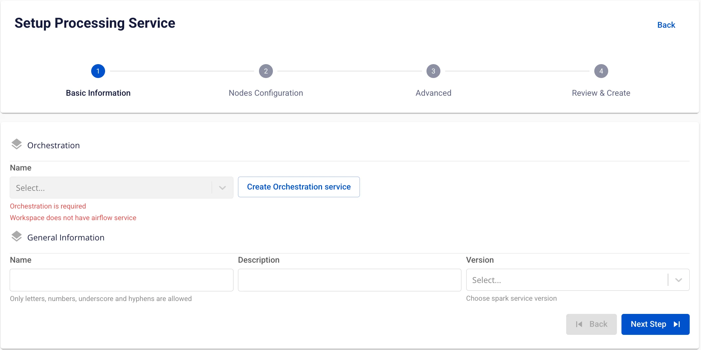
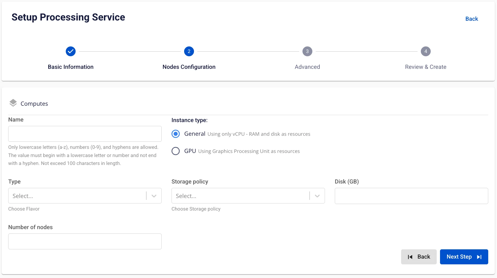
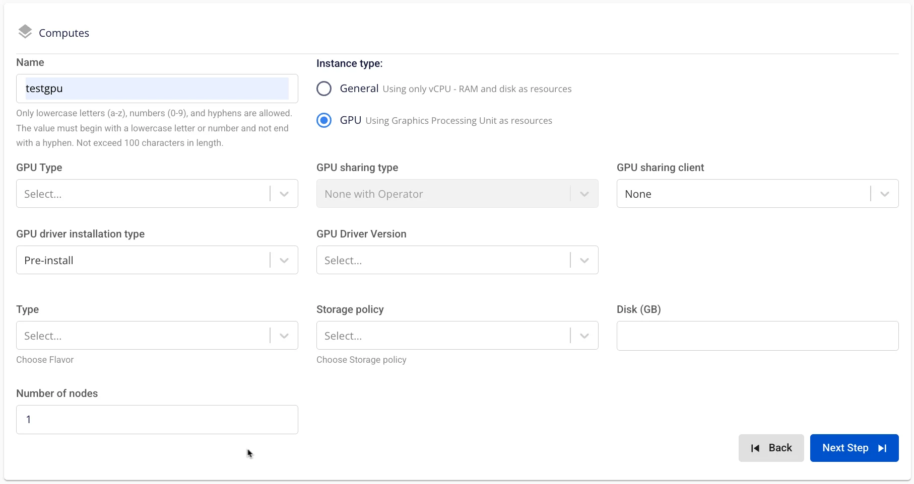
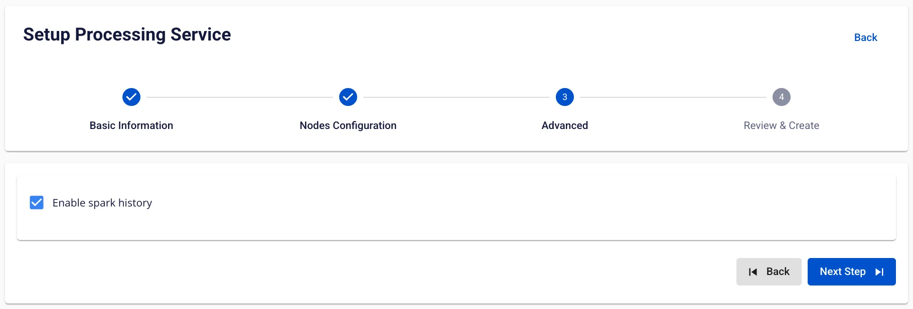

# Processing service の作成

**Processing service** を作成するには、以下の手順に従ってください。

**前提条件**: Orchestration service が正常に作成済みであること。

**ステップ 1:** メニューバーで **Data Platform** > **Workspace Management** > **Workspace name** を選択します。

**ステップ 2:** **Workspace Details** セクションで **Create** をクリックし、**Services** ポップアップが表示されたら **Processing service** を選択して **Create Service** をクリックします。

**ステップ 3:** **Processing service** 作成フォームで **Basic Information** を入力します。

  * **Orchestration service name**（必須）: Spark Job の動作を調整する Orchestration service を選択します。

  * **Name**（必須）: サービス名

注意: サービス名には小文字 a-z、大文字 A-Z、数字 0-9 を使用できます。スペースは使用できません — 代わりに「-」または「_」を使用してください。

  * **Description**（任意）: サービスの説明

  * **Version**（必須）: サービスのバージョン

**ステップ 4.** **Next Step** をクリックして **Nodes Configuration** 画面に進みます。

  * **Instance type = General**

以下の情報を入力します。

    * **Name**（必須）: Compute 名

注意: Compute 名には小文字 a-z、大文字 A-Z、数字 0-9 を使用できます。スペースは使用できません — 代わりに「-」または「_」を使用してください。

    * **Storage policy**: Storage policy を選択します。

    * **Disk size**: ディスク設定サイズを選択します（Disk >= 40）。

    * **Type**: フレーバーを選択します。

    * **Number of nodes**: ノード数を入力します。

:::warning
ノード数は 1 以上 10 以下である必要があります。
:::

  * **Instance type = GPU**

以下の情報を入力します。

    * **Name**（必須）: Compute 名

注意: Compute 名には小文字 a-z、大文字 A-Z、数字 0-9 を使用できます。スペースは使用できません — 代わりに「-」または「_」を使用してください。

    * **GPU type**（GPU を選択した場合は必須）

    * **GPU driver installation type**（必須）: ドライバーインストールタイプを選択します。

    * **Select a driver version**（必須）: ドライバーバージョンを選択します。

    * **GPU sharing type**（必須）: GPU 共有タイプを選択します。

      * None を選択した場合、**GPU sharing client** の入力欄は**表示されません**。

      * None 以外を選択した場合、**GPU sharing client** の入力欄が**表示されます**。

    * **Policy**（必須）: ポリシーを選択します。

    * **Storage policy**: Storage policy を選択します。

    * **Disk size**: ディスク設定サイズを選択します（Disk >= 40）。

    * **Type**: フレーバーを選択します。

    * **Number of nodes**: ノード数を入力します。

:::warning
ノード数は 1 以上 10 以下である必要があります。
:::

**ステップ 5.** **Next Step** をクリックして **Advanced** 画面に進みます。

以下の情報を入力します。

**Enable Spark history**

  * チェックボックス = true = 履歴を有効にする

  * チェックボックス = false = 履歴を無効にする

**ステップ 6:** **Next Step** をクリックして **Review & Create** 画面に進みます。

**ステップ 7.** 入力した情報を確認し、**Create** をクリックして Processing service の初期化を完了します。

**Processing service** の初期化は、**Worker Status** が **Succeeded** になり、**Processing service** の **Status** が **Healthy** になった時点で完了です（約 15 分）。
