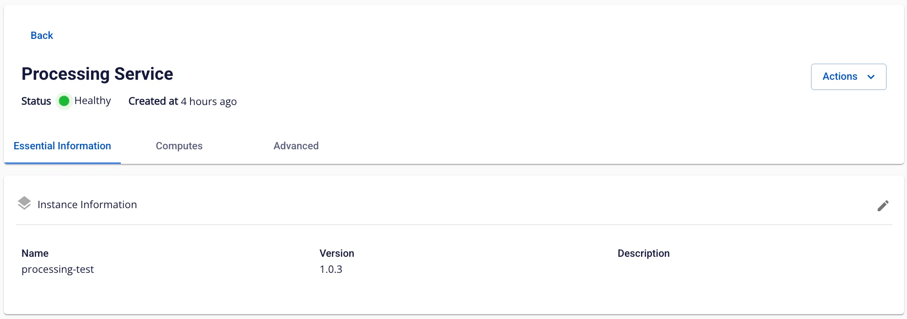
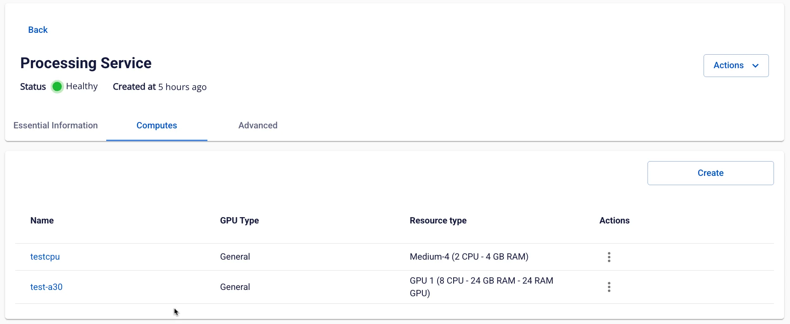

# Processing service 詳細表示

**Processing service** の情報を確認するには、以下の手順に従ってください。

**ステップ 1:** メニューバーで **Data Platform** > **Workspace Management** > **Workspace name** を選択します。

**ステップ 2:** **My Services** セクションで **Processing** service を選択します。

  * **「Essential Information」タブ**

**Processing Service** の詳細情報が表示されます。

**「Advanced」タブ**

**Processing History server** の詳細情報が表示されます。

画面に表示されている URL、ユーザー名、パスワードを使用して **Processing** history server にアクセスできます。

  * **「Compute」タブ**

Compute に関する情報が表示されます（最大 5 件まで表示）。

