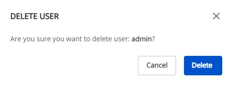

# Users の管理

**Query Engine** の **User** リストが表示されます。

 * ユーザーの追加:

   * **ステップ 1.** **Users** 画面で **Create a user** をクリックします。

   * **ステップ 2.** **User** の情報を入力します。

     * **Username**: アカウントのユーザー名

   * **ステップ 3.** **Create** をクリックしてユーザーを作成するか、**Cancel** をクリックして中止します。（ユーザー作成後、Query Engine は **Processing** 状態に移行し、約 **~3 分**で設定が完了します。）

 * **User** の詳細: **Users** 画面でユーザー名をクリックすると、Username と Password を含む詳細情報が表示されます。

 * **User** の削除:

   * ステップ 1: **Users** 画面で削除する **User** を選択し、**Action** > **Delete** を選択します。

   * ステップ 2: 確認ダイアログで削除を確定するか、操作をキャンセルします。

