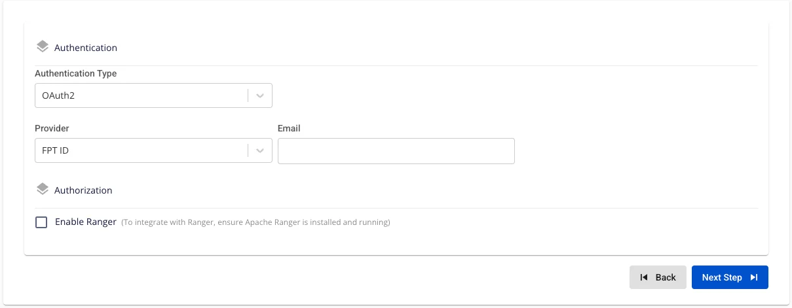
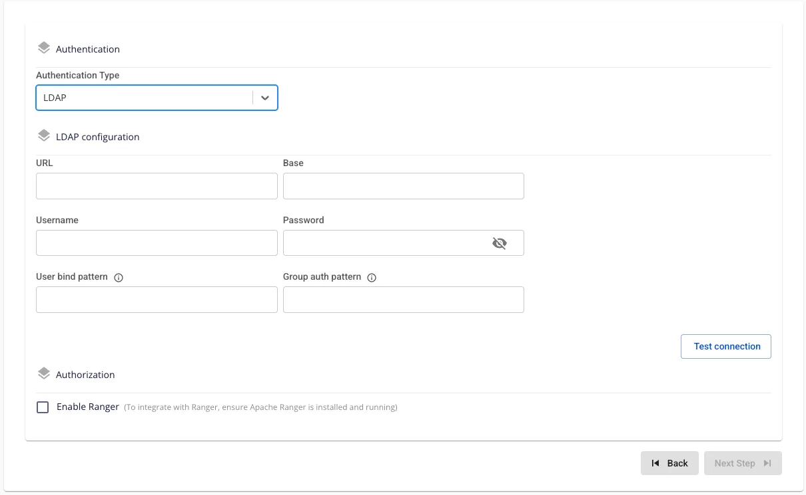

# Query Engine の作成

**FPT Query Engine** は、大規模なデータセットに対してクエリを高速かつ効率的に処理するために設計されたオープンソースの分散 SQL クエリエンジンである **Trino** を使用します。Trino を使用すると、リレーショナルデータベース、データウェアハウス、非リレーショナルデータストレージシステムなど、複数のソースからデータを移動またはコピーすることなくクエリできます。

**Query Engine** を作成するには、以下の手順に従ってください。

**ステップ 1:** メニューバーで **Data Platform** > **Workspace Management** > **Workspace name** を選択します。

**ステップ 2:** **My services** セクションで **Create** をクリックします。ポップアップが表示されたら **New service** を選択し、**Trino** を選択 > **Create** をクリックします。

**ステップ 3:** **Query Engine** 作成フォームで、**Basic Information** に以下の情報を入力します。

 * **Name**（必須）: サービス名

注意: サービス名は 1 ～ 30 文字である必要があります。小文字 a-z、大文字 A-Z、または数字 0-9 を使用できます。

 * **Description**（任意）: 説明

 * **Version**（必須）: バージョンを選択します。

**ステップ 4:** **Next** をクリックして **Node configuration** 画面に進みます。

以下の情報を入力します。

 * **Storage policy**（必須）: Query Engine のストレージを選択します。

 * **Type**（必須）: Query Engine の設定タイプを選択します。

 * **Number of coordinator**: デフォルトは 1 です。

 * **Number of workers**（必須）: ワーカー数を入力します。

**注意:** **Worker** 数は **1** 以上 **10** 以下である必要があります。

Worker の設定を自動スケールしたい場合は、**Enable worker auto scaling** にチェックを入れ、Worker の最大ノード数を入力します。

**ステップ 5:** **Next** をクリックして **Additional Properties** 画面に進みます。

以下の情報を入力します。

 * **Max memory (GB)**: Max memory の値を入力します。デフォルトは 20 です。

これは、クラスター全体でクエリが使用できる最大メモリ量です。ユーザーメモリは、ユーザーのクエリに直接関連する、またはユーザーのクエリで制御できるタスク（例: 実行中に作成されるハッシュテーブルに使用されるメモリ、ソート中に使用されるメモリなど）の実行中に割り当てられます。すべての Worker でクエリに割り当てられたユーザーメモリがこの制限に達すると、そのクエリは停止されます。
**注意:** **Max memory** の値は 1 以上である必要があります。

 * **Retry policy**: Retry policy を選択します。デフォルトは **NONE** です。

   * **NONE**: フォールトトレラント実行モードを無効にします。

   * **TASK**: エラーが発生したときにクエリ内の個々のタスクを再試行します。**exchange manager** の設定が必要です。

   * **QUERY**: エラーが発生したときにクエリ全体を再試行します。

 * **Custom Domain**

   * **目的:** サービスにアクセスするためのカスタムドメインを設定できます。

     * **パブリック Workspace の場合:** TLS の有効化/無効化なしにドメインと証明書を割り当てるために使用します（HTTPS は常に利用可能）。

     * **プライベート Workspace の場合:** ドメインと証明書に加えて、TLS/SSL を任意で有効化または無効化し、HTTPS か HTTP かを選択できます。

   * **Workspace がパブリックの場合**

     * **Custom domain**: チェックするとカスタムドメインを有効にします。

     * **Domain**: ドメイン名を入力します（例: abc.local、jupyter.example.com）。

     * **Certificate name**: **Certificate Manager** にインポートされた証明書の一覧から選択します。

     * **ボタン**:

       * **Manage certificate**: 証明書管理画面を開きます。

       * **Validate**: ドメインに対する証明書の有効性を確認します。

:::note
パブリック Workspace では **TLS/SSL certificate** オプションは**表示されません**。システムはデフォルトで HTTPS をサポートしています。
:::

   * **Workspace がプライベートの場合**

     * **Custom domain**: チェックするとカスタムドメインを有効にします。

     * **Domain**: ドメイン名を入力します。

     * **TLS/SSL certificate**: チェックするとサービスの HTTPS を有効にします。

     * **Certificate name**: 証明書の一覧から選択します。

     * **ボタン**:

       * **Manage certificate**: 証明書管理を開きます。

       * **Validate**: 証明書を確認します。

:::note
**TLS/SSL certificate** のチェックを外すと、サービスは HTTP で動作し、証明書は不要です。
:::

**ステップ 6:** **Next** をクリックして **Auth** 画面に進みます。

**Authentication Type:**

 * **Authentication Type = Basic**

   * Query Engine はベーシック認証（**Basic authentication**）で初期化されます。

 * **Authentication Type: OAuth2**

   * **Provider: FPT ID**. 以下の情報を入力します。

     * Email（必須）: 管理者アカウントとして使用する FPT メールアドレス。

   * **Provider: Google**. 以下の情報を入力します。

     * **Client ID**（必須）: アプリケーション識別子（Google Cloud → OAuth Credentials から取得）。

     * **Client Secret**（必須）: Client ID に関連するシークレット文字列。アプリケーションの認証に使用します。

     * **Email**（必須）: エンジンを初期化する管理者の Gmail または Workspace アドレス。

接続テストの前に、Google Cloud が Query Engine のリダイレクト URI を許可リストに追加済みであることを確認してください。

   * **Provider: Keycloak**. 以下の情報を入力します。

     * Auth Provider Name（任意）: プロバイダー名

     * Realm（必須）: すべてのユーザー、グループ、ロール、クライアント、その他のオブジェクトが独立して管理・保護される管理スペース。

     * Auth Server URL（必須）: クライアントが認証に使用する Keycloak サーバーのベース URL。**末尾は「/」で終わる必要があります**。

     * Client ID（必須）: Keycloak でクライアントを認証するために使用される ID コード。

     * Client Secret（必須）: Keycloak でクライアントを認証するために使用されるパスワード。

     * Email（必須）: Keycloak のメールアドレス。

 * **Authentication Type: LDAP**. 以下の情報を入力します。

   * **URL**（必須）: LDAP パス（例: ldap://ldap.example.com:389 または ldaps://ldap.example.com:636）。

   * **Base DN**（必須）: クエリルート（例: dc=example,dc=com）。

   * **Username**（必須）: 検索権限を持つバインド DN（例: cn=admin,dc=example,dc=com）。

   * **Password**（必須）: バインド DN のパスワード。

   * **User Bind Pattern**（任意）: ユーザー検索の DN パターン（例: uid={0},ou=People,dc=example,dc=com）。

   * **Group Auth Pattern**（必須）: グループクエリの DN パターン（例: cn={0},ou=Groups,dc=example,dc=com）。

 * **Authentication Type: JWT**

以下の情報を入力します。

   * **Issuer**（必須）: Query Engine が一致させる必要のある iss クレームの値。

   * **Audience**（任意）: aud クレームの値（JWT システムがこのフィールドを使用する場合）。

   * **Principal Field**（必須）: ユーザー名を含むクレーム名（通常は sub または email）。

   * **Public Key**（必須）: Query Engine が JWT 署名を検証するための PEM 形式の公開鍵（直接貼り付けまたはファイルアップロード）。

     * RSA または EC キー 2048 ビット以上を推奨します。PEM ファイルは -----BEGIN PUBLIC KEY----- で始まる必要があります。

**Authorization: Integrate Ranger**

 * **Enable Ranger** = False（Query Engine は標準モードで初期化され、Ranger からのポリシーは**適用されません**。）

 * **Enable Ranger** = True

   * **Enable Ranger** にチェックを入れる → UI に **Test connection** ボタンが自動表示されます。

   * **Test connection** をクリックして、統合のための **Ranger** への接続を確認します。Test Connection が成功した場合のみ、**Authentication type** を **Integrate Ranger** に設定して **Query Engine** を初期化できます。

Trino の認証制御および権限管理に Ranger を使用するには、**Query Engine** サービスを初期化する前に **Data Governance**（**Ranger**）サービスを初期化する必要があります。

**Ranger** の初期化は[こちら](https://fptcloud.com/documents/cloud-data-platform/?doc=tao-ranger)

**ステップ 7:** **Next** をクリックして **Review & Create** 画面に進みます。

**ステップ 8.** 入力した情報を確認した後、**Create** をクリックして完了します。

**Query Engine** の初期化は、**Worker Status** が **Succeeded** になり、**Trino** の **Status** が **Healthy** になると完了です（約 10 分）。
