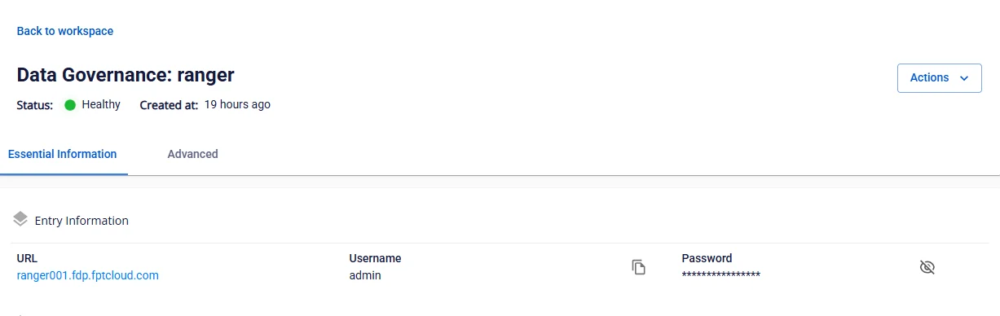
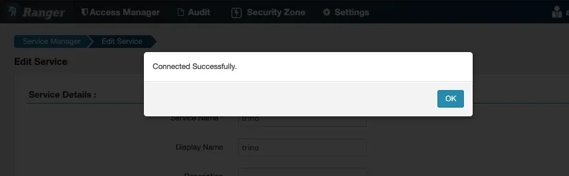

# Query Engine 管理のアクセスと設定

**前提条件**: **Query Engine** サービスが正常に初期化され、**Workspace** のステータスが **Succeeded**、**Trino** のステータスが **Healthy** であること（Query Engine サービスの初期化は**こちら**）。

**ステップ 1.** **Essential information** タブの **URL** と **Username** / **Password** を使用して **Ranger** にアクセスします。

**ステップ 2:** **Ranger Admin** から Trino Service を作成します。**Service Manager** 画面で **Resource TRINO** を選択し、**Add** アイコンをクリックします。

**ステップ 3.** **Service** の初期化情報を入力します。

 * **Service name**: サービス名（**Trino** アクセス URL に含まれる文字列で、**trino-xxxxxxxx** の形式）

 * **Display name**: 表示名

 * **Description**: 説明

 * **Active Status**: **Service** のステータス

 * **Select Tag Service**: タグサービスを選択します。

 * **Username**: Query Engine のログインアカウントのユーザー名

 * **Password**: Query Engine のログインパスワード

 * **jdbc.driverClassName**: デフォルトは io.trino.jdbc.TrinoDriver

 * **jdbc.url**: JDBC 経由の Query Engine 接続アドレス（**jdbc:trino://:443**）

 * **Superusers**: Query Engine に接続する際にアクセス制御チェックをバイパスするアカウント名

 * **Superuser groups**: Query Engine に接続する際にアクセス制御チェックをバイパスするグループ名

 * **Service admin users**: Ranger 上でサービス管理者に指定されるアカウント名

 * **Service admin usergroups**: Ranger 上でサービス管理者に指定されるグループ名

**ステップ 4.** **Service** 情報を保存します。

必要な情報をすべて入力したら、**Add** をクリックして **Query Engine** の **Service** 情報を **Ranger-Admin** に保存します。

**ステップ 5:** 接続を確認します。

 * Service Manager 画面で、作成した **Trino Service** の **Edit** アイコンをクリックし、**Test connection** をクリックします。

 * **Test connection** の結果が **Connected Successfully** と表示されたとき、**Ranger-Admin** が **Query Engine**（**Trino**）に正常に接続されていることを確認します。

