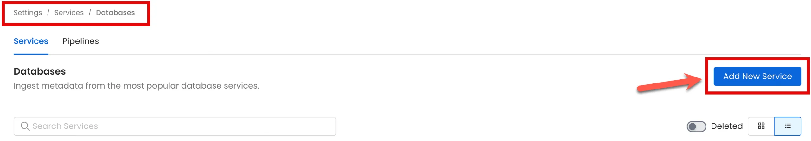
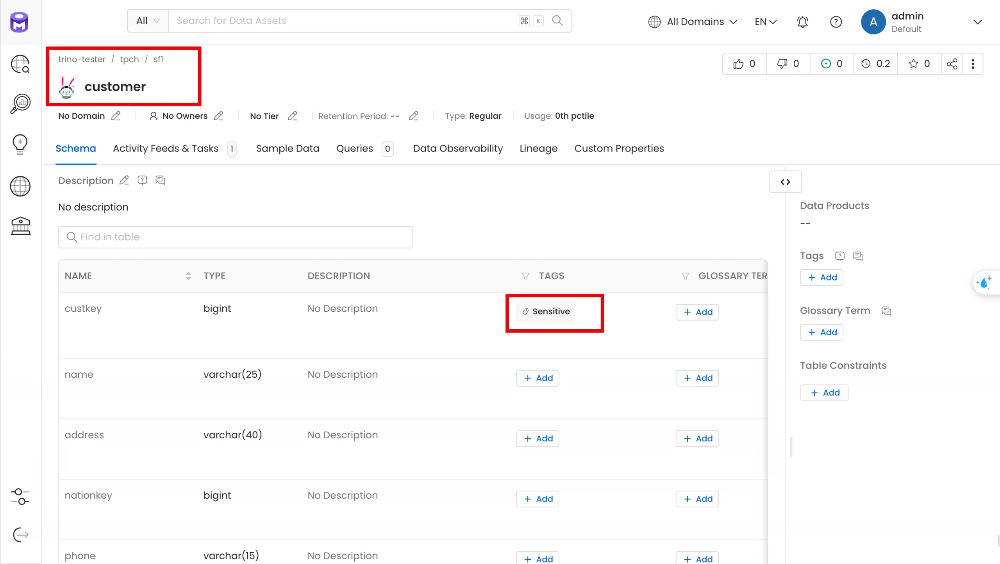
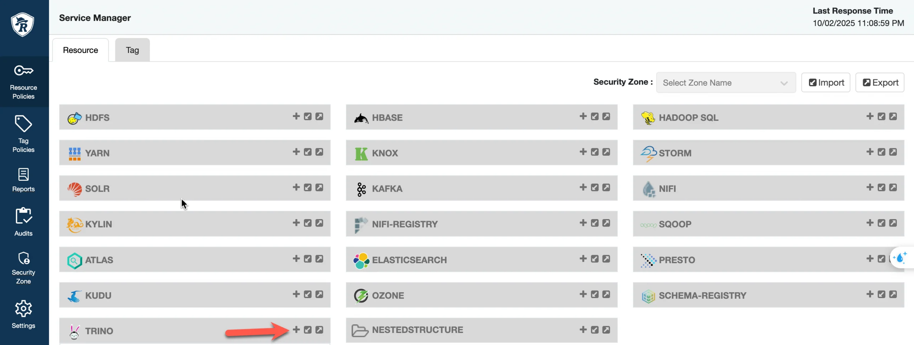
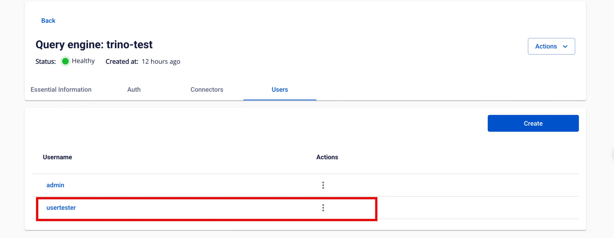
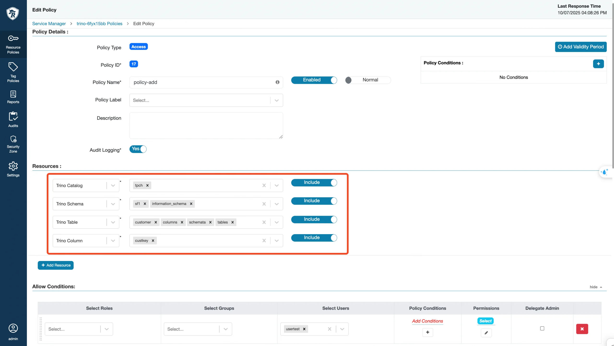
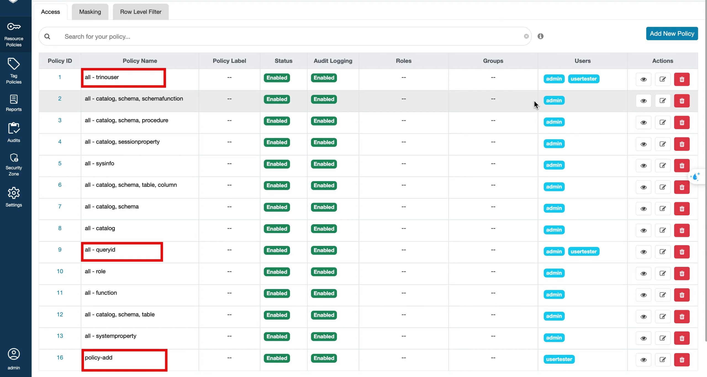
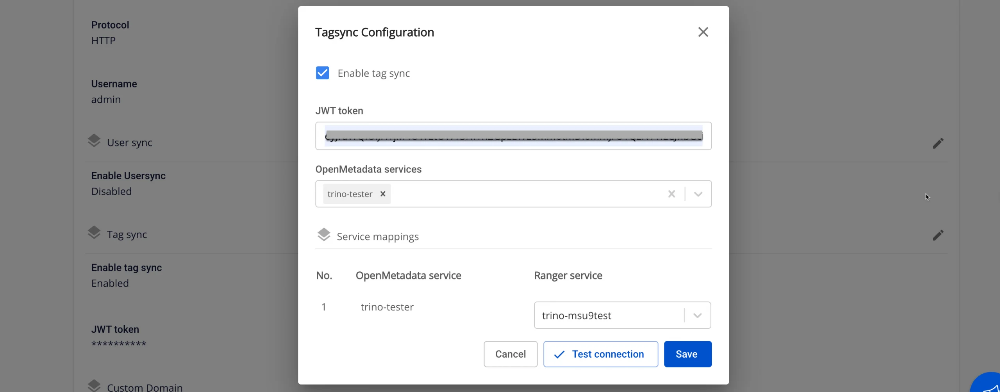
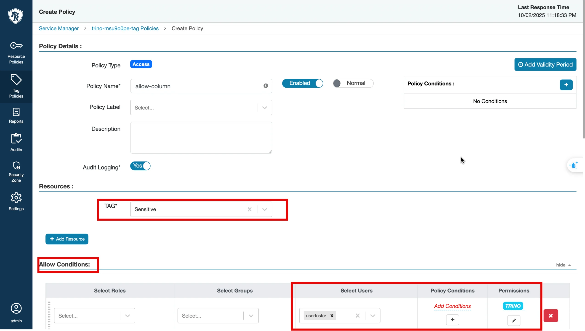

# Tag Sync (OpenMetadata & Ranger Integration)

**Tag Sync** 機能は、**OpenMetadata** から **Apache Ranger** へのタグの同期を可能にし、**Trino** においてタグに基づいた（リソースに加えた）権限管理の拡張を実現します。

**手順**

**_ステップ 1: Portal_**

Portal 上で、以下の 3 つのコンポーネントを作成する必要があります。

 1. OpenMetadata
 2. Apache Ranger
 3. Trino

**Trino クラスター**を作成する際には、**Integrate Ranger** にチェックを入れて、Trino が Ranger からの権限を使用できるようにする必要があります。

**_ステップ 2: Ranger で Trino の Resource Policies を作成する_**

**Ranger > Service Manager > Resource タブ**に移動し、作成した Trino サービスを選択します（例: trino-msu9test）。

**注意:** サービス名は Trino の cus_app_id と一致している必要があります。

これは Trino が機能し、OpenMetadata が接続テストに成功するための必須前提条件です。基本的な Resource Policies が欠けている場合、OM で Trino サービスを作成すると → Test Connection が失敗します。

**_ステップ 3: OpenMetadata で Trino Service を作成する_**

 1. **OpenMetadata > Settings > Services > Databases** に移動し、**Add New Service** をクリックします。

 2. **Trino** を選択 → **Next** をクリックします。

 3. サービスの詳細を入力します。

**Service Name**（例: trino-tester）。

**Username、Password、Host、Port**（Portal で作成した Trino クラスターを指定）。

 4. **Test Connection** をクリックします → 成功した場合は **Save** をクリックします。

 5. Trino サービスの **Ingestion** タブに移動 → **Add Ingestion** をクリックします。

Database/Schema/Table Filter Pattern を入力します。

Ingestion を実行します。

 6. Ingestion が成功すると、Trino DB が **Explore** に表示されます。

 7. **Explore > Database Trino** に移動し、カラムにタグを割り当てます（例: customer テーブルの custkey カラムに _Sensitive_ タグを付与）。

**_ステップ 4: Ranger で Tag Service と Trino Service を作成する_**

 1. **Ranger dashboard > Service Manager > Tag タブ**に移動し、**Add New Service** をクリックして先に **Tag Service** を作成します（例: trino-msu9test-tag）。

 2. **Service Manager > Resource タブ**に移動 → **Service Trino**（例: trino-msu9test）を編集します。

Trino サービスの設定で → **Select Tag Service** フィールド = trino-msu9test-tag を設定します。

 3. **Settings > Users** に移動 → **Add New User** をクリックします。

ユーザーを作成します（例: usertest）。role = User。

ユーザー名は Trino Portal で作成したユーザーと一致している必要があります。

 4. **Resource Policies** に移動 → ユーザー usertest をデフォルトポリシーに追加します。

a. デフォルトポリシーを確認/追加します。

   * **all – trinouser**

   * **all - queryid**

b. 新しいポリシーを追加します（**policy-customer-access**）。

   * Catalog = tpch

   * Schema = sf1、information_schema

   * Table = customer、columns、schemata、tables

   * Column = custkey

:::note
information_schema、columns、schemata、tables → Trino がメタデータを読み取るために必要です（show tables、describe など）。
:::

customer → アクセスを許可するビジネステーブル。

c. **Allow Conditions** でユーザー（例: usertest）を追加 → Permission = Select。

d. ポリシーを保存します。

**_ステップ 5: Ranger Service で Tag Sync を設定する_**

 1. **Data Platform > Data Governance (Ranger) > Advanced > Tag Sync** に移動します。

 2. **Enable Tag Sync** にチェックを入れます。

 3. OpenMetadata から **JWT Token** を取得します。

**Settings > Bots** に移動 → tagsync-bot を選択 → **Credentials** タブ → トークンをコピーします。

**JWT Token** フィールドに貼り付けます。

 4. **Service mappings** セクションで以下を選択します。

**OpenMetadata service** = OpenMetadata で作成した Trino サービス。

**Ranger service** = Ranger で作成した Trino サービス。

最低 1 つのマッピングが必要です。最大 5 つのマッピングまで設定できます。

 5. **Test Connection** をクリックします。

成功した場合 → _「Connection successful」_ が表示され、**Save** ボタンが有効になります。

失敗した場合 → エラーが表示され、保存できません。

 6. **Test Connection** が成功したら、**Save** をクリックして設定を保存します。

**_ステップ 6:_** **Tag Policies** に移動 → _Sensitive_ タグを選択 → **Add New Policy** をクリックします。

 1. Policy Name: allow-sensitive。

 2. Allow Conditions: user = usertest、component = TRINO、すべての権限にチェックを入れます。

 3. 保存します。

**_ステップ 7: クエリでアクセス権限をテストする_**

**_usertest には customer テーブルへのアクセス権のみが付与されており、orders テーブルへのクエリ権限はありません。_**

**ケース 1 – ユーザーが Allow 済みで custkey カラムへのクエリ権限がある場合**

 1. **DataGrip** でユーザー usertest を使用して Trino に接続します。

 2. クエリを実行します。

`SELECT custkey FROM tpch.sf1.customer LIMIT 1;`

 3. **期待される結果:** テーブルのデータが返されます。

**ケース 2 – ユーザーが Allow 済みでテーブルへのクエリ権限がない場合**

 1. **DataGrip** でユーザー usertest を使用して Trino に接続します。

 2. クエリを実行します。

`SELECT * FROM tpch.sf1.customer LIMIT 1;`

 3. **期待される結果:** クエリが拒否され、_権限なし_ のメッセージが表示されます。

**ケース 3 – ユーザーが Deny 済みで custkey カラムへのクエリ権限がない場合**

 1. 別のユーザーを作成します（例: usertest2）。

 2. custkey カラムに Personal タグを割り当てます。

 3. **Tag Policies** で → ユーザー usertest2 に対して Personal タグの Deny ポリシーを作成します。

 4. **DataGrip** でユーザー usertest2 を使用して Trino に接続します。

 5. クエリを実行します。

`SELECT custkey FROM tpch.sf1.customer LIMIT 1;`

 6. **期待される結果:** クエリが拒否され、_権限なし_ のメッセージが表示されます。
