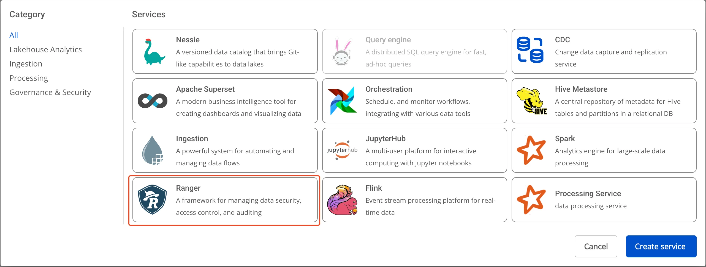
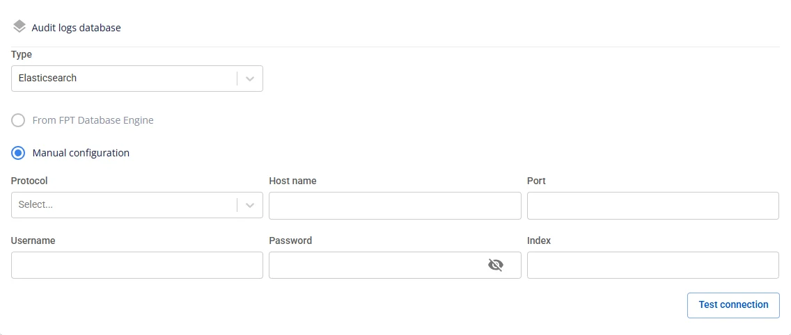
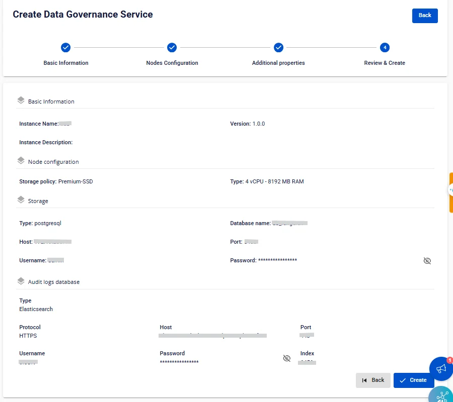

# Ranger の作成

**FPT Data Governance** は、**Query Engine**（**Trino**）向けの **Lakehouse** ソリューションにおけるセキュリティ管理およびアクセス制御ソリューションとして **Ranger** を使用します。ロールベースアクセス制御（RBAC）および属性ベースアクセス制御（ABAC）に基づく制御をサポートし、集中的かつ詳細なアクセス管理を提供します。

**Data Governance** を作成するには、以下の手順に従ってください。

**ステップ 1:** メニューバーで **Data Platform** > **Workspace Management** > **Workspace name** を選択します。

**ステップ 2:** **My service** セクションで **Create** をクリックします。ポップアップが表示されたら **New service** を選択し、**Ranger** を選択 > **Create** をクリックします。

**ステップ 3:** **Data Governance** 作成フォームで、**Basic Information** に以下の情報を入力します。

 * **Name**（必須）: サービス名

注意: サービス名は 1 ～ 30 文字である必要があります。小文字 a-z、大文字 A-Z、または数字 0-9 を使用できます。

 * **Description**（任意）: 説明

 * **Version**（必須）: バージョンを選択します。

**ステップ 4:** **Next** をクリックして **Node configuration** 画面に進みます。

以下の情報を入力します。

 * **Storage policy**（必須）: ストレージポリシーを選択します。

 * **Type**（必須）: リソース設定を選択します。

**ステップ 5.** **Next** をクリックして **Additional properties** 画面に進みます。

 * **Database**（**Data Governance** データを保存するデータベース情報。**FPT Database Engine** サービスで作成したデータベース、またはその他のデータベースを使用できます。）

**type** が **PostgreSQL** の場合:

 * **Host name**（必須）: **Postgres** のホスト名または IP アドレス

 * **Port**（必須）: 接続ポート。デフォルトは 5432 です。

 * **Database name**（必須）: データベース名

 * **Username**（必須）: **Postgres** へのアクセスアカウントのユーザー名

 * **Password**（必須）: **Postgres** へのアクセスパスワード

**Database** 情報をすべて入力したら、**Test connection** をクリックして **Workspace** から入力した **Database** への接続を確認します。

**Audit logs database** 情報を入力します。

 * **Type**（必須）: OpenSearch または Elasticsearch

:::note
**OpenSearch** の **Configure Parameters** では、ssl_http パラメーターをデフォルト値の True（HTTPS）ではなく False（HTTP）に設定する必要があります。
:::

 * **Protocol**（必須）: http または https を選択します。

 * **Host name**（必須）: アクセスアドレス

 * **Port**（必須）: 接続ポート

 * **Username**（必須）: アカウントのユーザー名

 * **Password**（必須）: パスワード

 * **Index**（必須）: インデックス

**Test connection** をクリックして **Workspace** から **Audit logs database** への接続を確認します。

**Usersync:**（LDAP/AD からユーザーとグループを Ranger に自動同期し、集中的な権限管理を可能にし、手動作成の手間を削減します。）

 * **Enable Usersync**（任意）: デフォルトは**未チェック**です。

   * **未チェック** → Ranger は LDAP を同期せず、追加フィールドは表示されません。

   * **チェック済み** → 以下の設定セクションが開きます。

 * **Enable Usersync** = チェック済みの場合、以下の情報を入力します。

   * **LDAP/AD URL**（必須）: ldap://host:port または ldaps://host:port

   * **Password**（必須）: バインドアカウントのパスワード

   * **Username**（必須）: 読み取り権限を持つバインドアカウント（例: cn=admin,dc=example,dc=com）

   * **User attribute**（必須）: Ranger でユーザー名として使用する属性（uid、sAMAccountName、cn など）

   * **User object class**（必須）: ユーザーを含むオブジェクトタイプ（person、inetOrgPerson、user など）

   * **User search base**（必須）: ユーザー検索のルート DN（例: ou=Users,dc=example,dc=com）

   * **User search filter**（任意）: 必要に応じた追加フィルター（例: (&(objectClass=person)(department=IT))）

   * **User group name attribute**（任意）: ユーザーのグループリストを格納する属性（通常は memberOf）

   * **Enable group config**: グループを同期するには Enabled を選択します。

   * **Group member attribute**（任意）: メンバーを列挙する属性（member、uniqueMember、memberUid）

   * **Group name attribute**（Enabled 時は必須）: グループ名の属性（cn）

   * **Group object class**（Enabled 時は必須）: グループのオブジェクトタイプ（groupOfNames、group など）

   * **Group search base**（Enabled 時は必須）: グループ検索のルート DN（例: ou=Groups,dc=example,dc=com）

   * **Group search filter**（任意）: 高度なフィルター（例: (&(objectClass=group)(cn=dev*))）

すべての情報を入力したら、**Test connection** をクリックして Ranger が LDAP/AD に正常に接続できることを確認します。

 * **Custom Domain**

   * **目的:** サービスにアクセスするためのカスタムドメインを設定できます。

     * **パブリック Workspace の場合:** TLS の有効化/無効化なしにドメインと証明書を割り当てるために使用します（HTTPS は常に利用可能）。

     * **プライベート Workspace の場合:** ドメインと証明書に加えて、TLS/SSL を任意で有効化または無効化し、HTTPS か HTTP かを選択できます。

   * **Workspace がパブリックの場合**

     * **Custom domain**: チェックするとカスタムドメインを有効にします。

     * **Domain**: ドメイン名を入力します（例: abc.local、jupyter.example.com）。

     * **Certificate name**: **Certificate Manager** にインポートされた証明書の一覧から選択します。

     * **ボタン**:

     * **Manage certificate**: 証明書管理画面を開きます。

     * **Validate**: ドメインに対する証明書の有効性を確認します。

:::note
パブリック Workspace では **TLS/SSL certificate** オプションは**表示されません**。システムはデフォルトで HTTPS をサポートしています。
:::

   * **Workspace がプライベートの場合**

     * **Custom domain**: チェックするとカスタムドメインを有効にします。

     * **Domain**: ドメイン名を入力します。

     * **TLS/SSL certificate**: チェックするとサービスの HTTPS を有効にします。

     * **Certificate name**: 証明書の一覧から選択します。

     * **ボタン**:

     * **Manage certificate**: 証明書管理を開きます。

     * **Validate**: 証明書を確認します。

:::note
**TLS/SSL certificate** のチェックを外すと、サービスは HTTP で動作し、証明書は不要です。
:::

**ステップ 6:** **Next Step** をクリックして **Review & Create** 画面に進みます。

**ステップ 7.** 入力した情報を確認した後、**Create** をクリックして完了します。

**Data Governance** の初期化は、**Worker Status** が **Succeeded** になり、**Ranger** の **Status** が **Healthy** になると完了です（約 10 分）。
