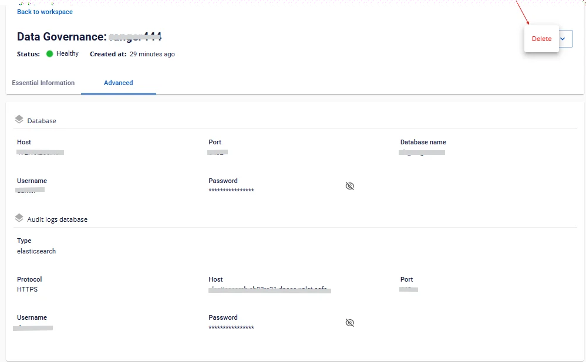

# Ranger の詳細表示

**Data Governance** の情報を表示するには、以下の手順に従ってください。

**ステップ 1:** メニューバーで **Data Platform** > **Workspace Management** > **Workspace name** を選択します。

**ステップ 2:** **My services** セクションで **Data governance** を選択します。

画面には 2 つのタブが表示されます: **Essential Information**、**Advanced**

 * **Essential Information**

ユーザーが設定した **Data Governance** の詳細情報が表示されます。

表示されている **URL**、**Username**、**Password** を使用して **Ranger** にアクセスします。

 * **Advanced**

Data Governance に設定されたデータベース情報が表示されます。

