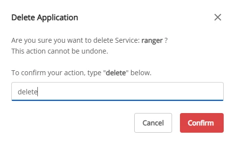

# Ranger の削除

**Data Governance** を削除するには、以下の手順に従ってください。

**ステップ 1:** メニューバーで **Data Platform** > **Workspace Management** > **Workspace name** を選択します。

**ステップ 2:** **My services** セクションで **Ranger** を選択し > 画面右上の **Action** ボタンをクリックして **Delete** を選択します。

**ステップ 3.** **Delete application** ダイアログが表示されます > **delete** と入力 > **Confirm** をクリックしてアプリケーションの削除を完了します。

