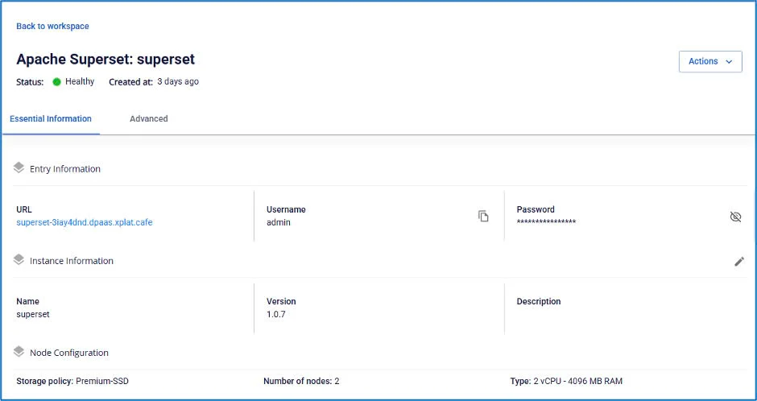
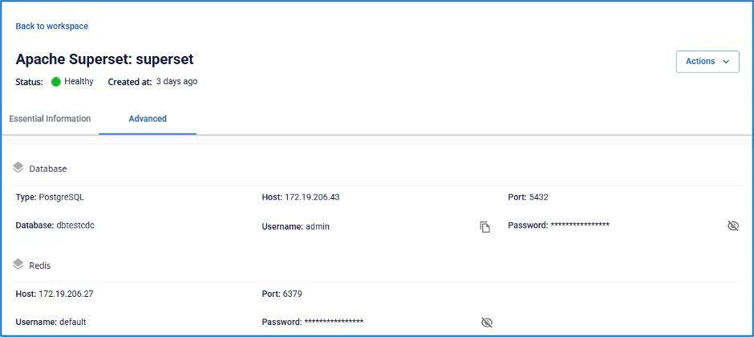

# Apache Superset情報の確認

**Apache Superset** の情報を確認するには、以下の手順に従ってください。

**ステップ 1：** メニューバーで **Data Platform** > **Workspace Management** を選択し、**Workspace name** を選択します。

**ステップ 2：** **My Services** セクションで **Apache Superset** を選択します。

**Essential Information** タブ

ユーザーが設定した **Apache Superset** の詳細情報が表示されます。画面に表示される **URL/Username/Password** を使用して **Apache Superset** にアクセスします。

**Advanced** タブ

**Apache Superset** で使用される **Database** および **SSO**（連携している場合）の情報が表示されます。

