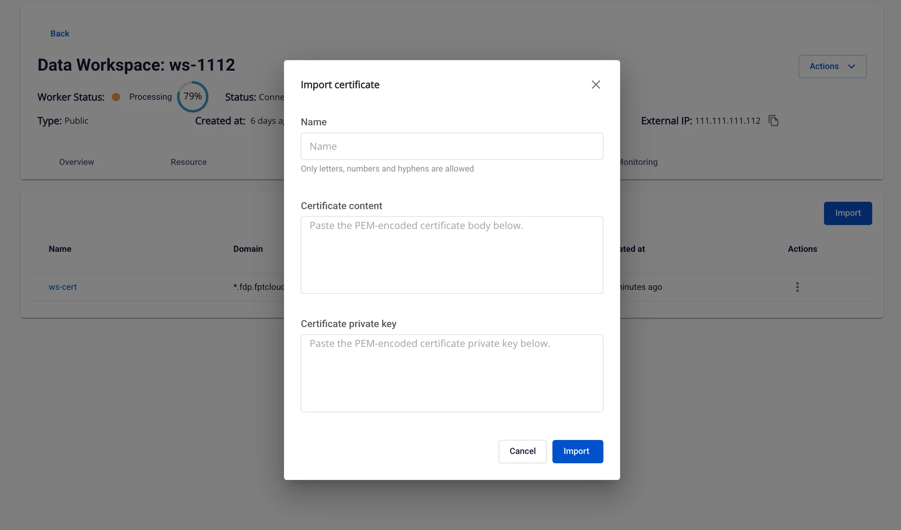
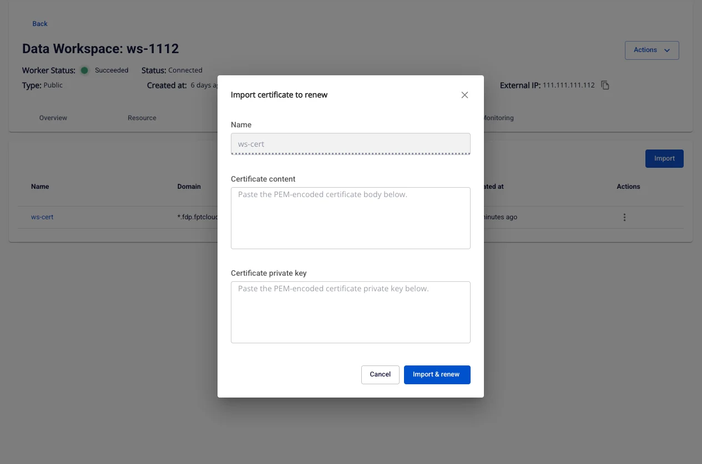
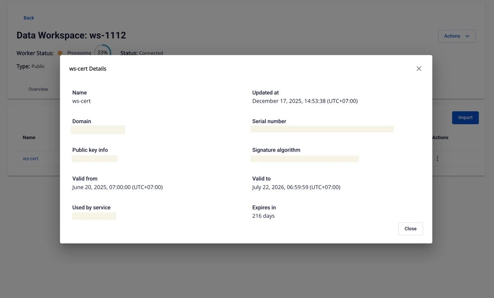

# Certificate Manager

**Certificate Manager** は、**Workspace** 内のデジタル証明書（SSL/TLS）のライフサイクルを管理するモジュールです。証明書の安全性、継続性、利便性を確保します。

主な機能：

 * 証明書の管理。

 * 証明書の更新（renew）または削除。

 * Workspace 内のサービスへの証明書の適用。

### 1\. 証明書リスト

**目的：** システムに作成された証明書のリストを表示します。

**アクセス：** Data Platform > Workspace を選択 > Certificate タブ

**証明書リストの列：**

 * **Name**：証明書名（クリックで詳細表示）。

 * **Domain**：適用ドメイン名。

 * **Used by service**：証明書を使用中のサービス。

 * **Updated at**：最終更新日時。

 * **Action**：操作メニュー（編集、削除）。

 * **Import to renew**：更新用の証明書をインポート（使用中の場合のみ利用可能）。

 * **Delete**：システムから証明書を削除。

 * **Import** ボタン：新しい証明書をインポート。

### 2\. 証明書のインポート

**目的：** 新しい SSL/TLS 証明書と private key をアップロードして使用します。

**アクセス：** Data Platform > Workspace > Certificate > Import

**手順：**

 1. **Name** を入力します（英数字とハイフンのみ、既存の名前と重複不可）。

 2. **Certificate content** を貼り付けます（PEM 形式）。

 3. **Certificate private key** を貼り付けます（PEM 形式）。

 4. **Import** をクリックします。

**システム検証チェック：**

 * 有効な PEM 形式であること。

 * 証明書が期限切れでなく、失効しておらず、有効期間内であること。

 * Private key が証明書と一致すること。

### 3\. 証明書の更新インポート

**目的：** 現在の証明書を新しい証明書に置き換えます。

**アクセス：** Data Platform > Workspace > Certificate > Import Certificate to Renew

**手順：**

 1. **Certificate content** と **Certificate private key** を入力します（PEM 形式）。

 2. **Import & renew** をクリックします。

 3. システムが更新し、使用中のサービスに即座に適用します。

**条件：**

 * 有効な PEM 形式であること。

 * 期限切れ、失効、または有効期間前でないこと。

 * Private key が証明書と一致すること。

 * 証明書が以前に更新されていないこと。

### 4\. 証明書の詳細

**目的：** 証明書の詳細情報を確認します。

**アクセス：** Data Platform > Workspace > Certificate > 証明書名をクリック

**Certificate List** で証明書名をクリックすると、システムが詳細ポップアップを開き、以下のフィールドが表示されます。

フィールド | 説明
---|---
**Name** | システム内の証明書の識別名。証明書のインポート時に設定されます。証明書を区別するために使用されます。
**Domain name** | 証明書が保護するドメインまたはワイルドカードドメイン（例：example.com または *.example.com）。使用するサービスに証明書が適切かどうかを判断するために重要な情報です。
**Public key info** | 公開鍵のタイプと長さに関する情報（例：**RSA 2048**、**RSA 4096**、**ECDSA P-256**）。鍵長が大きいほどセキュリティが高くなりますが、処理負荷も高くなります。
**Valid From** | 証明書の有効開始日時。複数の地域にデプロイする際の混乱を防ぐため、タイムゾーン付きで表示されます。
**Valid To** | 証明書の有効期限日時。この日時以降、証明書は無効となり、サービスのセキュア接続（HTTPS）エラーが発生する可能性があります。
**Expires in** | 証明書の有効期限までの残り日数。現在時刻と **Valid To** に基づいてシステムが自動計算します。タイムリーな更新の計画に役立つ指標です。
**Used by service** | この証明書を現在使用しているサービスのリスト（例：**JupyterHub**、**Ingestion API**、**Query Engine** など）。証明書が少なくとも 1 つのサービスに割り当てられている場合にのみ表示されます。
**Serial number** | 証明書の一意のシリアル番号（通常 CA（認証局）が発行）。システム内での照会、検証、管理に使用されます。
**Signature algorithm** | 証明書が使用するデジタル署名アルゴリズム（例：**SHA-256 with RSA** または **ECDSA with SHA-384**）。セキュリティレベルと処理速度に影響します。
**Updated at** | システム内で証明書が最後に更新された日時（通常は新規インポートまたは更新時）。証明書の変更履歴の追跡に役立ちます。

### 5\. 証明書の削除

**目的：** システムから証明書を削除します。

**アクセス：** Data Platform > Workspace > Certificate > Action > Delete

**手順：**

 1. 確認フィールドにキーワード **delete** を入力します。

 2. **Confirm** をクリックして削除します。

**条件：**

 * 証明書が現在使用中の場合、削除できません。

 * 誤ったキーワードを入力した場合、またはフィールドが空白の場合、システムがエラーを表示します。

