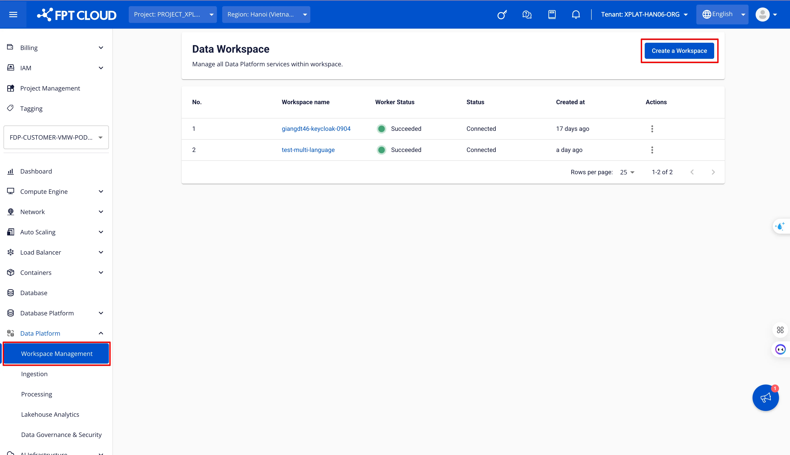

# Workspaceの作成

**Workspace** は、**Data Platform** システム上でのユーザーの作業環境です。**Workspace** の主な目的は、ユーザーがデータ関連業務を効率的かつ便利に実行できる、独立した安全な環境を提供することです。

Workspace を作成するには、以下の手順に従ってください。

**ステップ 1.** メニューバーで **Data Platform** > **Workspace Management** を選択し、**Create a Data Workspace** をクリックします。

**ステップ 2.** Workspace 作成フォームで、**Basic Information** を入力します。

 * **Name**（必須）：Workspace 名

:::warning
Workspace 名は 1〜30 文字である必要があります。英小文字 a-z、英大文字 A-Z、数字 0-9 を使用できます。Workspace 名は重複不可です。スペースは使用できません。代わりに「-」または「_」を使用してください。
:::

 * **Description**（任意）：Workspace の説明

 * **Type**（必須）：**Public** または **Private** を選択します。

 * **Subnet**（必須）：ネットワークを選択します。

Workspace は **Static Pool** オプションが有効になっている Subnet でのみ動作します。そのため、以下の手順に従って Static Pool を持つ Subnet を作成する必要があります。

**Go to Network** をクリックします。

画面が Subnet 作成画面に切り替わります。**Create Subnet** をクリックします。

Subnet 作成フォームで以下の情報を入力します。

 * **Name**：Subnet 名を入力します。

 * **Type**：Subnet のタイプを選択します。

:::warning
Type は **Routed** を選択してください。
:::

 * Network address（CIDR）：有効な CIDR を入力します。

 * Gateway IP：Gateway IP アドレスを入力します。

 * Static IP Pool（任意）：CIDR から取得した有効な IP 範囲を入力します。

:::warning
**Static IP Pool** の情報が必要です。
:::

 * **Primary DNS**：プライマリ DNS アドレス

 * **Secondary DNS**（任意）：セカンダリ DNS アドレス

 * **Add tag**（任意）：Subnet に付けるタグ

その後、**Create subnet** をクリックして Subnet の作成を完了します。

 * **LB Size**（必須）：割り当てられた LB を正しく選択します。

:::warning
**Workspace** を作成する前に、メニューから **Dashboard** を選択し、**load balancer** セクションの **detail** を確認して LB クォータを確認してください。クォータがない場合は、セールスサポートにお問い合わせください。
:::

**ステップ 3.** **Next Step** をクリックして **Worker Configuration** 画面に進みます。

**Worker Configuration** の情報を入力します。

 * **Policy**（必須）：**Service worker** の **storage policy** を選択します。

 * **Type**：デフォルト値は Medium-4（2 VCPU – 4 GB RAM）です。

 * **Number of nodes**：デフォルト値は 2 です。

**Disk（GB）**：デフォルト値は 40 です。

**ステップ 4.** **Next Step** をクリックして **Review & Create** 画面に進みます。

**ステップ 5.** 情報を確認し、**Create** をクリックして Workspace の作成を完了します。

**Worker Status** が **Succeeded** かつ Status が **Connected** になれば、**Workspace** の初期化は完了です（約 10 分）。
