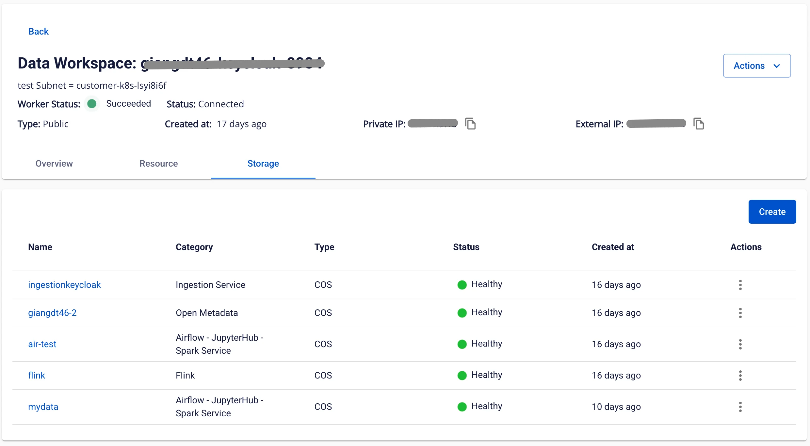

# Workspace情報の確認

Workspace の情報を確認するには、以下の手順に従ってください。

**ステップ 1.** メニューバーで **Data Platform** > **Workspace Management** を選択します。

**ステップ 2.** **workspace name** をクリックします。

画面には 3 つのタブが表示されます：**Overview**、**Resource**、**Storage**

**Overview タブ**

Workspace にインストールされているすべての **service** が表示されます。

**Resource タブ**

Workspace の **Resource** 設定が表示されます。

**Storage タブ**

**Workspace** 上の統合データソース（**Mount**）を管理します。

ストレージを作成するには、以下の手順に従ってください。

**ステップ 1.** メニューバーで **Data Platform** > **Workspace Management** を選択し、**workspace name** をクリックします。

**ステップ 2.** **Storage** タブを選択し、**Create** をクリックします。

**ステップ 3.** ダイアログボックスが表示されます。以下の情報を選択します。

 * **Category**：

   * **Airflow - Jupyterhub - Spark service**：次のサービス用のストレージ：**Airflow**、**Jupyterhub**、**Spark service**

   * **Flink**：**Apache Flink** 用のストレージ

   * **Ingestion service**：**Ingestion service** 用のストレージ

 * **Type**：ストレージタイプを選択します：**S3** または **NFS**

**ステップ 4.** **Create** をクリックします。画面がストレージ接続情報の入力フォームに切り替わります。

 * **Name**（必須）：パッケージ名

 * **Bucket name**（必須）：バケット名

 * **Endpoint**（必須）：エンドポイントアドレス

 * **Access key**（必須）：アクセスキー

 * **Secret**（必須）：シークレットキー

接続情報を入力した後、**Test connection** をクリックして **Workspace** から入力した **S3** ストレージへの接続を確認します。

**Type** が **NFS** の場合、画面が NFS ストレージ接続情報の入力フォームに切り替わります。

 * **Version**（必須）：NFS バージョン

 * **Port**（必須）：接続ポート

 * **Name**（必須）：ストレージ名

 * **Server address**（必須）：NFS サーバーアドレス

 * **Directory**（必須）：ディレクトリパス

**ステップ 5.** **Create** をクリックしてストレージの作成を完了します。
