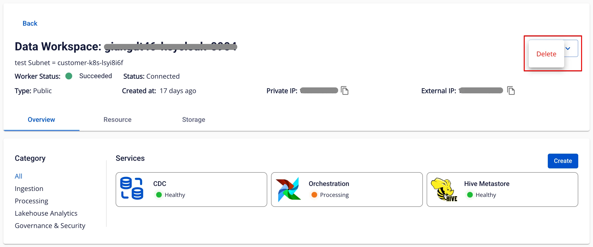
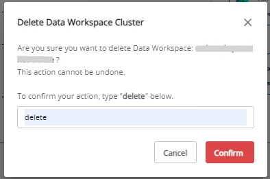

# Workspaceの削除

**前提条件**：Workspace 内に作成されたすべての Service が削除済みであること。

Workspace を削除するには、以下の手順に従ってください。

**ステップ 1.** メニューバーで **Data Platform** > **Workspace Management** を選択し、**workspace name** をクリックします。

**ステップ 2.** Workspace 詳細画面で **Action** をクリックし、**Delete** を選択します。

**ステップ 3.** **Delete Data Workspace Cluster** ダイアログボックスが表示されます。**delete** と入力し、**Confirm** をクリックして Workspace の削除を完了します。

