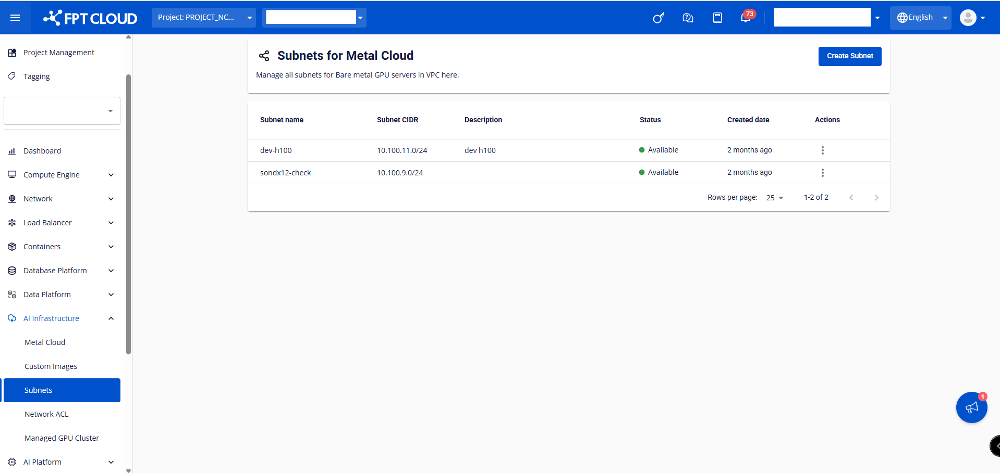
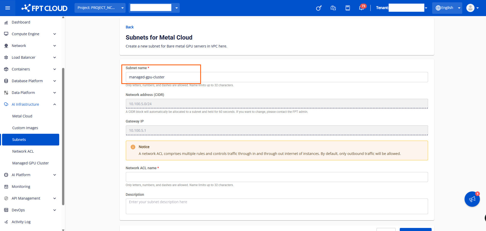
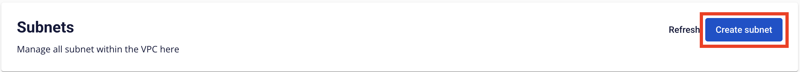
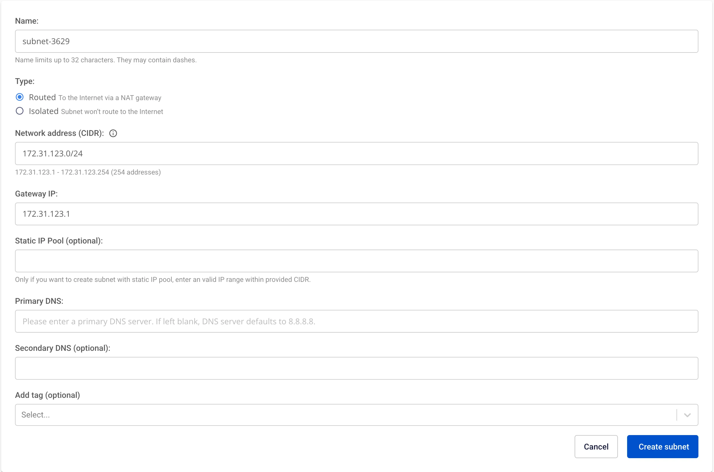

Initial Setup

MANAGED GPU CLUSTERを初めてご利用の場合は、まず以下の作業を確認・完了してください。

### 1\. FPT Cloudアカウントの作成とFPT Portalへのログイン

FPT Cloudアカウントを登録するには、[こちら](<https://fptcloud.com/>)のホームページにアクセスしてください。

次に**Sign Up**を選択し、システムの指示に従って必要な情報を入力してください。その後、サポートチームよりご連絡し、情報を確認してアカウントを作成いたします。

FPT Portalにログインするには、[console.fptcloud.com](<https://console.fptcloud.com/>)にアクセスしてください。

提供されたアカウントとパスワードでログイン後、正しいTenant、Region、VPCを選択してください。

上記情報が不明な場合や、3回試行してもシステムがエラーを返す場合は、すぐにサポートチームにお問い合わせください。

:::warning
AI Factoryサービスを利用するには、アカウントに2段階認証（MFA）が設定されている必要があります。
:::

### 2\. Managed GPU ClusterのBare Metal GPU Server用Subnetの作成

Managed GPU Clusterを作成するには、まずBare Metal GPU Server上のSubnet範囲が必要です。これらのマシンはK8s ClusterのWorkerノードとして機能します。Worker Bare Metal GPUのIPv4アドレスはこのSubnetから動的に割り当てられます。

**ステップ1：** [AI Infrastructure]に移動し、[Subnets]を選択し、[Create Subnet]を選択します。

**ステップ2**: Subnetに付けたい名前を入力します。

**ステップ3：** Subnetに対応するNetwork ACLの名前を入力します。

**ステップ4**: [Create Subnet]をクリックして、Bare Metal GPU用のSubnet作成プロセスを完了します。

:::warning
Subnetのデフォルトで作成されるNetwork ACLは、すべてのインバウンドトラフィックをブロックし、すべてのアウトバウンドトラフィックを許可します。Managed GPU ClusterでLoad Balancerを使用するには、Load Balancer SubnetのSubnet範囲に適切なルールを開いて接続を許可する必要があります。
:::

### 3\. Load Balancer用Subnetの作成

Managed GPU ClusterはStatic Poolオプションが有効なSubnetでのみ動作するため、以下の手順でStatic PoolのSubnetを作成する必要があります。

**ステップ1：** **Network**セクションで**Subnets**タブを選択します。

**ステップ2**: **Subnets Management**ページで**Create Subnet**を選択します。

 **ステップ3：** 以下の情報を入力します。

  * **Name：** Subnetのわかりやすい名前を入力します。
  * **CIDR：** 有効な**CIDR**を入力します。
  * **Advanced settings**オプションにチェックを入れます。
  * **Static IP Pool：** CIDRから取得した有効なIP範囲を入力します。

**Save**を選択して新しいSubnetを作成します。システムが処理を行い、結果を通知します。

### 3\. Managed GPU Clusterサービスのアクティベーションとリソースクォータの割り当て申請

FPT Cloudを初めてご利用の場合、一部のサービスがアカウントで有効になっていない場合があります。サポートチームにご連絡いただき、ご希望のサービスと設定の情報をご提供ください。Managed GPU Clusterサービスの利用開始に必要なRAM、CPU、Storage、Public IPなどのリソースを割り当てます。

サポートチームへのお問い合わせ：

**ホットライン**: 1900638399

**メール**: support@fptcloud.com
