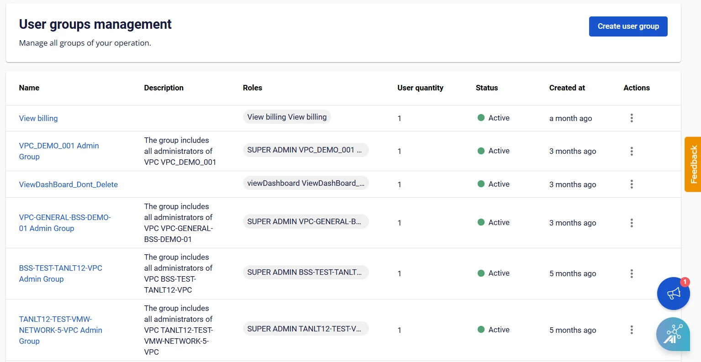

ユーザーグループ一覧の表示

**User Groups Management** ページで、作成済みのユーザーグループの一覧を表示・管理できます。

**User Groups Management** を開くには、以下の手順に従ってください。

FPT Portalの **IAM** セクションで **User Group** を選択します。システムは以下の重要な情報を含むユーザーグループ一覧を表示します：

Name、Description、Roles、User quantity、Created at、Actions

