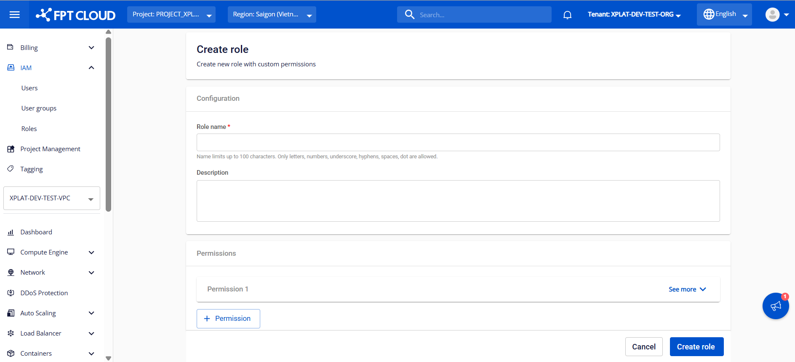

Role管理

RoleはFPT Cloud PortalのIAMモジュールの中核コンポーネントです。**Role管理**機能により、システム管理者はFPT Database Engineサービスを使用するユーザーに対して、特定のアクセス権限（permissions）を持つRoleを定義・割り当てることができます。

Roleを使用することで、詳細なアクセス制御によるセキュリティの強化、最小権限の原則の適用、および個々のニーズや運用モデルに応じた権限の分離が実現します。

以下の手順では、新しいRoleを作成し、そのRoleに対応するアクセス権限（permissions）を割り当てるための詳細な手順を説明します。

### ステップ1：Role管理ページへのアクセス

FPT Cloud Portalにログインします。ログイン成功後、メインメニューから**IAM** > **Roles**を選択します。**Role Management**インターフェースに既存のRoleのリストが表示され、Roleの作成、編集、削除のオプションも表示されます。

### ステップ2：新しいRoleの作成

**Role Management**ページで**Create role**をクリックします。新しいRole作成画面が以下のように表示されます。

基本情報を入力します。

  * **Role name**：IAMシステム内でRoleを識別するための名前。最大100文字で、文字、数字、アンダースコア（_）、ハイフン（-）、スペース、ドット（.）を使用できます。必須フィールドです。
  * **Description**：使用目的、権限の範囲、または適用されるユーザーグループを説明します。このフィールドにより、管理と監査がより明確になります。
  * **Permissions**：Roleに割り当てられた権限のリスト。
    * **Permission 1**：Roleに追加された権限を表示します。**See more**をクリックして権限の詳細を確認し、権限の設定を編集します。
    * **\+ Permission**：このボタンをクリックして新しい権限をRoleに追加します。機能ごとに権限を選択できます。

Permissionの設定の詳細についてはステップ3をご参照ください。

### ステップ3：Roleへの権限の設定

**See more**をクリックして、Permissionに必要な情報フィールドを表示します。

  * **Service Type**：割り当てる権限または操作に対応するサービスタイプを選択します。FPT Database Engineサービスでは、主に_「ManageDatabase」_と_「FDE」_の2つのService Typeを使用します。
    * **ManageDatabase**：情報の閲覧、データベースのプロビジョニング・運用、アドオンサービスの管理など、標準的なデータベース管理活動の権限を提供します。
    * **FDE**：データベース管理者アカウントのパスワード情報の閲覧や管理など、データベースに関するセンシティブな操作の権限を提供します。

Service Typeを選択すると、システムは**Action**セクションに対応するすべてのアクションを自動的に表示し、選択したService Typeに従ってPermission名を更新します。

  * **Action**：Roleが実行を許可されているアクションを定義します。**See more**をクリックして、Roleに付与するアクションを確認・選択します。選択されていないアクションは権限が付与されず、システムによってブロックされます。
  * **Resource**：Roleがアクセスを許可されているリソースを定義します。**See more**をクリックして、Roleに付与するリソースを確認・選択します。選択されていないリソースは権限が付与されず、システムによってブロックされます。2つのオプションがあります。
    * **All**：すべてのリソースへのアクセスを許可します。このオプションを選択すると、デフォルトでRoleはすべてのリソースにアクセスできます。
    * **Specific**：リストから選択した特定のリソースごとにアクセス権限を付与します。
:::warning
このオプションで**管理者アカウントのパスワード閲覧をブロック**する権限を付与する場合（Service TypeがFDEでアクションが「FDE:hide_admin_password」）、**Select resource**フィールドでブロックするデータベースを選択する必要があります。選択されたデータベースのみパスワード閲覧が制限され、選択されていないデータベースはパスワードの閲覧が許可されます。
:::

必要な情報をすべて入力したら、**Create role**をクリックしてRole作成プロセスを完了します。

作成が成功すると、新しいRoleが**Active**ステータスで管理リストに表示され、ユーザーへの権限付与の準備が整います。権限付与の手順については、[User Group管理](<https://fptcloud.com/documents/managed-fpt-database-engines-new/?doc=user-group-management>)セクションをご参照ください。

必要に応じて、作成済みのRoleに対して以下の操作を実行できます。

  * **Roleの編集**：この機能を使用すると、アクセス要件やセキュリティポリシーの変更があった場合に、Roleの名前、説明、権限を変更できます。この機能を使用するには、**Role Management**ページで編集するRoleに対応する**Edit role**アクションを選択します。変更を加えて**Save**をクリックして保存します。

  * **Roleの削除**：この機能を使用すると、使用されなくなったRoleを削除でき、アクセス管理システムを整理して正確に保つことができます。**Role Management**ページで削除するRoleに対応する**Delete**を選択します。警告ダイアログでアクションを確認して完了します。
:::warning
**Roleを削除すると、そのRoleが現在割り当てられているユーザーおよびユーザーグループのアクセス権限に影響します**。Roleが削除されると、関連する権限が即座に取り消され、クラウドリソースおよびDBaaSの管理・運用に支障が生じる可能性があります。削除を実行する前に、このRoleがいかなるUser GroupまたはUserにも割り当てられていないことを確認してください。
:::
