Quản lý Subnets

**Subnets** là một mạng con được tạo ra trong VPC của bạn. Nó tương đương với mạng LAN ở hệ thống vật lý. Bạn có thể đính kèm một hoặc nhiều **Subnet** vào máy ảo tùy vào nhu cầu.

## Tạo mới Subnet
Để tạo mới một **Subnet** bạn thao tác như sau:

**Bước 1**: Ở menu chọn **Networking** > **Subnets**. Chọn **Create subnet**.

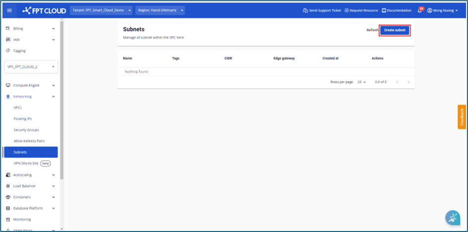

**Bước 2**: Nhập các thông tin hệ thống yêu cầu:

  * **Name**: Nhập Tên gợi nhớ của Subnet.

  * **Type**: Hiện tại đang hỗ trợ 2 loại:

    * **Routed**: Mạng con sẽ định tuyến với Internet thông qua cổng NAT

    * **Isolated**: Mạng con sẽ không định tuyến với Internet

  * **Network Address (CIDR)**: Nhập **CIDR** hợp lệ.

  * **Gateway IP**: Nhập địa chỉ **Gateway** hợp lệ

  * **Static IP Pool (optional)**: Nhập dải IP bạn muốn sử dụng, nếu không nhập hệ thống sẽ lấy toàn bộ IP từ **CIDR**.

  * **Primary DNS**: Nhập địa chỉ DNS theo định dạng IPv4. Nếu không nhập, hệ thống sẽ tự động tạo giá trị mặc định là 8.8.8.8.

  * **Secondary DNS (optional)**: Nhập Secondary DNS theo định dang địa chỉ IPv4. Nếu không nhập, hệ thống sẽ tự động tạo giá trị mặc định là 8.8.8.8.

  * **Add tag (optional)**: Chọn thẻ để gắn cho subnet

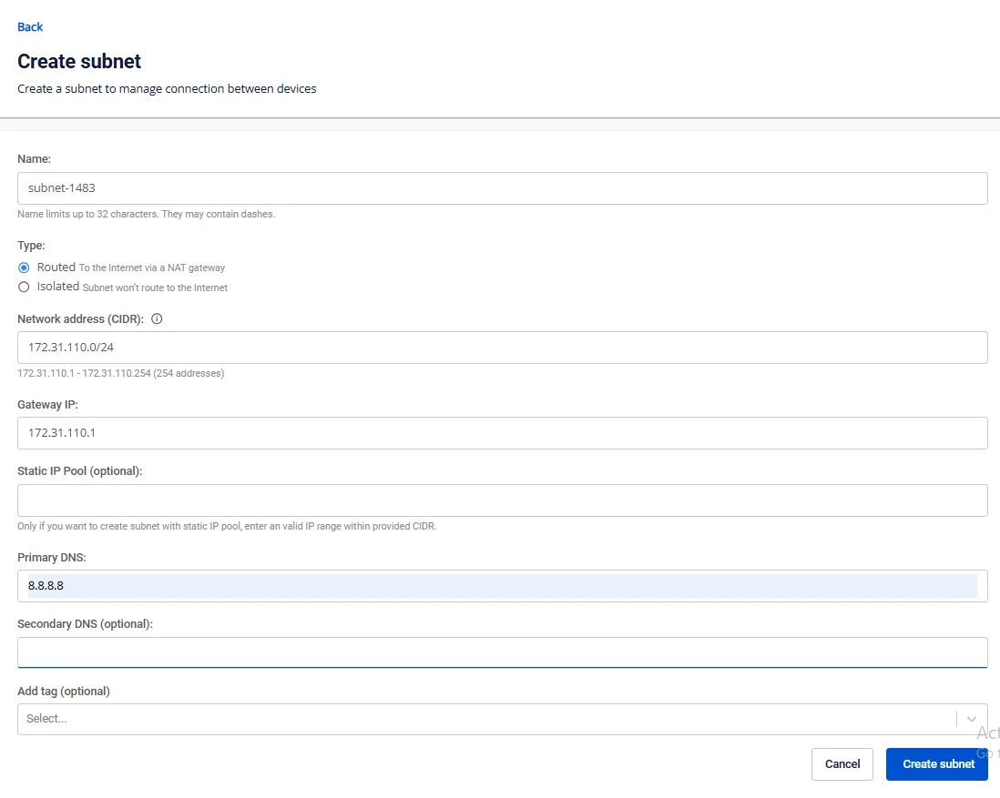

**Bước 3**: Chọn **Create subnet** để tạo Subnet mới. Hệ thống sẽ tiến hành xử lý và thông báo kết quả

Nếu thành công, **Subnet** vừa tạo sẽ được hiển thị ở bảng **Subnets**.

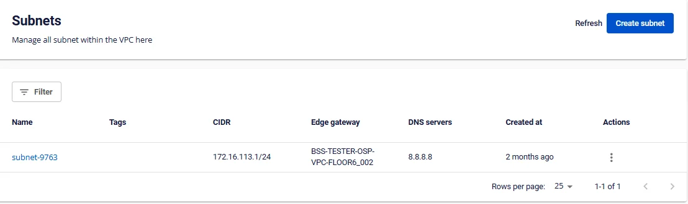

## Xem chi tiết Subnet
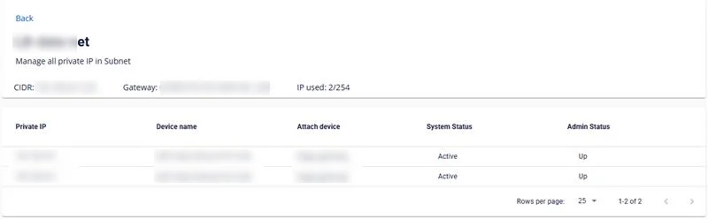

Cho phép xem 1 số thông tin của Subnet:

  * Subnet name
  * CIDR
  * Gateway (chỉ hỗ trợ VPC type Specific)
  * IP Used
  * IP List

    * Private IP

    * Device Name: thông tin IP đang gắn với Instance hoặc Load Balancer (chỉ hỗ trợ VPC type Specific). Nếu là Instance, device name là thông tin host name của Instance. Nếu là Load Balancer, device name là thông tin Load Balancer name

    * Attach device

    * System Status

    * Admin Status

## Đổi tên Subnet
**Bước 1**: Ở menu chọn **Subnets** , trong phần **Actions** của subnet cần đổi tên > Chọn **Rename**

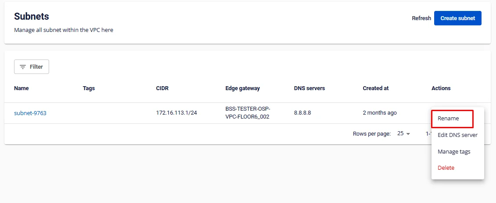

**Bước 2**: Modal **Rename subnet** hiện lên, người dùng tiến hàng đổi tên và nhấn **Rename subnet** để lưu thay đổi

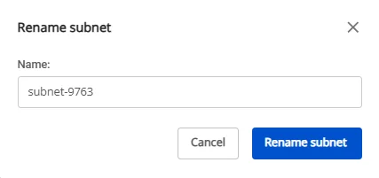

## Chuyển subnet từ Isolated sang Routed
Người dùng thao tác như sau:

**Lưu ý: Tính năng này chỉ hỗ trợ trên các VPC có duy nhất một Gateway. Nếu VPC của người dùng có nhiều Gateway vui lòng liên hệ đội hỗ trợ để được hỗ trợ xử lý.**

**Bước 1**: Ở menu chọn **Subnets** , sau đó chọn **Actions** > **Edit to Routed**

**Bước 2**: Một hộp thoại hiện lên, người dùng xác nhận và nhấn **Change to routed** để thực hiện thay đổi

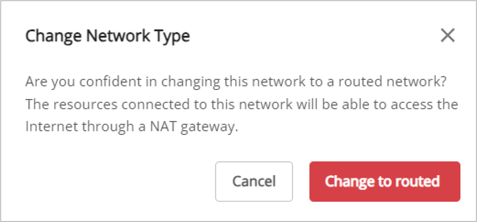

**Bước 3**: Sau khi người dùng thực hiện thay đổi thành công

Hệ thống cập nhật thông tin trên màn hình danh sách subnet với **Type** và **Edge gateway**

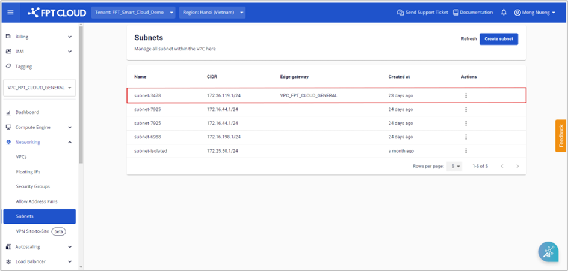

## Thay đổi thông tin DNS server
**Bước 1**: Ở menu chọn **Subnets** , tại subnet cần thay đổi DNS server, chọn **Actions** > Chọn **Edit DNS server**.

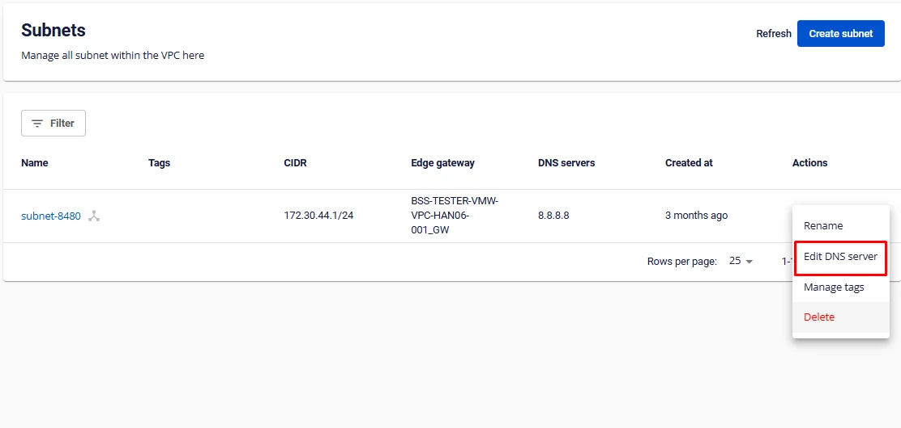

**Bước 2**: Nhập thông tin DNS server cần đổi và nhấn **Edit DNS** để cập nhật

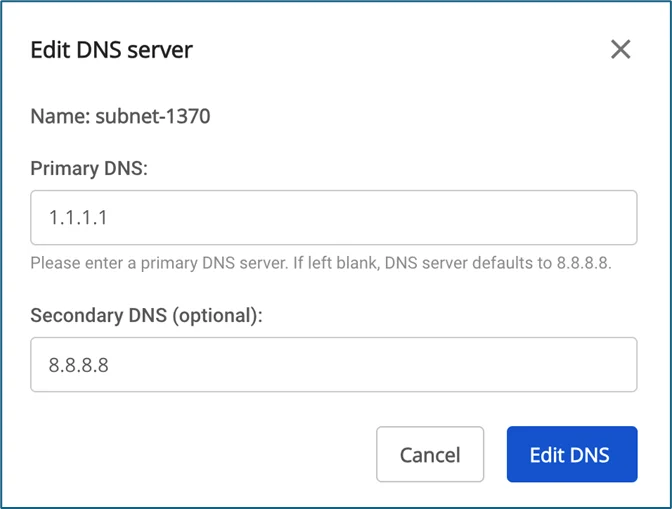

## Manage tags cho Subnet
**Bước 1**: Ở menu chọn **Subnets** , tại subnet gắn tag, chọn **Actions** > Chọn **Manage tags**.

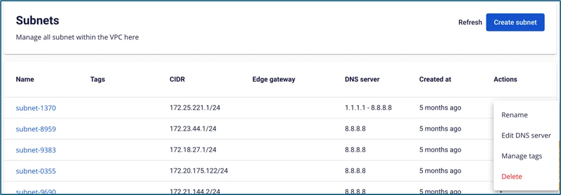

**Bước 2**: Chọn tag trong danh sách và nhấn **Save** để cập nhật

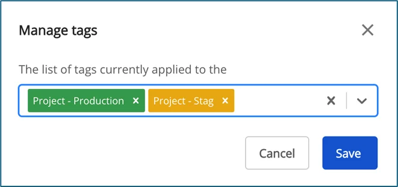

## Tạo private IP (IP Port)
_Tính năng chỉ hỗ trợ cho người dùng General_

Tính năng IP Port: tạo ra các địa chỉ private IP, người dùng có thể chỉ định giữ lại địa chỉ IP để sử dụng cho các mục đích khác nhau.

**Bước 1**: Ở menu chọn **Subnet** , hệ thống sẽ hiển thị ra danh sách Subnet tương ứng

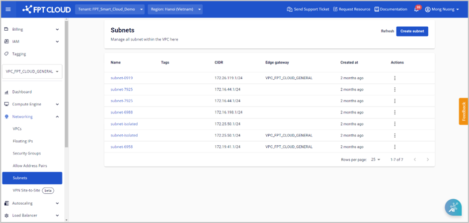

**Bước 2**: Người dùng nhấn vào chi tiết của một subnet. Nhấn vào **Create private IP**

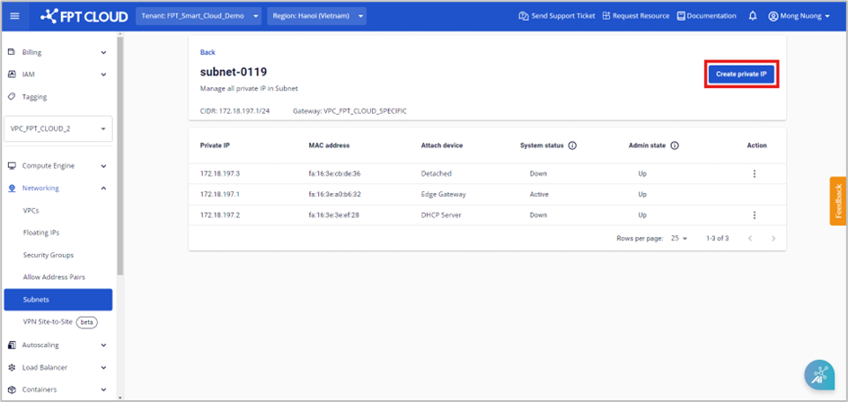

**Bước 3**: Một hộp thoại hiện lên, người dùng nhập các thông tin sau:

  * **Subnet name**: Hệ thống hiển thị mặc định subnet name của người dùng và không thể chỉnh sửa được.

  * **IP address**: Người dùng nhập vào địa chỉ IP hợp lệ và thuộc vào subnet

  * **MAC address**: Người dùng nhập vào địa chỉ MAC (trường không bắt buộc)

**Lưu ý: Địa chỉ IP của người dùng được tạo ra sẽ ở trạng thái đang bật (Up)**

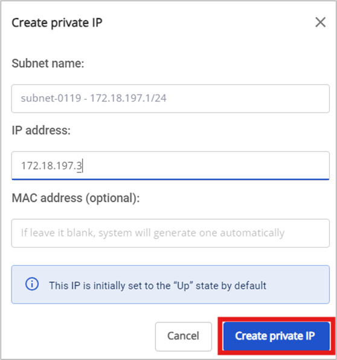

**Bước 4**: Người dùng nhấn **Create Private IP** để tạo địa chỉ IP. Hệ thống sẽ tiến hành khởi tạo và thông báo kết quả. Địa chỉ private IP sau khi được khởi tạo sẽ được hiển thị ở trang chi tiết Subnet

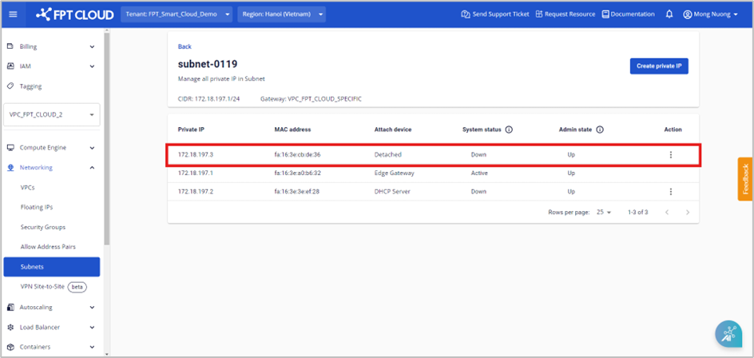

## Disable admin state
**Bước 1**: Ở menu chọn **Subnet** , sau đó chọn chi tiết của một Subnet cụ thể. Người dùng chọn một địa chỉ private IP có **Admin State** là **Up** > chọn **Actions**

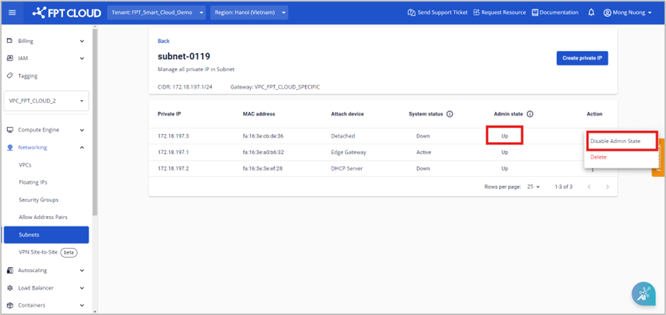

**Bước 2**: Người dùng chọn **Disable admin state**. Hệ thống sẽ **tắt** địa chỉ private IP (Admin State từ Up chuyển sang Down) và cập nhật trạng thái này trên màn hình chi tiết của Subnet

## Enable admin state
Lưu ý: Nếu private IP của người dùng đang được sử dụng cho [Allow address pair](<https://fptcloud.com/documents/cloud-server/?doc=allow-address-pair>) , thì không thể thực hiện hành động “Enable admin state”

**Bước 1**: Ở meu chọn **Subnet** , sau đó chọn chi tiết của một Subnet cụ thể. Người dùng chọn một địa chỉ private IP có **Admin State** là **Down** > chọn **Actions**

**Bước 2**: Người dùng chọn **Enable admin state**. Hệ thống sẽ **bật** địa chỉ private IP (Admin State từ Down chuyển sang Up) và cập nhật trạng thái đó trên màn hình chi tiết của Subnet.

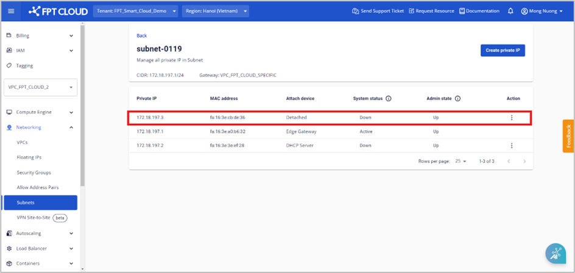

## Delete private IP
Xóa địa chỉ private IP khi không có nhu cầu sử dụng

**Bước 1**: Ở meu chọn **Subnet** , chọn vào chi tiết của một Subnet. Người dùng chọn một địa chỉ private IP đang có **Admin State** là **Up** > chọn **Actions**

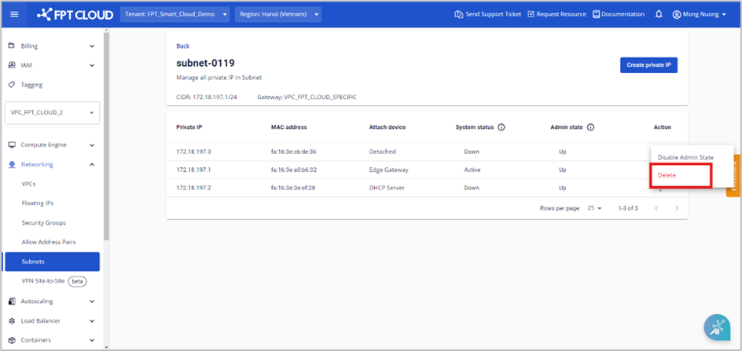

**Bước 2**: Người dùng nhấn **Delete**. Một hộp thoại cảnh báo xuất hiện nhằm xác nhận lại hành động. Người dùng xác nhận bằng cách nhấn vào nút **Yes, delete it**.

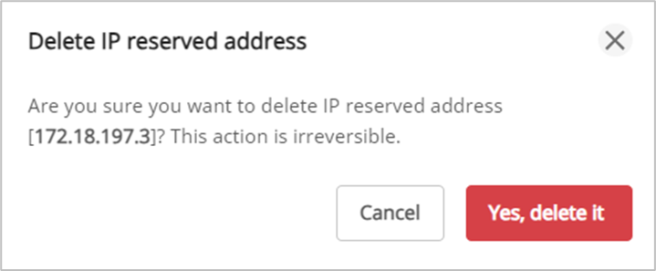

Lưu ý: Nếu địa chỉ private IP đang được sử dụng hoặc IP address đang được gắn vào address pair thì không thể xóa được.

Trường hợp người dùng muốn xóa thì vui lòng gỡ IP khỏi allow address pair trước

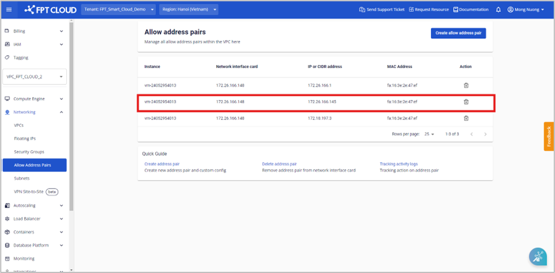

__

_Hình 172.26.166.145 đang được gắn vào allow address pair_

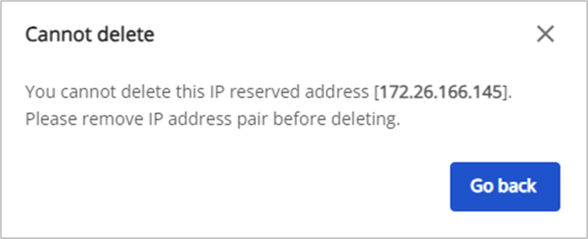

__

_Modal cảnh báo không thể thực hiện hành động xóa_

## Xóa Subnet khỏi VPC
**Lưu ý: Cần gỡ toàn bộ máy ảo khỏi Subnet để thực hiện thao tác này**

Nếu không còn nhu cầu sử dụng, bạn có thể xóa **Subnet** khỏi VPC. Để xóa **Subnet** bạn thao tác như sau:

**Bước 1**: Ở menu chọn **Subnets** , trong phần **Actions** của subnet cần đổi tên > Chọn **Delete**.

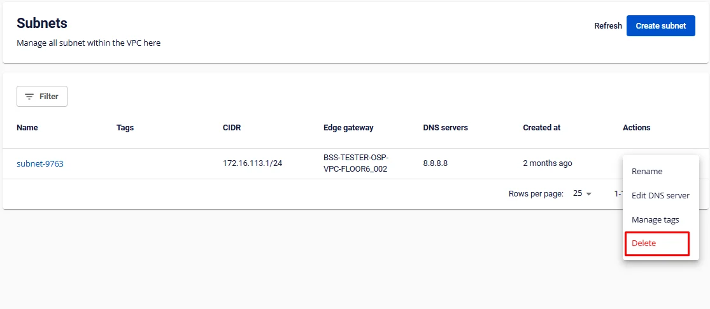

**Bước 2**: Hệ thống sẽ hiển thị popup xác nhận thông tin. Để đồng ý xóa, chọn **Delete network**.

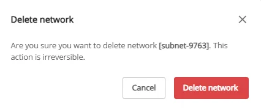

## Quản lý subnet của Load Balancer

Lưu ý: Tính năng này chỉ dành riêng cho một số Tenant có cấu hình đặc biêt, vui lòng liên hệ để được hỗ trợ.

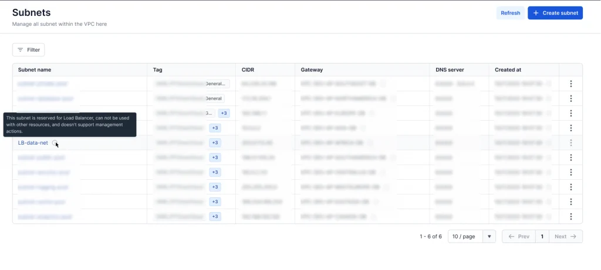

  * Các subnet của Load Balancer có tên là **LB-data-net**. Đây là subnets được dành riêng cho Load Balancer, không thể được sử dụng với các tài nguyên khác và không hỗ trợ các thao tác quản lý.

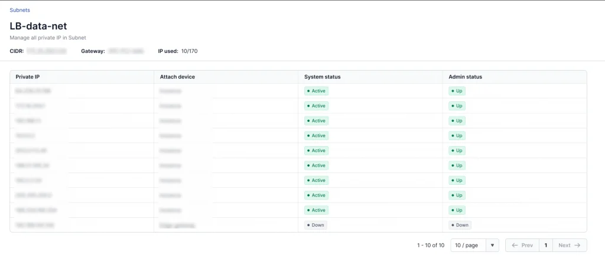

  * Vào chi tiết 1 subnet của Load Balancer tại trang quản lý subnet để quản lý danh sách IP đang sử dụng trong subnet
