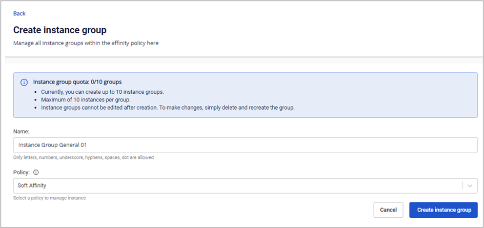
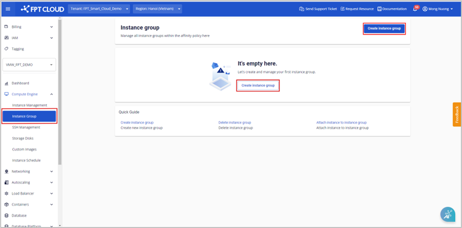

Khởi tạo một Instance Group mới

### Đối với người dùng sử dụng tài nguyên loại General
Người dùng có thể khởi tạo một instance group mới với các thao tác:

**Bước 1**: Ở menu chọn **Compute Engine** > **Instance Group** , chọn **Create instance group**.

**Bước 2**: Nhập các thông tin theo yêu cầu của hệ thống:

  * **Name**: Tên instance group.

  * **Policy**: Tùy chọn chính sách Soft Affinity hoặc Soft Anti Affinity để áp dụng cho instance group người dùng đang tạo

**Lưu ý: Hệ thống hỗ trợ tạo tối đa 10 instance groups, và mỗi instance group chỉ có thể gắn với tối đa 10 instances.**

**Bước 3**: Chọn **Create instance group**. Hệ thống sẽ tiến hành khởi tạo và thông báo kết quả.

Nếu thành công, instance group mới sẽ được hiển thị ở trang **Instance Group**.

**Lưu ý: Hệ thống không hỗ trợ chỉnh sửa instance group trên resource general, chỉ hỗ trợ xóa để tạo lại instance group mới.**

### Đối với người dùng sử dụng tài nguyên loại Specific
Đối với loại tài nguyên specific, khởi tạo một instance group với các thao tác sau:

**Bước 1**: Ở menu chọn **Compute Engine** > **Instance Group** , chọn **Create instance group**.

**Bước 2**: Nhập các thông tin theo yêu cầu của hệ thống:

  * **Name**: Tên instance group.

  * **Policy**: Tùy chọn chính sách Soft Affinity hoặc Soft Anti Affinity để áp dụng cho instance group người dùng đang tạo

  * **Instances**: Người dùng cần chọn ít nhất 2 instance để tạo instance group

**Lưu ý:**

  * Danh sách instance chỉ liệt kê các máy ảo có trạng thái: Running, Stopped.

  * Mỗi VPC được tạo tối đa 10 instance group, mỗi instance group tối đa 10 instance.
