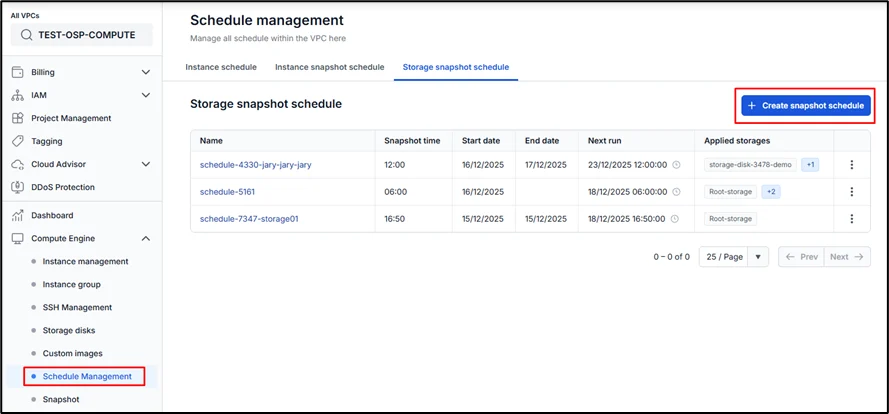
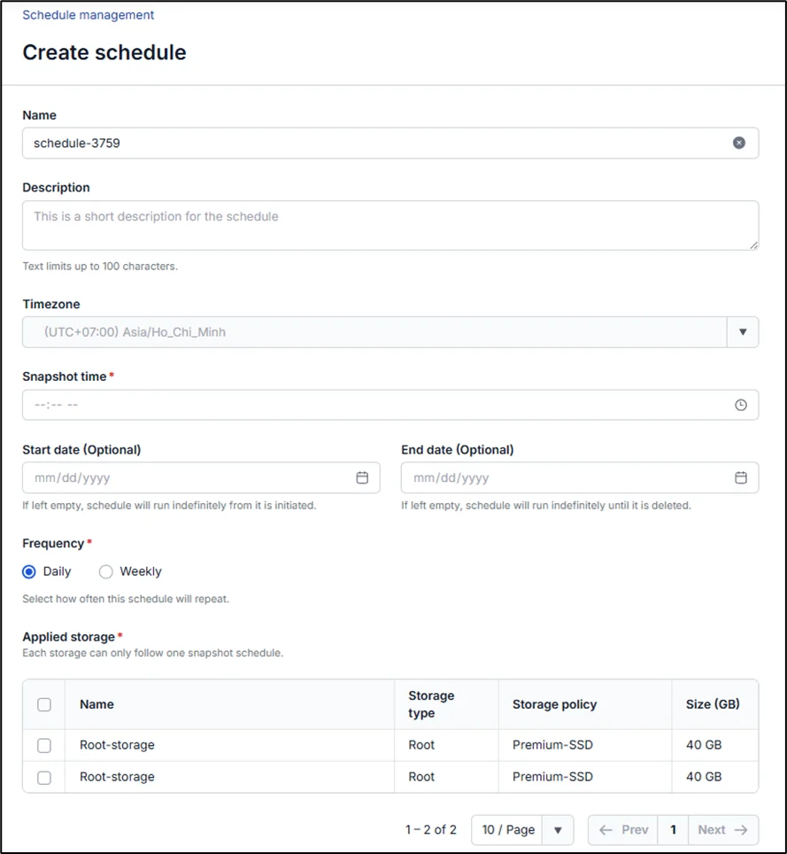
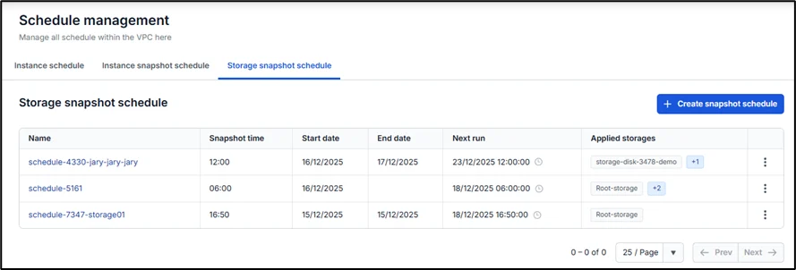

# Tạo lịch snapshot ổ đĩa

Để tạo mời một Lịch snapshot ổ đĩa bạn thao tác như sau **Bước 1:** Ở menu chọn Compute Engine > Schedule Management, chọn tab Storage snapshot schedule

Bước 2: Nhập các thông tin theo yêu cầu của hệ thống

  * Name: tên lịch

  * Time: chỉ có chọn time sau ít nhất 2h kể từ thời điểm chỉnh sửa để đảm bảo lịch chạy chính xác

  * Start date: ngày bắt đầu lặp lịch snapshot, nếu bỏ trống thì tính từ thời điểm tạo lịch thành công

  * End date: ngày kết thúc lịch snapshot, nếu bỏ trống thì lịch không có giới hạn

  * Frequency: tần suất cho việc thực hiện hành động snapshot

  *     * Daily: lịch chạy theo giờ mỗi ngày
  *     * Weekly: lịch chạy theo tuần, bạn có thể chọn ngày trong tuần
  * Applied Storage: Các ổ đĩa được gắn vào lịch (Lưu ý: mỗi ổ đĩa cùng lúc chỉ được cho phép gắn với 1 lịch)

**Bước 3:** Chọn Create Schedule. Hệ thống sẽ tiến hành khởi tạo và thông báo kết quả. Nếu thành công, lịch mới sẽ được hiển thị ở trang Storage snapshot schedule

