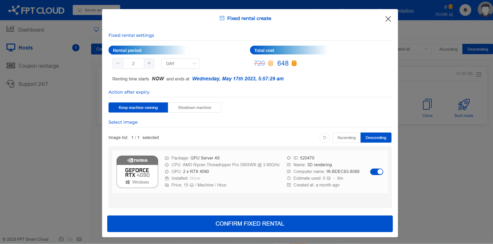
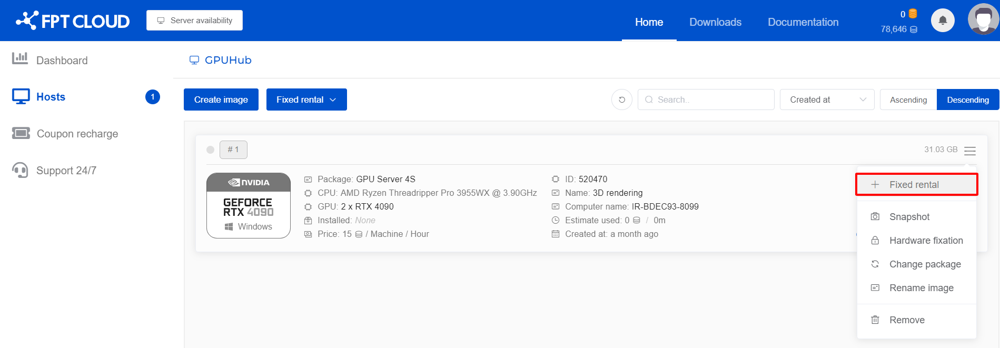

# Đặt thời gian thuê cố định

Đặt thời gian thuê cố định hay còn gọi là tính năng Fixed rental trên HPC Portal là tính năng rất được khuyến khích sử dụng khi bạn có những dự án lớn yêu cầu bật máy theo ngày, tuần, hoặc thậm chí là vài tháng để hoàn thành. Tính năng này cho phép bạn tiết kiệm đáng kể tiền của mình so với bật máy thuê theo giờ thông thường. Các mức giảm giá trên HPC Portal như sau:

– **6 hours**: Thuê máy liên tục trong 6 giờ để tiết kiệm **6%** chi phí so với thuê theo giờ

– **Day**: Thuê máy liên tục trong 1 ngày để tiết kiệm **8%** chi phí so với thuê theo giờ

– **Week**: Thuê máy liên tục trong 1 tuần để tiết kiệm **10%** chi phí so với thuê theo giờ

– **Month**: Thuê máy liên tục trong 1 tháng để tiết kiệm **20%** chi phí so với thuê theo giờ

**Lưu ý:** Tính năng Fixed rental không tích luỹ thời gian bật máy mà hệ thống sẽ tính tiền và mặc định máy bật liên tục trong thời gian đã chọn

Ví dụ: Dự án của bạn có thời gian hoàn thành là 8 giờ. Để tối ưu và tiết kiệm chi phí nhất, bạn nên lựa chọn **Fixed rental** trong 6 giờ, và thiết lập **Keep machine running** sau khi Fixed rental hết hạn để chạy tiếp 2 giờ còn lại

  1. Để Fixed rental cho máy, các bước thực hiện như sau:

Truy cập Hosts > Fixed rental để mở hộp thoại thiết lập tính năng Fixed rental

Chọn ít nhất 1 image để áp dụng fixed rental, chọn các thông tin thiết lập Fixed rental như Rental period, Number of machines, kiểm tra lại số tiền giảm đối với máy và nhấn **Confirm**

Ngoài ra bạn có thể lựa chọn 1 image cụ thể trước rồi thiết lập Fixed rental cho máy bằng cách chọn Action > Fixed rental nhưu sau:

  2. Sau khi thiết lập Fixed rental cho máy, bạn có thể cài đặt lại Action after expired bằng cách chọn **Image > Setting** và lựa chọn lại

– Keep the machine running: Sau khi thời gian thuê cố định hết hạn, hệ thống sẽ tiếp tục để máy chạy và tính tiền theo giờ đối với máy đó. Vui lòng đảm bảo số dư tài khoản của bạn đủ để duy trì máy tránh làm gián đoạn công việc.

– Shutdown machine: Sau khi hết thời gian thuê cố định, hệ thống sẽ thực hiện tắt máy tự động.

  3. Gia hạn thời gian thuê cố định sau khi hết hạn bằng cách chọn **Image > Renewal** và lựa chọn cài đặt tương tự như lúc thiết lập Fixed rental

  4. Kết thúc fixed rental bằng cách chọn **Image > Deactivate**
