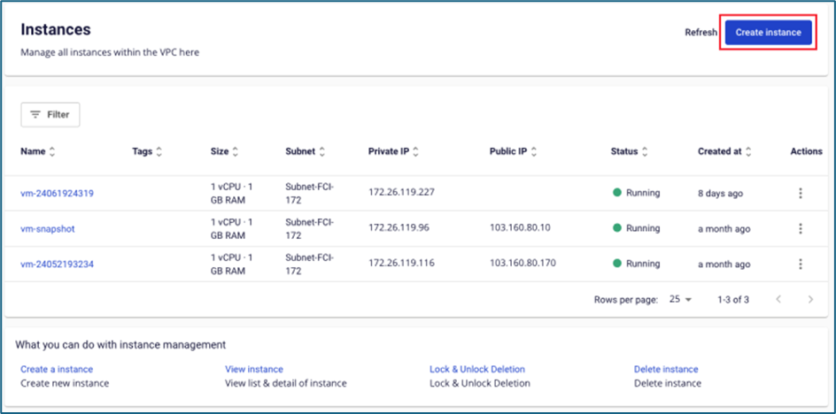
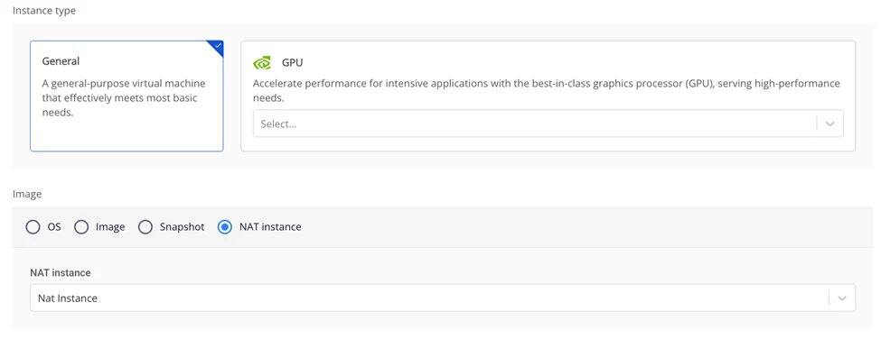
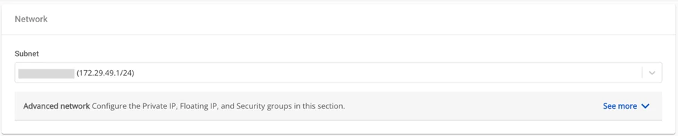
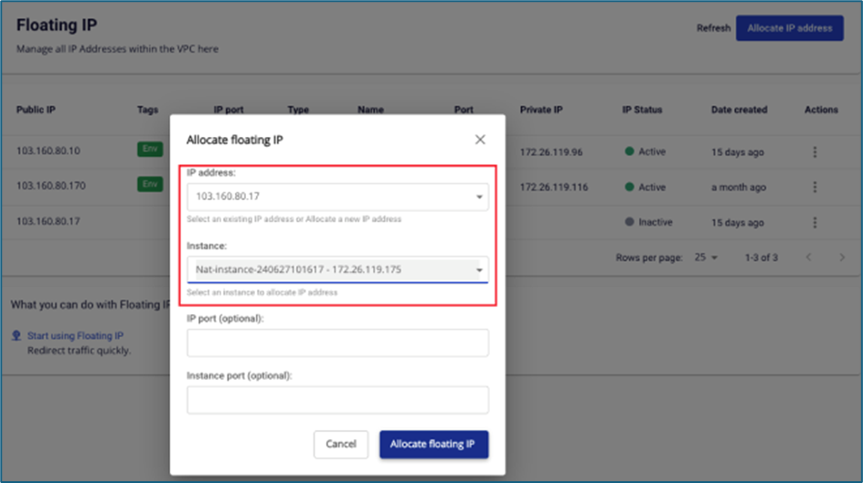
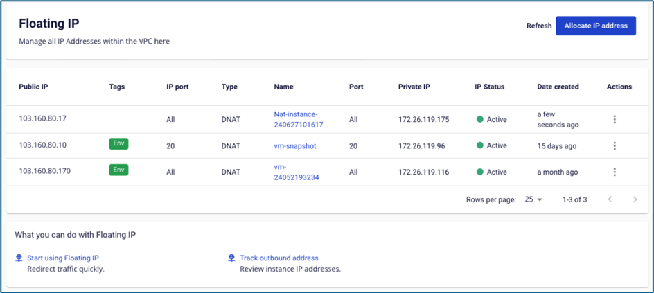
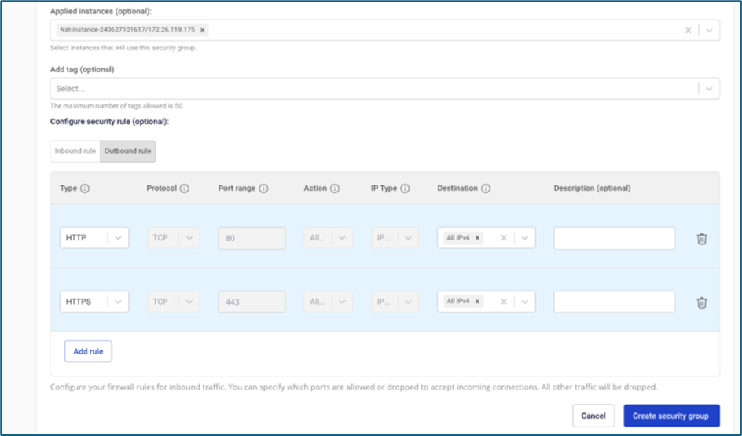
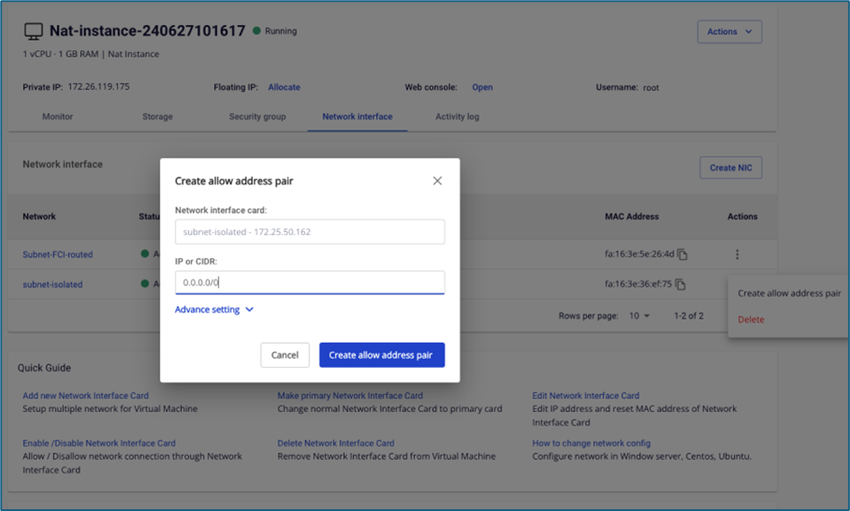

# Tổng quan NAT Instance

Chức năng hỗ trợ các instance trong mạng cô lập (isolated network) có thể truy cập hệ thống bên ngoài Internet như cài đặt phần mềm hoặc truy cập về On-premise.

Cài đặt Nat instance như sau:

**Bước 1**: Tạo Nat instance từ image do FCI cung cấp

**Lưu ý: Trường subnet, cần chọn subnet có thể truy cập Internet.**

**Bước 2**: Gắn Floating IP cho Nat instance. Trong trường hợp instance đã gắn floating IP từ bước khởi tạo, người dùng không cần thực hiện thao tác này.

**Bước 3**: Gắn security group cho Nat instance, người dùng mở các rule cần thiết cho instance trong isolated network truy cập ra Internet (có thể mở thêm port ICMP để test ping hệ thống). Trong trường hợp instance đã gắn vào security group từ bước khởi tạo, người dùng không cần thực hiện thao tác này.

**Bước 4**: Add thêm Network interface card (NIC) thuộc subnet trùng với isolated subnet của instance cần truy cập Internet.

**Bước 5**: Allow address pair 0.0.0.0/0 cho NIC thuộc isolated network

**Bước 6**: Truy cập vào instance thuộc isolated network, chuyển gateway về IP của NIC Nat instance. Trong ví dụ dùng, FCI dùng 1 instance thuộc hệ điều hành Windows.

")
