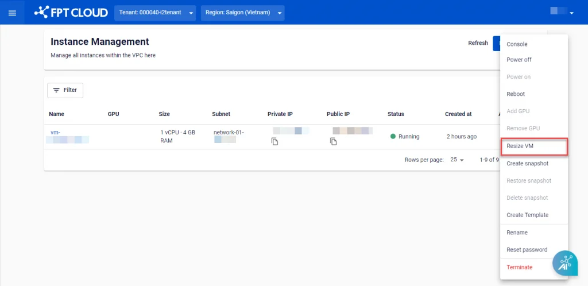
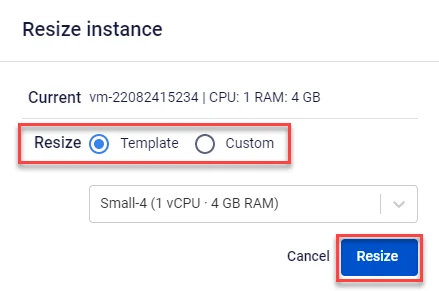
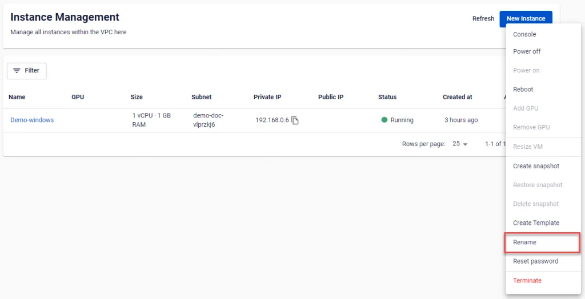
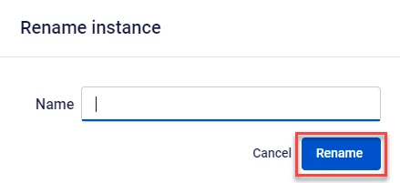
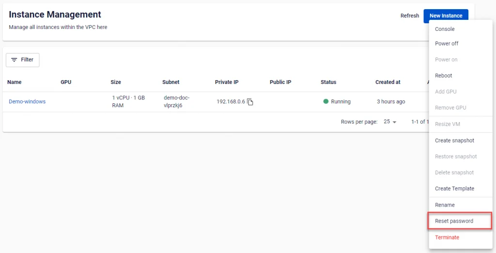

# Thay đổi thông tin cấu hình máy chủ

## 1\. Resize
**Resize** là chức năng giúp thay đổi cấu hình Ram-CPU của một máy ảo đã tạo.

Trong quá trình Resize, máy ảo sẽ tạm thời được tắt và tự khởi động lại sau khi quá trình hoàn tất.

Ngoài ra nếu không muốn tắt máy ảo khi Resize trong tương lai, hãy bật tính năng **Hot-add**. Trong trường hợp tính năng **Hot-add** đã được kích hoạt, máy ảo vẫn có thể hoạt động bình thường với cấu hình mới mà không cần thiết phải reboot.

**Bước 1**: Ở menu chọn **Instance Management**, trong phần **Actions** của máy chủ cần thay đổi cấu hình, chọn **Resize VM**.

**Bước 2**: Chọn kích thước mới cho máy ảo, có thể chọn theo template có sẵn hoặc tự chọn cấu hình riêng ở phần **Custom**.

Sau khi điền thông tin, nhấn **Resize** để xác nhận.

Hệ thống sẽ tiến hành kiểm tra tài nguyên, thay đổi cấu hình máy ảo và thông báo kết quả xử lý

### 2\. Rename
Người dùng có thể đổi tên của máy ảo đã tạo bằng chức năng **Rename**.

**Bước 1**: Ở menu chọn **Instance Management**, trong phần **Actions** của máy chủ cần đổi tên, chọn **Rename**.

**Bước 2:** Nhập tên mới cho máy ảo và chọn **Rename.**

Hệ thống sẽ tiến hành thay đổi tên cho máy ảo và thông báo kết quả xử lý.

## 3\. Reset Password
Với các máy ảo được tạo với phương thức xác thực là **Password**, **FPT Cloud** hỗ trợ người dùng reset lại **Password** cho tài khoản **root** ngay trên **FPT Portal**.

**Bước 1**: Ở menu chọn **Instance Management**, trong phần **Actions** của máy chủ cần thay đổi password chọn **Reset Password**.

**Bước 2:** Chọn **Reset Password**. Hệ thống sẽ gửi mật khẩu mới về email của người dùng.
