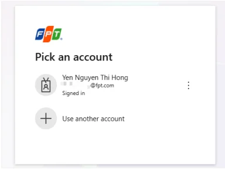
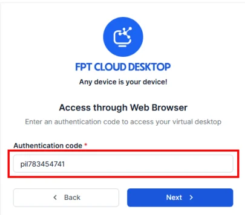

Truy cập qua Web browser

Dành cho người dùng muốn truy cập máy ảo nhanh, không cần cài đặt FCDClient.

**1.Truy cập vào Homepage dịch vụ với URL phù hợp**

Các định dạng URL hợp lệ:

  * URL riêng của doanh nghiệp/tổ chức dùng cho FCD (quản trị viên khách hàng cung cấp cho người dùng)
  * URL đã chứa authentication code hợp lệ (định dạng code.domain). Ví dụ: pil783454741.pilotfcd.online
  * URL mặc định của dịch vụ

**Thông tin URL này do quản trị viên khách hàng cung cấp**

Truy cập đường link dịch vụ bằng trình duyệt web, chọn **Access through FPT Cloud Desktop Client**

**2.Đăng nhập vào Authenticator (Server) phù hợp**

1.Nếu người dùng **truy cập bằng URL đã chứa authentication code hợp lệ** (ví dụ URL chứa code hợp lệ: pil783454741.pilotfcd.online)

  * Chỉ cần đăng nhập bằng tài khoản SSO tương ứng (ví dụ Đăng nhập bằng tài khoản Microsoft), nhập OTP tương ứng theo SSO => Đăng nhập Authenticator (Server) thành công 

2.Nếu người dùng **truy cập từ URL mặc định của dịch vụ:**

  * Cần nhập thông tin Authentication Code (thông tin do quản trị viên khách hàng quản lý) (Ví dụ Authentication Code hợp lệ: pil783454741) 

  * Đăng nhập bằng tài khoản SSO (ví dụ Đăng nhập bằng tài khoản Microsoft), nhập OTP tương ứng theo SSO => Đăng nhập Authenticator (Server) thành công

**3: Truy cập vào máy ảo**

Tại màn hình danh sách các máy ảo, chọn truy cập vào máy ảo mong muốn

Nhập thông tin đăng nhập vào máy ảo nếu hệ thống yêu cầu => Truy cập máy ảo thành công

")
