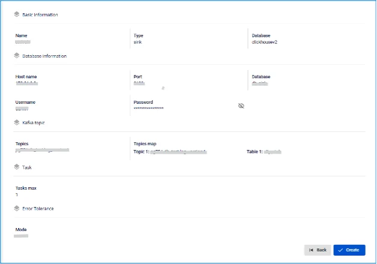

# ClickHouse (Replication) Sink Connector

**Tạo connector, Type là sink, Database là ClickHouse**

**Pre-condition:** Status CDC service Healthy

## Các bước tạo connector:

**Bước 1:** Tại thanh menu chọn **Data Platform** > chọn **Workspace Management** > chọn **Workspace name**

**Bước 2:** Tại phần **My services** chọn **CDC service**

**Bước 3:** Tại màn detail **CDC service** > Chọn tab **Connectors** > nhấn **Create a connector**

**Bước 4:** Nhập các thông tin màn **Connector Information**:

 * **Name (required):** tên connector

Chú ý: Tên connector có thể chứa các kí tự chữ cái thường a-z hoặc các kí tự số 0-9. Đặc biệt không dùng dấu cách có thể thay dấu cách bằng dấu “-”.

 * **Type (required):** chọn **sink**

 * **Database (required):** chọn **ClickHouse (Replication)** 

**Bước 5:** Nhấn **Next** ở góc phải màn hình để chuyển qua màn **Properties**

Có hai lựa chọn: From FPT Database Engine, Manual configuration

 * Trường hợp chọn **Manual configuration** \- Điền các thông tin:

 * **Host Name** (required): Hostname hoặc IP của clickhouse

 * **Port** (required): ClickHouse server port, mặc định là: `8123`.

 * **Database name** (required): Database đích mà Connector sẽ sink dữ liệu vào

 * **Username** (required): Username sử dụng bởi Connector

 * **Password** (required): Password sử dụng bởi Connector

 * **Topics** (required): Danh sách các topics Connector sẽ consume và sink dữ liệu vào ClickHouse, và được ngăn cách bởi dấu ","

 * Trường hợp chọn **From FPT Database Engine** \- Điền các thông tin:

 * **Database** (required): Chọn Database

 * **Host Name** (required): Hostname hoặc IP của clickhouse

 * **Port** (required): ClickHouse server port, mặc định là: `8123`.

 * **Database name** (required): Database đích mà Connector sẽ sink dữ liệu vào

 * **Username** (required): Username sử dụng bởi Connector

 * **Password** (required): Password sử dụng bởi Connector

 * **Topics** (required): Danh sách các topics Connector sẽ consume và sink dữ liệu vào ClickHouse, và được ngăn cách bởi dấu ","

 * Nhấn **Test connection** để kiểm tra kết nối từ Workspace tới Database đã nhập

 * **Converter**

 * **Converter key**: chọn giá trị key cho converter

 * **Converter key schema enable**: chọn giá trị có/không sử dụng schema trong Converter key

 * **Converter value**: chọn giá trị value cho converter

 * **Converter value schema enable**: chọn giá trị có/không sử dụng schema trong Converter value 

**Bước 6:** Nhấn **Next** ở góc phải màn hình để chuyển qua màn **Additional Properties**

Điền các thông tin:

 * **Tasks max (required):** Số lượng tác vụ tối đa cho kết nối

 * **Topic 1:** tên topics Connector sẽ consume và sink dữ liệu vào ClickHouse

 * **Table 1:** tên table lắng nghe dữ liệu thay đổi từ postgres

**Chú ý:** Enable “Create new table” để đặt tên table mới, Disable “Create new table” có thể chọn table có trong Database

 * **Mode (required):** Hành vi của Connector khi không thể xử lý được message

 * **None**: Connector sẽ bỏ qua các messages không thể sink vào CSDL

 * **All**: Các message lỗi sẽ được gửi vào topic được nhập 

**Bước 7.** Nhấn **Next** ở góc phải màn hình để chuyển qua màn **Review** 

**Bước 8:** Kiểm tra thông tin và nhấn nút **Create** để hoàn thành việc tạo connector.
