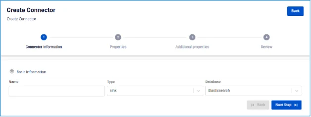
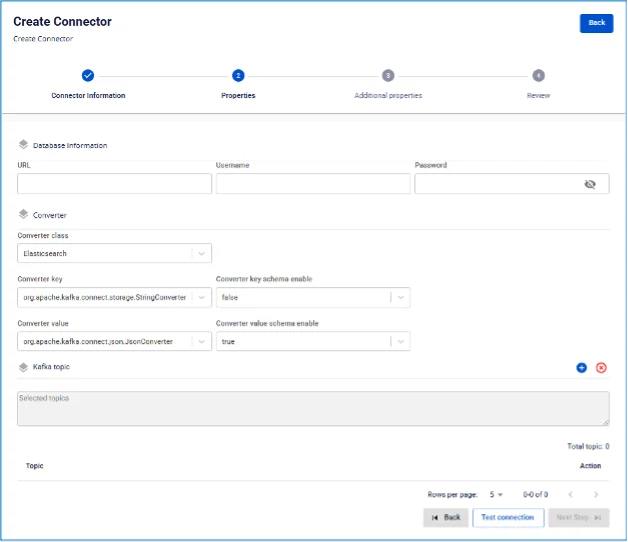
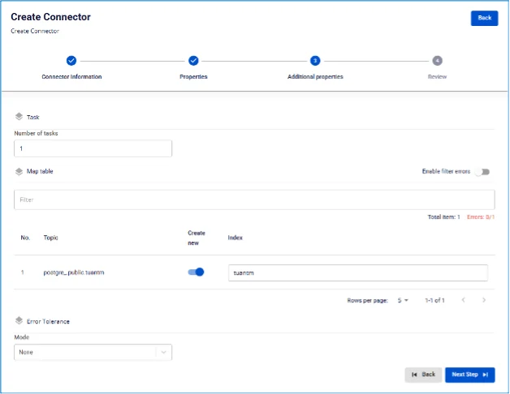

# Elasticsearch Sink Connector

**Tạo connector, Type là sink, Database là Elasticsearch**

**Pre-condition:** Status CDC service Healthy

## Các bước tạo connector:

**Bước 1:** Tại thanh menu chọn **Data Platform** > chọn **Workspace Management** > chọn **Workspace name**

**Bước 2:** Tại phần **My services** chọn **CDC service**

**Bước 3:** Tại màn detail **CDC service** > Chọn tab **Connectors** > nhấn **Create a connector**

**Bước 4:** Nhập các thông tin màn **Connector Information**:

 * **Name** (required): tên connector

Chú ý: Tên connector có thể chứa các kí tự chữ cái thường a-z hoặc các kí tự số 0-9. Đặc biệt không dùng dấu cách có thể thay dấu cách bằng dấu “-”.

 * **Type** (required): Chọn **sink**

 * **Database** (required): Chọn **Elasticsearch** 

**Bước 5:** Nhấn **Next** ở góc phải màn hình để chuyển qua màn **Properties**

 * **Database Information**

Nhập thông tin **Database**

 * **URL**: Địa chỉ truy cập

 * **Username**: Tên tài khoản

 * **Password**: Mật khẩu

Nhấn **Test Connection** để kiểm tra kết nối từ Workspace tới Elasticsearch đã nhập

 * **Converter**

 * **Converter key**: Chọn giá trị key cho converter

 * **Converter key schema enable**: Chọn giá trị có/không sử dụng schema trong Converter key

 * **Converter value**: Chọn giá trị value cho converter

 * **Converter value schema enable**: Chọn giá trị có/không sử dụng schema trong Converter value

 * **Kafka topic**

 * Nhấn vào dấu ‘+’ để lấy thông tin topic

 * Chú ý: giới hạn chỉ lấy tối đa 100 topic 

**Bước 6.** Nhấn **Next** chuyển qua màn **Additional Properties**

 * **Task:**

 * **Number of tasks**: Số lượng tác vụ tối đa có thể thực hiện song song
 * **Map table**: Liên kết topic và bảng dữ liệu của cơ sở dữ liệu đích

 * **Create new**: Lựa chọn tạo mới bảng hoặc lựa chọn từ danh sách bảng đã có trong cơ sở dữ liệu đích

 * Index: Chọn index nếu không chọn tạo mới index, nhập tên index nếu lựa chọn tạo mới index

 * **Error Tolerance**:

 * **Mode**:
 * **None**: Connector dừng xử lý nếu có lỗi xảy ra 

**Bước 7.** Nhấn **Next** ở góc phải màn hình để chuyển qua màn **Review** 

**Bước 8.** Kiểm tra thông tin, sau đó nhấn **Create** để hoàn thành việc tạo connector

 Sink Connector")
