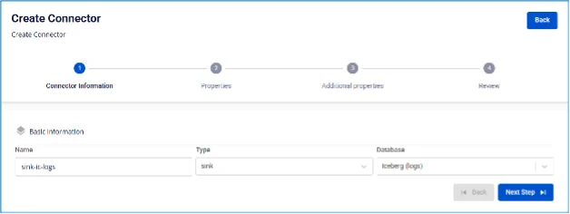
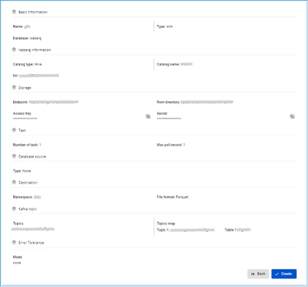

# Iceberg (logs) Sink Connector

**Tạo connector, Type là sink, Database là Iceberg (logs)**

**Pre-condition:** Status CDC service healthy

## Các bước tạo connector:

**Bước 1:** Tại thanh menu chọn **Data Platform** > chọn **Workspace Management** > chọn **Workspace name**

**Bước 2:** Tại phần **My services** chọn **CDC service**

**Bước 3:** Tại màn detail **CDC service** > Chọn tab **Connectors** > nhấn **Create a connector** 

**Bước 4:** Nhập các thông tin màn **Connector Information**:

 * **Name** (required): tên connector

Chú ý: Tên connector có thể chứa các kí tự chữ cái thường a-z hoặc các kí tự số 0-9. Đặc biệt không dùng dấu cách có thể thay dấu cách bằng dấu “-”.

 * **Type** (required): chọn **sink**

 * **Database** (required): chọn **Iceberg (logs)** 

**Bước 5.** Nhấn **Next** để chuyển qua màn **Properties**

Nhập các thông tin sau:

 * **Catalog type** (required): chọn loại catalog

 * **URL** (required): nhập đường dẫn url

 * **Catalog Name** (required): tên catalog

 * **Endpoint** (required): địa chỉ endpoint tới S3

 * **Access key** (required): Khóa truy cập

 * **Secret** (required): mật khẩu kết nối tới endpoint

 * **Root directory** (required): root directory trong S3

 * **Topics** (required): lựa chọn các topic dữ liệu được gửi từ source connector 

Nhấn **Test connection** để kiểm tra kết nối từ Workspace tới Database đã nhập

 * **Converter**

 * **Converter key**: chọn giá trị key cho converter

 * **Converter key schema enable**: chọn giá trị có/không sử dụng schema trong Converter key

 * **Converter value**: chọn giá trị value cho converter

 * **Converter value schema enable**: chọn giá trị có/không sử dụng schema trong Converter value

**Bước 6:** Nhấn **Next** để chuyển qua màn **Additional Properties**

Nhập các thông tin sau:

 * **Number of tasks**: số lượng tác vụ tối đa có thể thực hiện song song

 * **Max poll record**: số max poll record

 * **Type**: chọn Type DB source

 * **Namespace**: chọn namespace

 * **File format**: chọn định dạng file

 * **Topic 1**: Danh sách các topics Connector sẽ consume và sink dữ liệu vào database đích, và được ngăn cách bởi dấu ","

 * **Table 1**: tên table trong Database

 * **Mode**: Hành vi của Connector khi không thể xử lý được message

 * ****None**: connector sẽ dừng xử lý nếu gặp lỗi 

**Bước 7:** Nhấn **Next** để chuyển qua màn **Review** 

**Bước 8:** Kiểm tra thông tin sau đó nhấn **Create** để hoàn thành việc tạo connector
