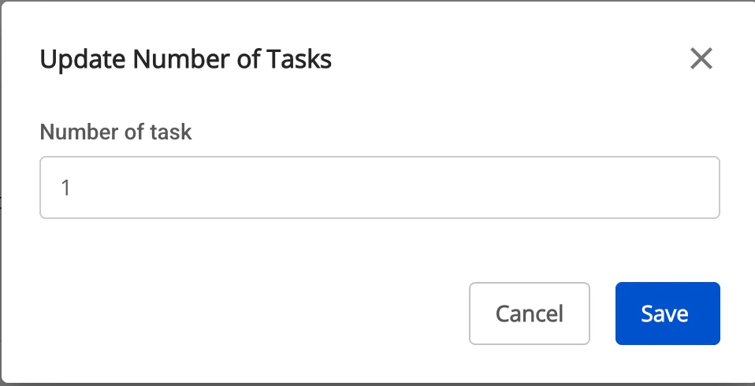
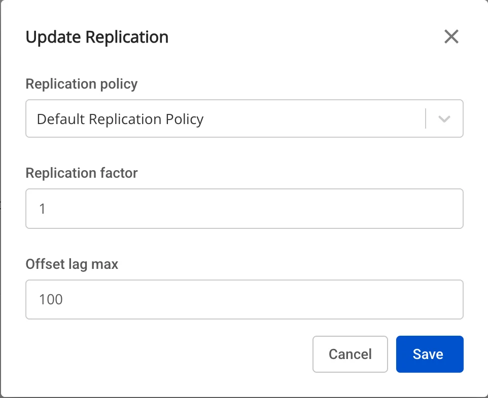
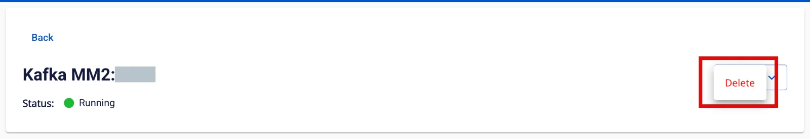
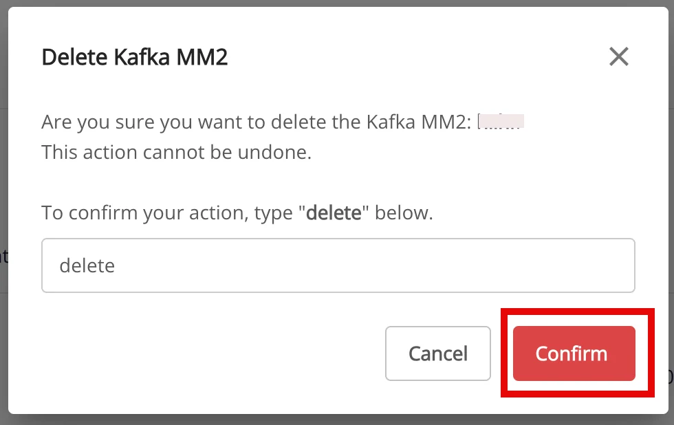

# Kafka MM2

**Kafka MM2 (MirrorMaker 2)** là một công cụ dùng để **đồng bộ dữ liệu giữa các cụm Kafka khác nhau** (multi-cluster replication)

### 1\. Tạo Kafka MM2 source

Trường hợp tạo Kafka MM2, Type là source

Pre-condition: Status CDC service healthy

**Bước 1:** Tại thanh menu chọn **Data Platform** > chọn **Workspace Management** > chọn **Workspace name**

**Bước 2:** Tại phần **My services** chọn **CDC service**

**Bước 3:** Tại màn detail **CDC service** > Chọn tab **Kafka MM2** > nhấn **Create a Kafka MM2**

**Bước 4:** Nhập các thông tin màn **Connector Information**:

 * **Name** (required): tên connector

Chú ý: Tên connector có thể chứa các kí tự chữ cái thường a-z hoặc các kí tự số 0-9. Đặc biệt
không dùng dấu cách có thể thay dấu cách bằng dấu “-”.

 * **Type** (required): chọn **source**

**Bước 5.** Nhấn **Next** để chuyển qua màn **Properties**

Nhập các thông tin sau:

 * **Kafka cluster information**

 * **Cluster alias name** (required): nhập tên định danh của cluster

 * **Bootstrap server endpoint** (required): nhập địa chỉ kết nối Kafka

 * **Security protocol** (required): lựa chọn giao thức bảo vệ

 * **SASL Mechanism** (optional): tùy thuộc vào lựa chọn giao thức bảo vệ

 * **Username** (required): tên đăng nhập

 * **Password** (required): mật khẩu

Nhấn **Test connection** để kiểm tra kết nối từ Workspace tới **Cluster** đã nhập

 * **Topics**

 * **Topic** (required): lựa chọn các topic dữ liệu từ nguồn Kafka trên
 * **Group**

 * **Group** (required): lựa chọn các group consumer cần replication

**Bước 6:** nhấn **Next** để chuyển qua màn **Additional Properties**

Nhập các thông tin sau:

 * **Number of tasks**: số lượng tác vụ tối đa có thể thực hiện song song

 * **Replication policy**: lựa chọn thêm vào trước topic hoặc giữ nguyên tên topic sau khi replication

 * **Replication factor**: số lượng bản sao của mỗi topic sau khi replication

 * **Offset lag max**: độ trễ tối đa của offset giữ source và target

**Bước 7:** Nhấn **Next** để chuyển qua màn **Review**

**Bước 8:** Kiểm tra thông tin sau đó nhấn **Create** để hoàn thành việc tạo Kafka MM2 source

### 2\. Sửa Kafka MM2 source

Để sửa **Kafka MM2 source**, người dùng thực hiện các bước sau:

**Bước 1:** Tại thanh menu chọn **Data Platform** > chọn **Workspace Management** > chọn **Workspace name**

**Bước 2:** Tại phần **My services** chọn **CDC service**

**Bước 3:** Tại màn detail **CDC service** > Chọn tab **Kafka MM2 source** > chọn **Kafka MM2 name**

**Bước 4.** **Sửa thông tin Kafka MM2 source**

 * **Kafka Cluster Information**

 * Tại màn chi tiết Kafka MM2, chọn biểu tượng ở mục Kafka Cluster Information.

 * Popup Update Database Info hiện ra, cho phép chỉnh:

 * **Security protocol** (required): lựa chọn giao thức bảo vệ

 * **SASL Mechanism** (optional): tùy thuộc vào lựa chọn giao thức bảo vệ

 * **Username** (required): tên đăng nhập

 * **Password** (required): mật khẩu

 * Nhấn Test connection để kiểm tra kết nối.

 * Nếu OK → nhấn Save để lưu.

 * Muốn thoát → nhấn Cancel.

 * **Task**

 * Tại màn chi tiết Kafka MM2, chọn biểu tượng ở mục Task.

 * Popup Update Number of Tasks hiện ra, cho phép chỉnh:

 * **Number of tasks**: số lượng tác vụ tối đa có thể thực hiện song song

 * Nếu OK → nhấn Save để lưu.

 * Muốn thoát → nhấn Cancel.

 * **Replication**

 * Tại màn chi tiết Kafka MM2, chọn biểu tượng ở mục Replication.

 * Popup Update Replication hiện ra, cho phép chỉnh:

 * **Replication policy**: lựa chọn thêm vào trước topic hoặc giữ nguyên tên topic sau khi replication

 * **Replication factor**: số lượng bản sao của mỗi topic sau khi replication

 * **Offset lag max**: độ trễ tối đa của offset giữ source và target

 * Nếu OK → nhấn Save để lưu.

 * Muốn thoát → nhấn Cancel.

### 3\. Xóa Kafka MM2 source

Để xóa **Kafka MM2 source**, người dùng thực hiện các bước sau:

**Bước 1:** Tại thanh menu chọn **Data Platform** > chọn **Workspace Management** > chọn **Workspace name**

**Bước 2:** Tại phần **My services** chọn **CDC service**

**Bước 3:** Tại màn detail **CDC service** > Chọn tab **Kafka MM2 source** > chọn **Kafka MM2 name** > chọn **Action** > chọn **Delete**

**Bước 4:** Hiển thị hôp thoại **Delete Kafka MM2** > nhập Delete > nhấn **Confirm** để xóa **Kafka MM2 source**, chọn **Cancel** để hủy bỏ thao tác. 
