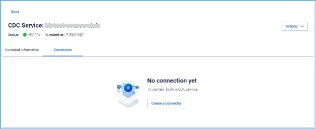
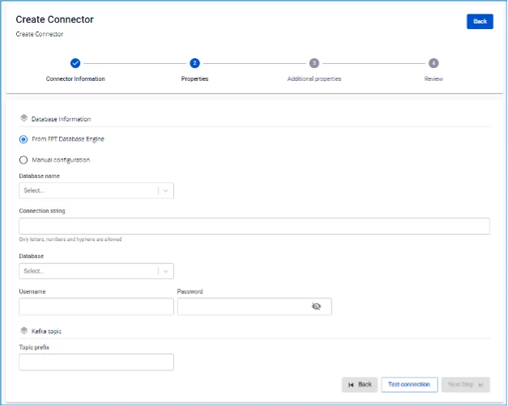

# MongoDB Source Connector

**Tạo connector, Type là source, Database là MongoDB**

**Pre-condition:** Status CDC service _Healthy_

## Cấu hình MongoDB

**1\. Enable oplogs:** cần enable oplogs trên MongoDB server (chỉ áp dụng với standalone, cluster đã enabled sẵn).

**2\. Permission:** MongoDB Connector yêu cầu user có quyền thực hiện các tác vụ find, changeStream trên database được cấu hình.

 * Để khởi tạo user có các quyền này, có thể sử dụng command sau:

```
db.createUser({
 user: "<USERNAME>",
 pwd: "<PASSWORD>",
 roles: [
 { role: "readWrite", db: "<DATABASE>" }
 ]
 })
```

 * Hoặc trên toàn bộ các database:

```
db.createUser({
 user: "<USERNAME>",
 pwd: "<PASSWORD>",
 roles: [
 { role: "readWrite", db: "" }
 ]
 })
```

## Các bước tạo connector:

Để tạo connector, người dùng thực hiện các bước sau:

**Bước 1:** Tại thanh menu chọn **Data Platform** > chọn **Workspace Management** > chọn **Workspace name**

**Bước 2:** Tại phần **My services** chọn **CDC service**

**Bước 3:** Tại màn detail **CDC service** > Chọn tab **Connectors** > nhấn **Create a connector** 

**Bước 4:** Nhập các thông tin màn **Connector Information:**

 * **Name (required):** tên Connector *Chú ý: Tên connector có thể chứa các kí tự chữ cái thường a-z hoặc các kí tự số 0-9. Đặc biệt không dùng dấu cách có thể thay dấu cách bằng dấu “-”.

 * **Type (required):** chọn source

 * **Database (required):** chọn MongoDB 

**Bước 5:** Nhấn **Next** ở góc phải màn hình để chuyển qua màn **Properties**, điền các thông tin:

 * Trường hợp chọn **From FPT Database Engine:** \- điền các thông tin sau:

 * **Database name (required):** Chọn Database

 * **Connection string (required):** MongoDB connection uri

 * **Database:** Database mà connector sẽ lắng nghe các thay đổi

 * **Username (required):** Username kết nối tới mongoDB

 * **Password (required):** Password kết nối tới mongoDB

 * **Collection:** Collection mà connector sẽ lắng nghe các thay đổi

 * **Topic prefix (required):** Prefix of topic name (.database.collection).



 * Trường hợp chọn **Manual configuration** \- điền các thông tin sau

 * ****Connection string (required):** MongoDB connection uri

 * **Database:** Database mà connector sẽ lắng nghe các thay đổi

 * **Topic prefix (required):** Prefix of topic name (.database.collection). 

**Bước 6:** Nhấn Next để chuyển qua màn **Additional Properties**

Chọn các thông tin sau:

 * **Snapshot:** Hành vi của connector sau khi khởi tạo

 * **Latest:** Connector chỉ lắng nghe thay đổi dữ liệu

 * **Copy_existing:** Connector sẽ sao chép toàn bộ dữ liệu đang có sẵn, đồng thời lắng nghe các thay đổi. Nếu collection có sự thay đổi trong quá trình sao chép, connector sẽ tạo ra 2 event với cùng 1 bản ghi với 2 operation khác nhau (copyingData và operation của bản ghi đó instert/update/delete).

 * **Error Tolerance:** Hành vi của connector đối với exception.

 * **None:** connector sẽ dừng lại

**Bước 7:** Nhấn **Next** để chuyển qua màn **Review**

**Bước 8:** Kiểm tra thông tin và nhấn nút **Create** để hoàn thành việc tạo connector.
