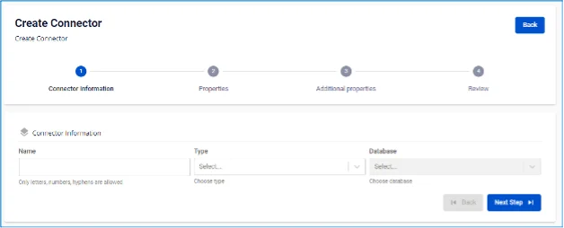
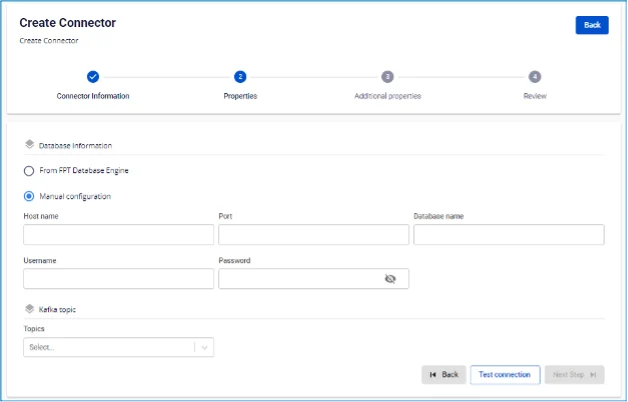
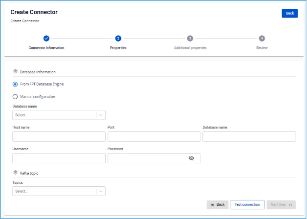

# MySQL Sink Connector

**Tạo connector, Type là sink, Database là MySQL**

**Pre-condition:** Status CDC service healthy

## Các bước tạo connector:

**Bước 1:** Tại thanh menu chọn **Data Platform** > chọn **Workspace Management** > chọn **Workspace name**

**Bước 2:** Tại phần **My services** chọn **CDC service**

**Bước 3:** Tại màn detail **CDC service** > Chọn tab **Connectors** > nhấn **Create a connector** 

**Bước 4:** Nhập các thông tin màn **Connector Information**:

 * **Name (required):** tên connector

Chú ý: Tên connector có thể chứa các kí tự chữ cái thường a-z hoặc các kí tự số 0-9. Đặc biệt không dùng dấu cách có thể thay dấu cách bằng dấu “-”.

 * **Type** **(required):** chọn **sink**

 * **Database (required):** chọn **MySQL** 

**Bước 5.** Nhấn **Next** để chuyển qua màn **Properties**

Nhập thông tin màn Properties

 * **Trường hợp chọn** Manual configuration** - Điền các thông tin:

 * **Host Name** (required): Hostname hoặc IP của MySQL

 * **Port** (required): MySQL server port, mặc định là: `3306`.

 * **Database name** (required): Database đích mà Connector sẽ sink dữ liệu vào

 * **Username** (required): Username sử dụng bởi Connector

 * **Password** (required): Password sử dụng bởi Connector

 * **Topics** (required): Danh sách các topics Connector sẽ consume và sink dữ liệu vào database đích, và được ngăn cách bởi dấu "," 

 * **Trường hợp chọn** From Database Engine** - Điền các thông tin:

 * **Database name** (required): Tên Database

 * **Host Name** (required): Hostname hoặc IP của MySQL

 * **Port** (required): MySQL server port, mặc định là: `3306`.

 * **Database name** (required): Database đích mà Connector sẽ sink dữ liệu vào

 * **Username** (required): Username sử dụng bởi Connector

 * **Password** (required): Password sử dụng bởi Connector

 * **Topics** (required): Danh sách các topics Connector sẽ consume và sink dữ liệu vào database đích, và được ngăn cách bởi dấu "," 

 * Nhấn Test connection để kiểm tra kết nối từ Workspace tới Database đã nhập

 * **Converter**

 * **Converter key**: chọn giá trị key cho converter

 * **Converter key schema enable**: chọn giá trị có/không sử dụng schema trong Converter key

 * **Converter value**: chọn giá trị value cho converter

 * **Converter value schema enable**: chọn giá trị có/không sử dụng schema trong Converter value

**Bước 6:** Nhấn **Next** để chuyển qua màn **Additional Properties**

Nhập các thông tin sau:

 * **Timezone:** chọn Timezone phù hợp của dữ liệu từ database nguồn

 * **Task max:** số task xử lý cùng nhau

 * **Type:** chọn loại Database source

 * **Name**: tên Schema

 * **Topic 1**: Tên topic lắng nghe từ source connector

 * **Table 1:** tên table lắng nghe dữ liệu thay đổi từ source connector

 * **Mode** (required): Hành vi của Connector khi không thể xử lý được message

 * **None**: Connector sẽ bỏ qua các messages không thể sink vào CSDL

 * **All**: Các message lỗi sẽ được gửi vào topic được nhập 

**Bước 7.** Nhấn **Next** để chuyển qua màn **Review** 

**Bước 8:** Kiểm tra thông tin và nhấn nút **Create** để hoàn thành việc tạo connector
