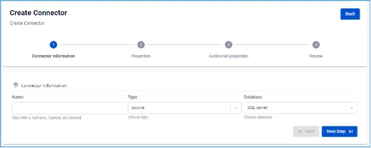
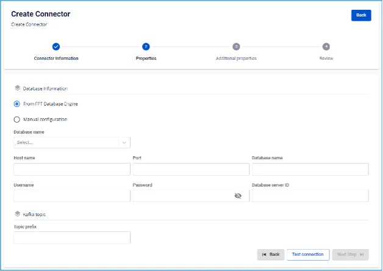
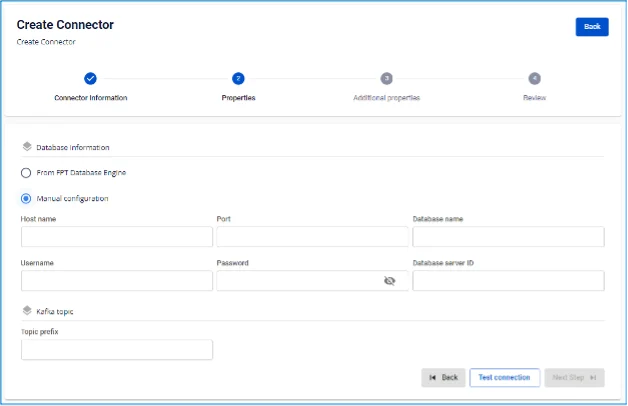
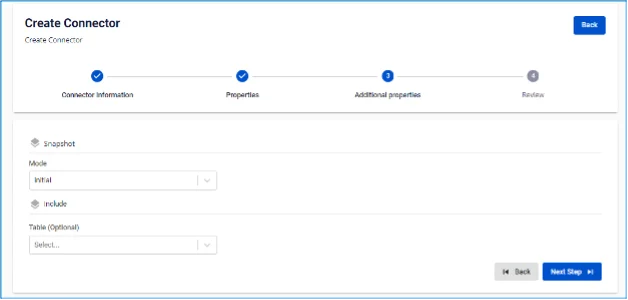
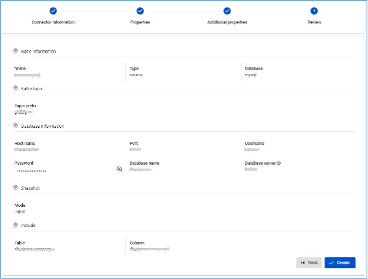

# MySQL Source Connector

**Trường hợp tạo connector, Type là source, Database là MySQL**

**Pre-condition: Status CDC service healthy**

MySQL source connector sử dụng binary log của MySQL để thực hiện CDC. Tuy nhiên MySQL được cấu hình để loại bỏ binlogs trong một khoảng thời gian. Vì vậy khi MySQL connector được khởi tạo, connector sẽ sẽ thực hiện một _initial consistent snapshot_ trước khi bắt đầu đọc từ binlogs để đảm bảo dữ liệu được consistent.

**Supported MySQL topologies**

**1.** Standalone: phải enable binlogs trước đó.
**2.** Primary and replica: Hỗ trợ đọc binlogs từ một trong các server (nếu binlog enabled), nhưng connector chỉ detect được các thay đổi trên server đó.
**3.** High available.

## Cấu hình MySQL

**1.** Tạo MySQL user:

```
CREATE USER '<USERNAME>'@'%' IDENTIFIED BY '<PASSWORD>';
```

**2.** MySQL source connector yêu cầu các permission sau

```
SHOW DATABASES: GLOBAL PRIVILEGES
```

```
SELECT: DATABASES PRIVILEGES
```

```
RELOAD: GLOBAL PRIVILEGES
```

```
REPLICATION SLAVE: GLOBAL PRIVILEGES
```

```
REPLICATION CLIENT: GLOBAL PRIVILEGES
```

Thêm quyền trên toàn bộ Database:

```
GRANT SELECT, RELOAD, SHOW DATABASES, REPLICATION SLAVE, REPLICATION CLIENT ON *.* TO '<USERNAME>'@'%';
 FLUSH PRIVILEGES;
```

Hoặc trên database cụ thể:

```
GRANT SHOW DATABSASES, RELOAD, REPLICATION SLAVE, REPLICATION CLIENT ON *.* TO '<USERNAME>'@'%';
 GRANT SELECT ON <DATABASE-NAME>.* TO '<USERNAME>'@'%';
 FLUSH PRIVILEGES;
```

**3.** Enable binlog:


:::note
Với dịch vụ của FPTCloud, không cần phải thực hiện các tác vụ này.
:::


 * Kiểm tra binlog đã được enabled chưa:

 * for MySQL 5.x

```
SELECT variable_value as "BINARY LOGGING STATUS (log-bin) ::"
 FROM information_schema.global_variables WHERE variable_name='log_bin';
```

 * for MySQL 8.x

```
SELECT variable_value as "BINARY LOGGING STATUS (log-bin) ::"
 FROM performance_schema.global_variables WHERE variable_name='log_bin';
```

 * Hoặc:

```
SHOW GLOBAL VARIABLES LIKE "log_bin";
```

 * Nếu log_bin nhận giá trị OFF, thay đổi giá trị này từ configuration file:

```
server-id = <CHANGE_ME> #result of query SHOW VARIABLES LIKE "server_id";
 log_bin = mysql-bin
 binlog_format = ROW
 binlog_row_image = FULL
 binlog_expire_logs_seconds = 864000
```

 * Hoặc:

```
SET @@global.binlog_format="ROW";
 SET @@global.binlog_row_image="FULL";
 SET @@global.binlog_expire_logs_seconds=864000;
```

**4.** Enable GTIDs:


:::note
Với dịch vụ của FPTCloud, không cần phải thực hiện các tác vụ này.
:::


 * Kiểm tra gtid_mode đã enabled chưa

```
SHOW GLOBAL VARIABLES LIKE "gtid_mode";
```

 * Kiểm tra enforce_gtid_consistency đã enabled chưa

```
SHOW GLOBAL VARIABLES LIKE "enforce_gtid_consistency";
```

 * Trong trường hợp các cấu hình gtid_mode và enforce_gtid_consistency đều nhận giá trị OFF, thay đổi giá trị này từ configuration file:

```
gtid_mode = ON
 enforce_gtid_consistency = ON
```

 * Hoặc

```
SET @@global.gtid_mode="ON";
 SET @@global.enforce_gtid_consistency="ON";
```

**5.** Cấu hình binlog_row_value_options cho phép connector lắng nghe UPDATE events:


:::note
Với dịch vụ của FPTCloud, không cần phải thực hiện các tác vụ này.
:::


 * Kiểm tra giá trị binlog_row_value_options

```
SHOW GLOBAL VARIABLES LIKE "binlog_row_value_options";
```

 * Thay đổi giá trị binlog_row_value_options thành ""

```
SET @@global.binlog_row_value_options="" ;
```

## Các bước tạo connector

Để tạo connector, người dùng thực hiện các bước sau:

**Bước 1:** Tại thanh menu chọn **Data Platform** > chọn **Workspace Management** > chọn Workspace name

**Bước 2:** Tại phần **My services** chọn **CDC service**

**Bước 3:** Tại màn detail **CDC service** > Chọn tab **Connectors** > nhấn **Create a connector** 

**Bước 4:** Nhập các thông tin màn connector information:

 * **Name** (required): tên connector

Chú ý: Tên connector có thể chứa các kí tự chữ cái thường a-z hoặc các kí tự số 0-9. Đặc biệt không dùng dấu cách có thể thay dấu cách bằng dấu “-”.

 * **Type** (required): chọn source
 * **Database** (required): chọn MySQL 

**Bước 5:** Nhấn **Next** để chuyển qua màn **Properties**

Nhập thông tin Database

 * Trường hợp chọn **Manual configuration** \- Điền các thông tin:

 * **Host name** (required): Hostname hoặc IP của MySQL
 * **Port** (required): MySqL server port, mặc định là: `6447`.
 * **Database name** (required): Database đích mà Connector sẽ sink dữ liệu vào
 * **Username** (required): Username sử dụng bởi Connector
 * **Password** (required): Password sử dụng bởi Connector
 * **Database server ID** (required): ID của Database server

Chú ý: Database server ID phải là số và phải lớn hơn 1000 và nhỏ hơn 9999.

 * **Topic prefix** (required): Danh sách các topics Connector sẽ consume và sink dữ liệu vào database đích, và được ngăn cách bởi dấu "," 
 * Trường hợp chọn **From Database Engine -** Điền các thông tin:

 * **Database name** (required): Tên Database
 * **Host name** (required): Hostname hoặc IP của MySQL
 * **Port** (required): MySQL server port, mặc định là: `6447`.
 * **Database name** (required): Database đích mà Connector sẽ sink dữ liệu vào
 * **Username** (required): Username sử dụng bởi Connector
 * **Password** (required): Password sử dụng bởi Connector
 * **Database server ID** (required): ID của Database server

Chú ý: Database server ID phải là số và phải lớn hơn 1000 và nhỏ hơn 9999.

 * **Topics** (required): Danh sách các topics Connector sẽ consume và sink dữ liệu vào database đích, và được ngăn cách bởi dấu "," 

 * **Enable incremental snapshot** (optional): Checkbox để bật tính năng incremental snapshot cho Connector

 * Chỉ hiển thị với các source connector: **MySQL, MariaDB, PostgreSQL**
 * Khi check vào checkbox này và click "Test connection", hệ thống sẽ kiểm tra:
 * Database có đủ quyền để thực hiện snapshot (cần quyền INSERT, CREATE TABLE cho PostgreSQL/MySQL)
 * Nếu database thiếu quyền, sẽ hiển thị thông báo lỗi chi tiết
 * Nếu database có đủ quyền, hiển thị "Test connection successfully"
 * Sau khi tạo Connector thành công với checkbox này được check:
 * Connector sẽ có tính năng quản lý incremental snapshot
 * Trong màn hình List Connector sẽ hiển thị cột "Snapshot Status"
 * Có thể thực hiện các thao tác: Execute, Pause, Resume, Stop snapshot thông qua menu Actions
 * Nhấn **Test connection** để kiểm tra kết nối từ Workspace tới Database đã nhập

**Bước 6:** Nhấn **Next** để chuyển qua màn **Additional Properties**

Nhập các thông tin sau:

 * **Mode** (required): Hành vi của Connector

Chọn các loại mode sau:

 * **Initial (default)**: Connector sẽ snapshot toàn bộ dữ liệu đã tồn tại trong các bảng, sau đó tiếp tục capture data changes trên các bảng này
 * **Initial_only**: Connector sẽ chỉ snapshot toàn bộ dữ liệu đã tồn tại trong các bảng, sau đó không lắng nghe các sự kiện thay đổi dữ liệu trên bảng
 * **Nerver**: Connector sẽ không snapshot dữ liệu đã tồn tại trong bảng mà chỉ lắng nghe các sự kiện thay đổi dữ liệu trên bảng
 * **Table** (optional): tên một table trong database đã kết nối ở màn trước
 * **Column** (optional): tên một cột dữ liệu muốn lấy ra trong table 

**Bước 7:** Nhấn **Next** để chuyển sang màn **Review** 

**Bước 8:** Kiểm tra thông tin sau đó nhấn **Create** để hoàn thành việc tạo connector
