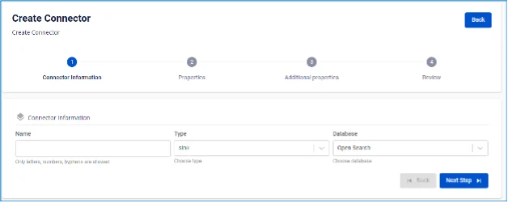
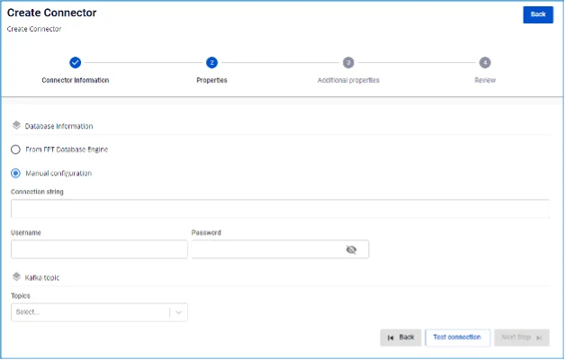

# OpenSearch Sink Connector

**Tạo connector, Type là sink, Database là OpenSearch**

## Các bước tạo connector:

**Bước 1:** Tại thanh menu chọn **Data Platform** > chọn **Workspace Management** > chọn **Workspace name**

**Bước 2:** Tại phần **My services** chọn **CDC service**

**Bước 3:** Tại màn detail **CDC service** > Chọn tab **Connectors** > nhấn **Create a connector** 

**Bước 4:** Nhập các thông tin màn **Connector Information**:

 * **Name** (required): tên connector

Chú ý: Tên connector có thể chứa các kí tự chữ cái thường a-z hoặc các kí tự số 0-9. Đặc biệt không dùng dấu cách có thể thay dấu cách bằng dấu “-”.

 * **Type** (required): chọn **sink**

 * **Database** (required): chọn **OpenSearch** 

**Bước 5.** Nhấn **Next** để chuyển qua màn **Properties**

Nhập các thông tin sau:

 * Trường hợp chọn **From FPT Database Engine** \- Điền các thông tin sau:

 * **Database name** (required): Chọn Database

 * **Connection string** (required): OpenSearch host/hostname

 * **Password** (required): Password kết nối tới OpenSearch

 * **Topics**: Danh sách các topics 

 * Trường hợp chọn **From FPT Database Engine** \- Điền các thông tin sau:

 * **Connection string** (required): OpenSearch connection uri

 * **Username** (required): Username kết nối tới OpenSearch

 * **Password** (required): Password kết nối tới OpenSearch

 * **Topics**: Danh sách các topics 

 * Nhấn **Test connection** để kiểm tra kết nối từ Workspace tới Database đã nhập

 * **Converter**

 * **Converter key**: chọn giá trị key cho converter

 * **Converter key schema enable**: chọn giá trị có/không sử dụng schema trong Converter key

 * **Converter value**: chọn giá trị value cho converter

 * **Converter value schema enable**: chọn giá trị có/không sử dụng schema trong Converter value

**Bước 6:** Nhấn **Next** để chuyển qua màn **Additional Properties**

Nhập thông tin sau:

 * **Data streams enable:** mặc định là trạng thái Disable

 * **Task max:** Số lượng task mà connector có thể chạy đồng thời, nếu topics của có số lượng partition lớn hơn 1. Trong trường hợp task max > 1, message có thể consume không theo thứ tự (bạn cần đảm bảo key của message hoạt động đúng, khi đó các message cùng key sẽ đẩy vào cùng một partition).

 * **Topic 1:** tên topics Connector sẽ consume và sink dữ liệu vào OpenSearch

 * **Table 1:** tên table lắng nghe dữ liệu thay đổi từ PosgresSQL

Chú ý nếu người dùng muốn tạo bảo bảng mới thì enable nút create new table

 * **Mode (required):** Hành vi của Connector khi không thể xử lý được message

 * **None**: Connector sẽ bỏ qua các messages không thể sink vào CSDL

 * **All**: Các message lỗi sẽ được gửi vào topic được nhập 

**Bước 7:** Nhấn **Next** để chuyển qua màn **Review** 

**Bước 8:** Kiểm tra thông tin sau đó nhấn **Create** để hoàn thành việc tạo connector 
