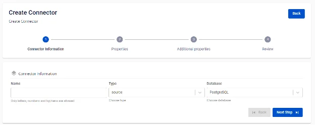
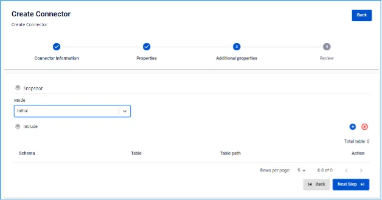

# PostgreSQL Source Connector

**Tạo connector: Type là source, Database là PostgreSQL**

**Pre-condition:** Status CDC service Healthy.

## Cấu hình PostgreSQL

**1**. _pgoutput_ cần thay đổi cấu hình _wal_level_ của Postgres cluster thành logical _đồng thời cần thực hiện CDC trên primary, thay vì_ hot _hoặc_ warm* replicas.

 * Để kiểm tra cấu hình:

```
SHOW wal_level;
```

 * Để thực hiện thay đổi cấu hình, chạy câu lệnh sau trên Postgres và restart service sau khi thay đổi cấu hình:

```
ALTER SYSTEM SET wal_level = 'logical';
```

**2**. **PostgreSQL source connector yêu cầu tối thiểu REPLICATION role.**

 * Trong trường hợp sử dụng một user là SuperUser, chuyển tới bước 5.
 * Để kiểm tra một user có phải là SuperUser:

```
SELECT rolsuper FROM pg_roles WHERE rolname = '<USER_NAME>';
```

 * Ngược lại, có thể khởi tạo một user với role REPLICATION:

```
CREATE USER <USER_NAME> WITH REPLICATION LOGIN PASSWORD '<PASSWORD>';
```

 3. **Tạo Publication:**

 * **Note:** thực hiện các thao tác dưới đây với quyền superuser. Với giá trị ``, FPTCloud chỉ chấp nhận chuỗi kí tự chỉ chứa chữ cái in thường.
 * Tạo Publication cho toàn bộ các bảng:

```
CREATE PUBLICATION <PUBLICATION_NAME> FOR ALL TABLES;
```

 * Kiểm tra các Publication hiện có:

```
SELECT * FROM pg_publication;
```

 * Tạo Publication cho một số bảng nhất định:

```
CREATE PUBLICATION <PUBLICATION_NAME> FOR TABLE <SCHEMA1>.<TABLE1>, <SCHEMA2>.<TABLE2>, ...;
```

 * Thêm bảng vào publication:

```
ALTER PUBLICATION <PUBLICATION_NAME> ADD TABLE <SCHEMA1>.<TABLE1>, <SCHEMA2>.<TABLE2>, ...;
```

 * Xóa bảng khỏi publication:

```
ALTER PUBLICATION <PUBLICATION_NAME> DROP TABLE <SCHEMA1>.<TABLE1>, <SCHEMA2>.<TABLE2>, ...;
```

 * Xóa một Publication:

```
DROP PUBLICATION <PUBLICATION_NAME>;
```

 4. **Thêm quyền SELECT trên các bảng cho user đang được sử dụng:**

 * Cấp quyền SELECT cho một bảng:

```
GRANT SELECT ON TABLE '<SCHEMA_NAME>.<TABLE_NAME>' TO <USER_NAME>;
```

 * Hoặc thêm quyền cho toàn bộ bảng trong schema:

```
DO $$
 DECLARE
 table_record RECORD;
 BEGIN
 FOR table_record IN
 SELECT table_name
 FROM information_schema.tables
 WHERE table_schema = '<SCHEMA_NAME>' AND table_type = 'BASE TABLE'
 LOOP
 EXECUTE 'GRANT SELECT ON TABLE <SCHEMA_NAME>."' || table_record.table_name || '" TO <USER_NAME>;';
 END LOOP;
 END $$;
```

 5. **Thay đổi REPLICA IDENTITY level của các bảng cần Capture Data Change.**

 * Việc thay đổi cấu hình này sẽ giúp các sự kiện thay đổi dữ liệu có đủ thông tin trước và sau khi thay đổi:

```
ALTER TABLE your_schema_name.your_table_name REPLICA IDENTITY FULL;
```

 * Hoặc thay đổi cho toàn bộ các bảng trong schema:

```
DO $$
 DECLARE
 table_record RECORD;
 BEGIN
 FOR table_record IN
 SELECT table_name
 FROM information_schema.tables
 WHERE table_schema = '<SCHEMA_NAME>' AND table_type = 'BASE TABLE'
 LOOP
 EXECUTE 'ALTER TABLE <SCHEMA_NAME>."' || table_record.table_name || '" REPLICA IDENTITY FULL;';
 END LOOP;
 END $$;
```

 6. **Connector sẽ tự tạo ra hoặc dùng lại một replication_slot đã có sẵn với giá trị slot.name nhập từ giao diện**, để lắng nghe thay đổi từ wal_log (write-ahead log).

 * Kiểm tra số lượng replication_slot tối đa:

```
show max_replication_slots;
```

 * Kiểm tra các replication_slot hiện tại:

```
SELECT slot_name, plugin, slot_type, database, active FROM pg_replication_slots;
```

 * Để loại bỏ một replication_slot không active:

```
SELECT pg_drop_replication_slot('<REPLICATION_SLOT_NAME>');
```

 7. **Khi xóa bỏ một connector, cần loại bỏ replication_slot và publication của nó:**

 * Xóa bỏ replication_slot:

```
SELECT pg_drop_replication_slot('<REPLICATION_SLOT_NAME>');
```

 * Xóa bỏ publication:

```
DROP PUBLICATION <PUBLICATION_NAME>;
```

 8. **Trong trường hợp muốn thay đổi cấu hình max_replication_slots**, thay đổi cấu hình này trong file _postgres.conf_.

* * *

## Các bước tạo connector:

Để tạo connector, người dùng thực hiện các bước sau:

**Bước 1:** Tại thanh menu, chọn **Data Platform > Workspace Management > Workspace name.**

**Bước 2:** Tại phần **My services** chọn **CDC service**

**Bước 3**. Tại màn detail **CDC service**, chọn tab _Connectors_ và nhấn _Create a connector_. 

**Bước 4** Nhập thông tin màn **Connector Information**:

 * **Name (required):** Tên connector. Chú ý: Tên connector có thể chứa các kí tự chữ cái thường a-z hoặc các kí tự số 0-9. Đặc biệt không dùng dấu cách có thể thay dấu cách bằng dấu “-”.

 * **Type (required):** Chọn _source_.

 * **Database (required):** Chọn _PostgreSQL_. 

**Bước 5:** **Nhấn Next để chuyển qua màn Properties** và nhập các thông tin sau:

 * Trường hợp chọn **From FPT Database Engine:** \- điền các thông tin sau:

 * **Database (required):** Chọn Database.

 * **Host Name (required):** Hostname hoặc IP của Postgres server.

 * **Port (required):** Postgres server port, mặc định là 5432.

 * **Database name (required):** Database mà Connector sẽ lắng nghe thay đổi dữ liệu.

 * **Username (required):** Postgres user sử dụng bởi Connector.

 * **Password (required):** Mật khẩu.

 * **Topic prefix (required):** Khi dữ liệu thay đổi, các sự kiện thay đổi sẽ được produce vào các Kafka topics, tên của các topics sẽ có dạng [topic.prefix].[tên_schema].[tên_bảng]

Ví dụ: tiền tố topic: syncdata, schema inventory, các bảng: customer, order, item. Connector sẽ thực hiện ghi lại các thay đổi của dữ liệu vào các topic của Kafka: syncdata.inventory.customer, syncdata.inventory.order, syncdata.inventory.item)

 * **Slot (required):** Replication slot sử dụng bởi connector, giá trị chỉ nhận chữ cái và in thường.

 * **Publication (required):** Publication sử dụng bởi connector, giá trị chỉ nhận chữ cái và in thường.

 * Trường hợp chọn **Manual configuration** \- điền các thông tin sau:

 * **Host Name (required):** Hostname hoặc IP của Postgres server

 * **Port (required):** Postgres server port, mặc định là 5432

 * **Database name (required):** Database mà Connector sẽ lắng nghe thay đổi dữ liệu

 * **Username (required):** Postgres user sử dụng bởi Connector

 * **Password (required):** mật khẩu

 * **Topic prefix (required):** Khi dữ liệu thay đổi, các sự kiện thay đổi sẽ được produce vào các Kafka topics, tên của các topics sẽ có dạng [topic.prefix].[tên_schema].[tên_bảng] Ví dụ: tiền tố topic: syncdata, schema inventory, các bảng: customer, order, item. Connector sẽ thực hiện ghi lại các thay đổi của dữ liệu vào các topic của Kafka: syncdata.inventory.customer, syncdata.inventory.order, syncdata.inventory.item)

 * **Slot (required):** Replication slot sử dụng bởi connector, giá trị chỉ nhận chữ cái và in thường

 * **Publication (required):** Publication sử dụng bởi connector, giá trị chỉ nhận chữ cái và in thường 

 * **Enable incremental snapshot** (optional): Checkbox để bật tính năng incremental snapshot cho Connector

 * Chỉ hiển thị với các source connector: **MySQL, MariaDB, PostgreSQL**
 * Khi check vào checkbox này và click "Test connection", hệ thống sẽ kiểm tra:
 * Database có đủ quyền để thực hiện snapshot (cần quyền INSERT, CREATE TABLE cho PostgreSQL/MySQL)
 * Nếu database thiếu quyền, sẽ hiển thị thông báo lỗi chi tiết
 * Nếu database có đủ quyền, hiển thị "Test connection successfully"
 * Sau khi tạo Connector thành công với checkbox này được check:
 * Connector sẽ có tính năng quản lý incremental snapshot
 * Trong màn hình List Connector sẽ hiển thị cột "Snapshot Status"
 * Có thể thực hiện các thao tác: Execute, Pause, Resume, Stop snapshot thông qua menu Actions

Nhấn **Test connection** để kiểm tra kết nối từ **Workspace** tới Database đã nhập

**Bước 6:** Nhấn Next để chuyển qua màn **Additional Properties** và nhập các thông tin:

 * **Mode (required):** Hành vi của Connector. Chọn các loại mode sau

 * **Initial (default):** Connector sẽ snapshot toàn bộ dữ liệu đã tồn tại trong các bảng, sau đó tiếp tục capture data changes trên các bảng này

 * **Initial_only:** Connector sẽ chỉ snapshot toàn bộ dữ liệu đã tồn tại trong các bảng, sau đó không lắng nghe các sự kiện thay đổi dữ liệu trên bảng

 * **No_data:** Connector sẽ không snapshot dữ liệu đã tồn tại trong bảng mà chỉ lắng nghe các sự kiện thay đổi dữ liệu trên bảng 

Nhấn vào dấu ‘+’ để lấy thông tin schema, table 

:::warning
Giới hạn tối đa lựa chọn là 100 table
:::

**Bước 7:** **Nhấn Next để chuyển qua màn Review** và kiểm tra thông tin. 

**Bước 8:** Kiểm tra thông tin và nhấn nút **Create** để hoàn thành việc tạo connector.
