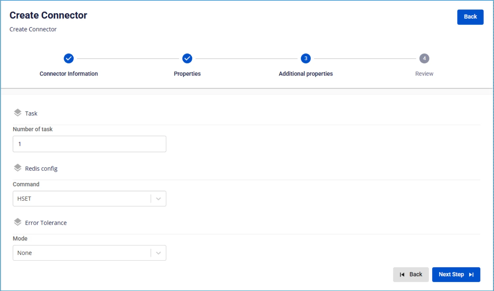

# Redis Sink Connector

Trường hợp tạo connector, Type là sink, Database là Redis

Pre-condition: Status CDC service healthy

**Bước 1:** Tại thanh menu chọn **Data Platform** > chọn **Workspace Management** > chọn **Workspace name**

**Bước 2:** Tại phần **My services** chọn **CDC service**

**Bước 3:** Tại màn detail **CDC service** > Chọn tab **Connectors** > nhấn **Create a connector**

**Bước 4:** Nhập các thông tin màn **Connector Information**:

 * **Name** (required): tên connector

Chú ý: Tên connector có thể chứa các kí tự chữ cái thường a-z hoặc các kí tự số 0-9. Đặc biệt không dùng dấu cách có thể thay dấu cách bằng dấu “-”.

 * **Type** (required): chọn **sink**

 * **Database** (required): chọn **Redis**

**Bước 5.** Nhấn **Next** để chuyển qua màn **Properties**

Nhập các thông tin sau:

 * **Database information**

 * **URL** (required): nhập địa chỉ kết nối database

 * **Username** (required): tên đăng nhập

 * **Password** (required): mật khẩu

Nhấn **Test connection** để kiểm tra kết nối từ Workspace tới Database đã nhập

 * **Converter**

 * **Converter key**: chọn giá trị key cho converter

 * **Converter key schema enable**: chọn giá trị có/không sử dụng schema trong Converter key

 * **Converter value**: chọn giá trị value cho converter

 * **Converter value schema enable**: chọn giá trị có/không sử dụng schema trong Converter value

 * **Kafka topic**

 * **Topics** (required): lựa chọn các topic dữ liệu được gửi từ source connector

**Bước 6:** nhấn **Next** để chuyển qua màn **Additional Properties**

Nhập các thông tin sau:

 * **Number of tasks**: số lượng tác vụ tối đa có thể thực hiện song song

 * **Command**: lựa chọn command lưu dữ liệu

 * **Mode**: Hành vi của Connector khi không thể xử lý được message

 * **None**: connector sẽ dừng xử lý nếu gặp lỗi

**Bước 7:** Nhấn **Next** để chuyển qua màn **Review**

**Bước 8:** Kiểm tra thông tin sau đó nhấn **Create** để hoàn thành việc tạo connector

 Sink Connector")
