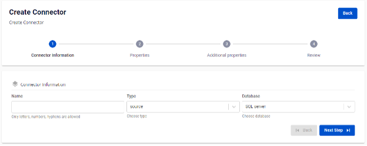
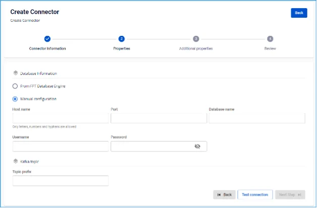
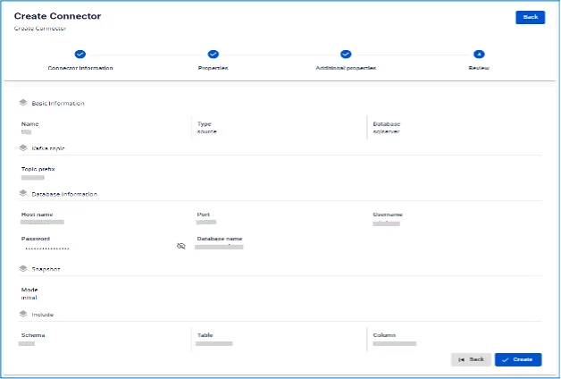

# SQL Server Source Connector

**Tạo connector, Type là source, Database là SQLserver**

**Pre-condition:** Status CDC service healthy

**SQL Server source connector** dựa trên tính năng change data capture trên SQL Server 2016 trở lên bản Standard hoặc Enterprise.

## Cấu hình SQL Server

**Điều kiện tiên quyết:**

 * Thực hiện các tác vụ dưới quyền sysadmin.

 * Thực hiện các tác vụ trên database dưới quyền db_owner.

**1.** Để thực hiện **CDC với SQL server**, trước hết phải _enable_ **SQLServer Agent**.

 * Chi tiết có thể tham khảo [Configure SQL Server Agent](<https://learn.microsoft.com/en-us/sql/ssms/agent/configure-sql-server-agent?view=sql-server-ver16#to-configure-sql-server-agent>) và [Install SQL Server Agent](<https://learn.microsoft.com/en-us/sql/linux/sql-server-linux-setup-sql-agent?view=sql-server-ver16&tabs=rhel>).

 * Với dịch vụ của FPTCloud, liên hệ Support để được hỗ trợ.

**2.** Khởi tạo SQLServer user:

```
CREATE LOGIN <YOUR_USERNAME> WITH PASSWORD = '<YOUR_PASSWORD>';
 CREATE USER <YOUR_USERNAME> FOR LOGIN <YOUR_USERNAME>;
```

**3.** Optional - Khởi tạo role cho CDC:

 * Connector có thể sử dụng sysadmin hoặc dbowner. Tuy nhiên trong trường hợp mong muốn một mức độ bảo mật cao hơn, ta có thể tạo role mới cho user này.

```
CREATE ROLE <YOUR_ROLE_NAME>;
```

 * Add user to Role:

```
ALTER ROLE <YOUR_ROLE_NAME> ADD MEMBER <YOUR_USERNAME>;
```

**4.** Cấu hình CDC trên SQLServer database:

```
USE <YOUR_DATABASE_NAME>
 GO
 EXEC sys.sp_cdc_enable_db
 GO
```

**5.** Cấu hình CDC trên table cần lắng nghe các thay đổi:

 * Với role vừa được khởi tạo:

```
USE <YOUR_DATABASE_NAME>
 GO
 EXEC sys.sp_cdc_enable_table
 @source_schema = N'dbo',
 @source_name = N'<YOUR_TABLE>',
 @role_name = N'<YOUR_ROLE_NAME>',
 @supports_net_changes = 0;
 GO
```

 * Chỉ với role sysadmin hoặc db_owner:

```
USE <YOUR_DATABASE_NAME>
 GO
 EXEC sys.sp_cdc_enable_table
 @source_schema = N'dbo',
 @source_name = N'<YOUR_TABLE>',
 @role_name = NULL,
 @supports_net_changes = 0;
 GO
```

**6.** Kiểm tra lại quyền với CDC user: Note: Thực hiện thao tác này với user đã được tạo ở trên.

```
USE <YOUR_DATABASE_NAME>
 EXEC sys.sp_cdc_help_change_data_capture;
 GO
```

## Các bước tạo connector:

Để tạo connector, người dùng thực hiện các bước sau: **Bước 1:** Tại thanh menu chọn **Data Platform** > chọn **Workspace Management** > chọn **Workspace name**

**Bước 2:** Tại phần **My services** chọn **CDC service**

**Bước 3:** Tại màn detail **CDC service** > Chọn tab **Connectors** > nhấn **Create a connector** 

**Bước 4:** Nhập các thông tin màn **Connector Information:**

 * **Name (required): tên connector

_Chú ý: Tên connector có thể chứa các kí tự chữ cái thường a-z hoặc các kí tự số 0-9. Đặc biệt không dùng dấu cách có thể thay dấu cách bằng dấu “-”._

 * **Type (required): chọn source

 * **Database (required): chọn SQLserver 

**Bước 5:** Nhấn Next để chuyển qua màn **Properties**

Nhập thông tin màn **Properties**

 * Trường hợp chọn **Manual configuration** \- điền các thông tin:

 * **Host name (required):** Hostname hoặc IP của SQLserver

 * **Port (required):** SQLserver port, mặc định là: `1433`.

 * **Database name (required):** Database đích mà Connector sẽ sink dữ liệu vào

 * **Username (required):** Username sử dụng bởi Connector

 * **Password (required):** Password sử dụng bởi Connector

 * **Topics (required):** Danh sách các topics Connector sẽ consume và sink dữ liệu vào database đích, và được ngăn cách bởi dấu "," 

 * Trường hợp chọn **From Database Engine** \- điền các thông tin:

 * **Database name (required):** Tên Database

 * **Host name (required):** Hostname hoặc IP của SQLserver

 * **Port (required):** SQLserver server port, mặc định là: `1433`.

 * **Database name (required):** Database đích mà Connector sẽ sink dữ liệu vào

 * **Username (required):** Username sử dụng bởi Connector

 * **Password (required):** Password sử dụng bởi Connector

 * **Topics (required):** Danh sách các topics Connector sẽ consume và sink dữ liệu vào database đích, và được ngăn cách bởi dấu "," 

Nhấn **Test connection** để kiểm tra kết nối từ **Workspace** tới Database đã nhập

**Bước 6:** Nhấn **Next** để chuyển qua màn **Additional Properties**

 * Nhập các thông tin sau:

 * **Mode (required):** Hành vi của **Connector** \- chọn các loại mode sau:

 * **Initial (default):** Connector sẽ snapshot toàn bộ dữ liệu đã tồn tại trong các bảng, sau đó tiếp tục capture data changes trên các bảng này

 * **Initial_only:** Connector sẽ chỉ snapshot toàn bộ dữ liệu đã tồn tại trong các bảng, sau đó không lắng nghe các sự kiện thay đổi dữ liệu trên bảng

 * **Nerver:** Connector sẽ không snapshot dữ liệu đã tồn tại trong bảng mà chỉ lắng nghe các sự kiện thay đổi dữ liệu trên bảng

 * **Schema (optional):** là một namespace dùng để gom nhóm các table có chung một đặc điểm nào đó để dễ dàng quản lý.

 * **Table (optional):** tên một table trong schema

 * **Column (optional):** tên một cột dữ liệu muốn lấy ra trong table 

**Bước 7:** Nhấn **Next** để chuyển sang màn **Review** 

**Bước 8:** Kiểm tra thông tin sau đó nhấn **Create** để hoàn thành việc tạo connector
