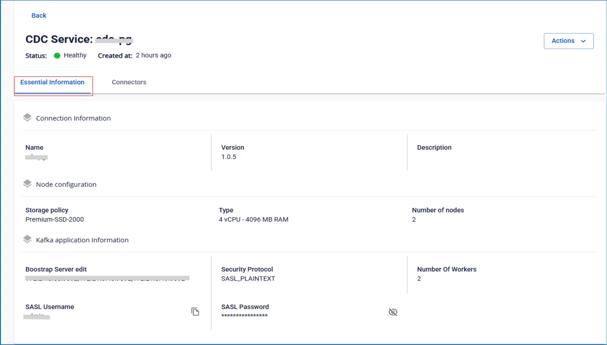

# Xem thông tin CDC Service

**Để xem thông tin CDC Service, người dùng thực hiện các bước sau:**

 * **Bước 1:** Tại thanh menu chọn **Data Platform** > chọn **Workspace Management** > chọn **Workspace name**

 * **Bước 2:** Tại phần **My services** nhấn chọn **CDC service**

 * **Bước 3:** Màn hình hiển thị các thông tin chung sau:

 * **Status**: trạng thái dịch vụ

 * **Created at**: thời gian tạo dịch vụ

Màn hình hiển thị 2 tab: **Essential Information**, **Connectors**

 * **Tab Essential Information**

Hiển thị thông tin chi tiết của CDC service 

 * **Tab Connectors**

Hiển thị danh sách các connector đã được cấu hình cho việc lấy dữ liệu từ source hoặc lưu dữ liệu vào sink 
