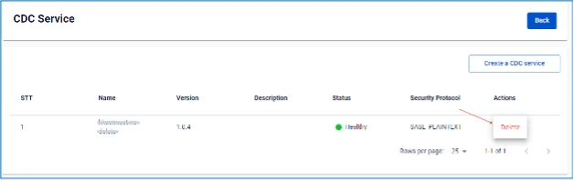

# Xóa CDC Service

**Để xóa CDC Service, người dùng thực hiện các bước sau:**

 * **Bước 1:** Tại thanh menu chọn **Data Platform** > chọn **Workspace Management** > chọn **Workspace name**

 * **Bước 2:** Tại phần **My services** chọn **CDC service**

Người dùng cũng có thể vào trực tiếp dịch vụ CDC service bằng cách:

Tại thanh menu chọn **Data Platform** > chọn **CDC service** > nhấn chọn một **CDC service name**

 * **Bước 3:** Tại màn **Detail CDC service** > chọn **CDC service name** > chọn **Action** > nhấn **Delete** 

 * **Bước 4:** Hiển thị hộp thoại **Delete Application**

→ Nhập **delete** > nhấn **Confirm** để xóa dịch vụ khỏi workspace

→ Chọn **Cancel** để hủy bỏ thao tác 
