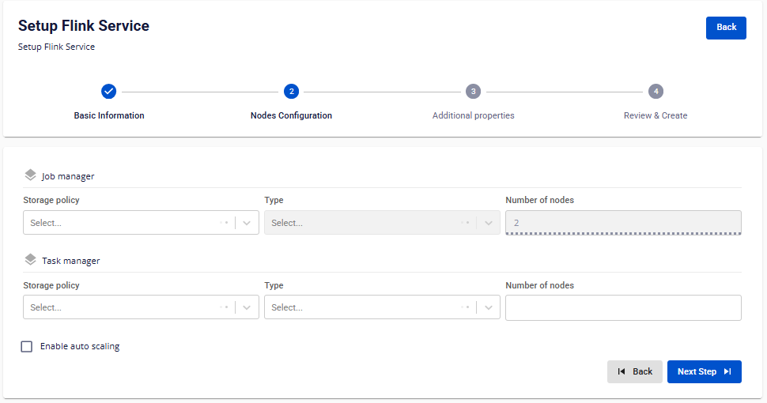
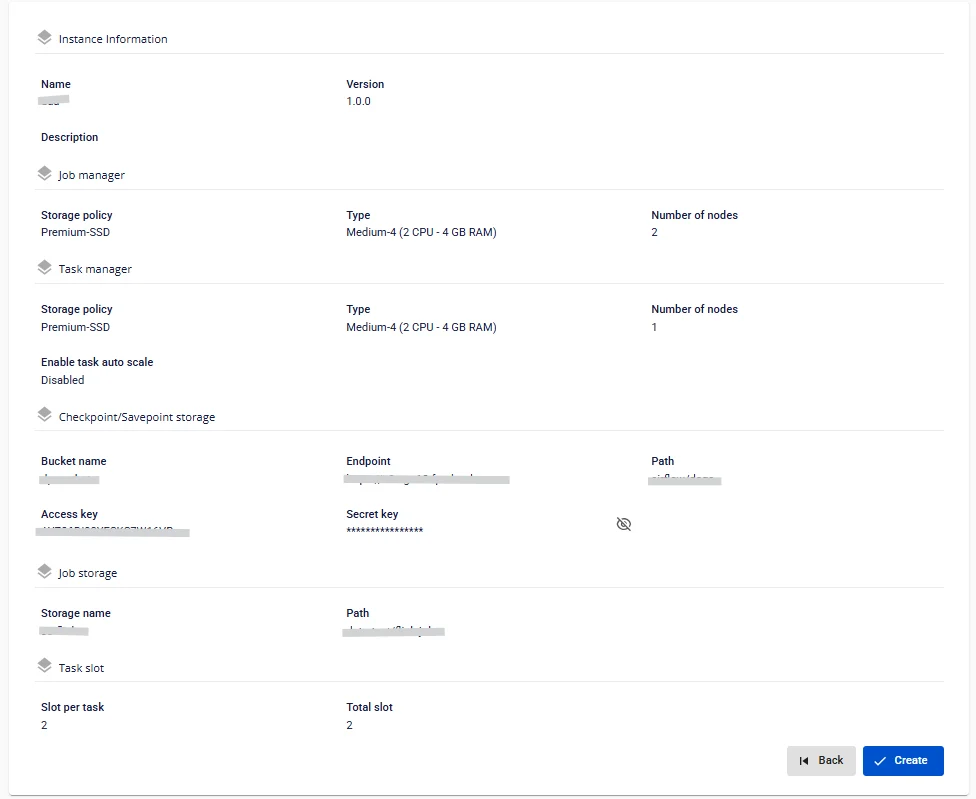

# Tạo Apache Flink

Để tạo **Flink** người dùng thực hiện các bước sau:

**Bước 1:** Tại thanh menu chọn **Data Platform** > chọn **Workspace Management** > chọn **Workspace name**

**Bước 2:** Nhấn **Create** > hiển thị popup **New Service** > chọn **Flink** > **Create**

**Bước 3:** Trong form tạo **Flink,** nhập thông tin màn **Basic Information**:

 * **Name** (required): Tên dịch vụ

Chú ý: Tên Apache có thể chứa các kí tự chữ cái thường a-z hoặc chữ cái in hoa A-Z hoặc các kí tự số 0-9. Đặc biệt không dùng dấu cách có thể thay dấu cách bằng dấu “-” hoặc “_”.

 * **Description** (optional): Mô tả

 * **Version** (required): chọn version

**Bước 4:** Nhấn **Next Step** để chuyển sang màn nhập thông tin **Nodes Configuration**

Nhập thông tin sau:

**Job manager**

 * **Storage policy** (required): chọn Storage Policy

 * **Type**: mặc định là Medium-4 (2 CPU – 4 GB RAM)

 * **Number of nodes**: giá trị mặc định là 2

**Task manager**

 * **Storage policy** (required): chọn Storage Policy

 * **Type** (required): chọn cấu hình

 * **Number of nodes**: nhập số node

:::warning
số node phải lớn hơn hoặc bằng 1 và nhỏ hơn hoặc bằng 10
:::

Nếu người dùng muốn tự động tăng cấu hình **Worker** của **Flink**, tích chọn **Enable worker auto scaling** > nhập số node tối đa cho **Worker**:::warning
Số max node phải lớn số **Number of nodes** và nhỏ hơn hoặc bằng 10
:::

**Bước 5:** Nhấn **Next Step** để chuyển sang màn **Additional Properties**

Nhập các thông tin sau:

**Checkpoint/Savepoint storage** lưu trạng thái của ứng dụng streaming:

 * **Enpoint:** nhập thông tin endpoint

 * **Access key:** nhập khóa truy cập

 * **Secret:** nhập mật khẩu

 * **Bucket name:** nhập tên bucket

 * **Path:** nhập đường dẫn path

Nhấn **Test Connection** để kiểm tra kết nối từ **Workspace** tới **Storage**

**Job Storage** chứa job file *.jar, có thể tải lên trực tiếp job vào S3:

 * **Job Storage**: chọn Storage đã được mount trên Workspace

 * **Path**: nhập đường dẫn chứa tệp

**Task slot**

 * **Slot per task**: nhập số Slot per task

:::warning
số **Slot per task** phải lớn hơn hoặc bằng 1 và nhỏ hơn hoặc bằng 4
:::

 * **Total slot:** số total slot phụ thuộc vào số slot per task

 * **Custom Domain**

 * **Mục đích:** Cho phép cấu hình domain tùy chỉnh để truy cập services.

 * **Với Workspace Public:** Dùng để gán domain và certificate mà không cần bật/tắt TLS (HTTPS luôn khả dụng).

 * **Với Workspace Private:** Ngoài domain và certificate, người dùng có thể tùy chọn bật hoặc tắt TLS/SSL để quyết định dùng HTTPS hay HTTP.

 * **Workspace là Public**

 * **Custom domain**: Tích để bật domain tùy chỉnh.

 * **Domain**: Nhập tên miền (VD: abc.local, jupyter.example.com).

 * **Certificate name**: Chọn từ danh sách certificate đã import trong **Certificate Manager**.

 * **Nút**:

 * **Manage certificate**: Mở màn hình quản lý certificate.

 * **Validate**: Kiểm tra chứng chỉ hợp lệ với domain.

 * 
:::note
Ở Workspace Public **không hiển thị** tùy chọn **TLS/SSL certificate** — hệ thống mặc định hỗ trợ HTTPS.
:::

 * **Workspace là Private**

 * **Custom domain**: Tích để bật domain tùy chỉnh.

 * **Domain**: Nhập tên miền.

 * **TLS/SSL certificate**: Tích để bật HTTPS cho services.

 * **Certificate name**: Chọn từ danh sách certificate.

 * **Nút**:

 * **Manage certificate**: Mở quản lý certificate.

 * **Validate**: Kiểm tra chứng chỉ.

 * 
:::note
Nếu bỏ tích **TLS/SSL certificate**, dịch vụ sẽ chạy HTTP và không yêu cầu certificate.
:::

**Bước 6:** Nhấn **Next Step** để chuyển sang màn **Review & Create**

**Bước 7.** Kiểm tra thông tin nhập sau đó nhấn **Create** để hoàn thành việc khởi tạo **Apache Flink**

**Apache Flink** hoàn thành khởi tạo khi **Worker Status** là **Succeeded** và **Status** của **Flink** là **Healthy** (~10 phút)
