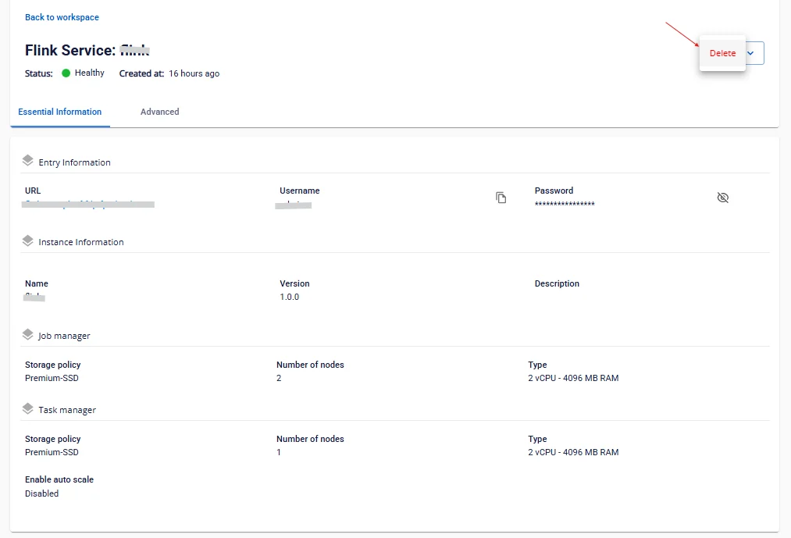

# Xóa Apache Flink

Để xóa Flink, người dùng thực hiện các bước sau:

**Bước 1:** Tại thanh menu chọn **Data Platform** > chọn **Workspace Management** > chọn **Workspace name**

**Bước 2:** Tại phần **My Service** > chọn **Flink >** nhấn **Action** > chọn **Delete**

**Bước 3.** Hiển thị hộp thoại **Delete Application** > nhập **delete** > nhấn **confirm** để xóa hoàn thành việc xóa Application khỏi workspace

